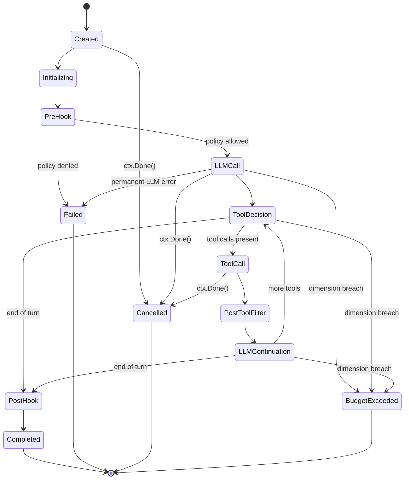

# praxis

**Enterprise agent orchestration for Go.**

[](https://github.com/praxis-os/praxis/actions)
[](https://pkg.go.dev/github.com/praxis-os/praxis)
[](LICENSE)

`praxis` is a production-grade Go library for orchestrating LLM agents with
enterprise guardrails built in rather than bolted on: a typed invocation state
machine, a provider-agnostic LLM interface, first-class policy hooks and filter
chains at every security-sensitive boundary, four-dimensional budget
enforcement, a typed error taxonomy, mandatory OpenTelemetry observability, and
optional per-call identity signing.

---

## Not the right tool?

If you want to call an LLM API directly without governance overhead, praxis
is not what you need. Reach for
[`anthropic-sdk-go`](https://github.com/anthropics/anthropic-sdk-go) or
[`go-openai`](https://github.com/sashabaranov/go-openai) instead — they are
minimal, well-maintained wrappers with no opinions beyond the HTTP contract.

praxis is for teams that need an auditable invocation kernel with policy hooks,
cost enforcement, and structured telemetry as framework-level guarantees, not
application-level afterthoughts.

---

## Table of contents

- [Prerequisites](#prerequisites)
- [Install](#install)
- [Quick start](#quick-start)
- [Supported providers](#supported-providers)
- [Error handling](#error-handling)
- [What praxis is](#what-praxis-is)
- [Architecture at a glance](#architecture-at-a-glance)
- [Tool integrations — MCP](#tool-integrations--mcp)
- [v1.0 interface surface](#v10-interface-surface)
- [Roadmap](#roadmap)
- [Versioning and stability](#versioning-and-stability)
- [Contributing](#contributing)
- [Security](#security)
- [License](#license)
- [Origin](#origin)

---

## Prerequisites

- Go 1.26 or later
- An API key for at least one supported provider:
  - **Anthropic** (`llm/anthropic`) — Claude models
  - **OpenAI** (`llm/openai`) — GPT models
  - **Gemini** (`llm/gemini`) — Google Gemini models
  - **OpenRouter** (`llm/openrouter`) — multi-provider routing
  - **Groq** (`llm/groq`) — low-latency LPU inference
  - **Ollama** (`llm/ollama`) — local models, no API key required

---

## Install

```sh
go get github.com/praxis-os/praxis
```

---

## Quick start

```go
package main

import (
	"context"
	"fmt"
	"log"
	"os"

	"github.com/praxis-os/praxis/invocation"
	"github.com/praxis-os/praxis/llm"
	"github.com/praxis-os/praxis/llm/anthropic"
	"github.com/praxis-os/praxis/orchestrator"
)

func main() {
	provider := anthropic.New(os.Getenv("ANTHROPIC_API_KEY"))

	orch, err := orchestrator.New(provider,
		orchestrator.WithDefaultModel("claude-sonnet-4-20250514"),
	)
	if err != nil {
		log.Fatal(err)
	}

	result, err := orch.Invoke(context.Background(), invocation.InvocationRequest{
		Messages: []llm.Message{
			{Role: llm.RoleUser, Parts: []llm.MessagePart{llm.TextPart("Say hi in one sentence.")}},
		},
	})
	if err != nil {
		log.Fatal(err)
	}

	for _, part := range result.Response.Message.Parts {
		if part.Type == llm.PartTypeText {
			fmt.Println(part.Text)
		}
	}
}
```

All defaults are safe for zero-configuration use: no policy hooks, no budget
guard, no tool invoker. Wire in only what your workload requires.

---

## Supported providers

praxis ships six provider adapters. The `llm.Provider` interface is stable
(frozen-v1.0) — any OpenAI-compatible service works via the `openai` package
with `WithBaseURL`.

| Package | Provider | Auth | Notes |
|---|---|---|---|
| `llm/anthropic` | Anthropic | `ANTHROPIC_API_KEY` | Claude models. Header auth (`x-api-key`). |
| `llm/openai` | OpenAI | `OPENAI_API_KEY` | GPT models. Also works for Azure OpenAI via `WithBaseURL`. |
| `llm/gemini` | Google Gemini | `GEMINI_API_KEY` | Gemini models. Query-param auth. Up to 1M context tokens. |
| `llm/openrouter` | OpenRouter | `OPENROUTER_API_KEY` | Routes to many upstream models. Optional `WithReferer`/`WithTitle` headers. |
| `llm/groq` | Groq | `GROQ_API_KEY` | Low-latency LPU inference. OpenAI-compatible. |
| `llm/ollama` | Ollama | none | Local models. No API key required. Default: `localhost:11434`. |

```go
// Anthropic
provider := anthropic.New(os.Getenv("ANTHROPIC_API_KEY"))

// OpenAI
provider := openai.New(os.Getenv("OPENAI_API_KEY"))

// Gemini
provider := gemini.New(os.Getenv("GEMINI_API_KEY"))

// OpenRouter (multi-provider routing)
provider := openrouter.New(os.Getenv("OPENROUTER_API_KEY"),
    openrouter.WithModel("anthropic/claude-sonnet-4-20250514"),
)

// Groq (fast inference)
provider := groq.New(os.Getenv("GROQ_API_KEY"))

// Ollama (local, no key)
provider := ollama.New(ollama.WithModel("llama3.2"))
```

All providers satisfy `llm.Provider` and plug directly into `orchestrator.New(provider)`.

**Examples:** [`examples/minimal/`](examples/minimal/) |
[`examples/openrouter/`](examples/openrouter/) |
[`examples/groq/`](examples/groq/) |
[`examples/ollama/`](examples/ollama/) |
[`examples/gemini/`](examples/gemini/)

---

## Error handling

Every error returned by praxis implements `errors.TypedError`:

```go
import praxiserrors "github.com/praxis-os/praxis/errors"

result, err := orch.Invoke(ctx, req)
if err != nil {
    var te praxiserrors.TypedError
    if errors.As(err, &te) {
        fmt.Println(te.Kind(), te.HTTPStatusCode())
    }
    log.Fatal(err)
}
```

Seven error kinds drive differentiated retry behavior: `transient_llm` (retries
with jittered backoff), `permanent_llm`, `tool`, `policy_denied`,
`budget_exceeded`, `cancellation`, and `system`. `errors.Is` and `errors.As`
work across all of them.

---

## What praxis is

`praxis` is the **invocation kernel**: the component that owns a single agent
call from request to terminal state, with every security, cost, and
observability contract enforced by construction. It is deliberately narrower
than a general agent framework and deliberately wider than a direct SDK
wrapper.

It is the library a team reaches for when "call an LLM in a loop" is not
enough, and when ad-hoc glue around a raw provider SDK would compromise
auditability, cost control, or security.

**What it gives you out of the box:**

- A typed, eleven-state invocation finite state machine with allow-listed
  transitions and property-based tests.
- A provider-agnostic `llm.Provider` interface with six shipped adapters:
  Anthropic, OpenAI, Gemini, OpenRouter, Groq, and Ollama (local models).
- A four-phase policy hook model (`PreInvocation`, `PreLLMInput`,
  `PostToolOutput`, `PostInvocation`) plus pre-LLM and post-tool filter chains
  that can `Pass`, `Redact`, `Log`, or `Block`.
- Four-dimensional budget enforcement: wall-clock duration, LLM tokens, tool
  call count, cost estimate in micro-dollars.
- A typed error taxonomy driving a differentiated retry policy.
- Mandatory OpenTelemetry spans and a neutral lifecycle event stream. No
  "verbose mode" — silent paths are a bug.
- Optional per-tool-call identity assertion via `identity.Signer` (Ed25519 JWT
  reference impl).

**What it does not do:**

- No HTTP or SSE handler bundled — the caller owns the transport.
- No plugin system, no WebAssembly host, no reflection magic. Extension is by
  Go interface implementation at build time.
- No hardcoded LLM pricing. Pricing is a caller-provided interface.
- No prompt template engine, no multi-agent coordination, no vector store.
- No knowledge of any specific consumer's identity, tenant, agent, or event
  model. That all sits behind interfaces.

---

## Architecture at a glance

A single invocation flows through an explicit finite state machine, not a
procedural loop. Hook phases are state entries, and property-based tests
generate random transition sequences to assert that only allow-listed
transitions are accepted.



The tool-use cycle `LLMContinuation → ToolDecision → ToolCall →
PostToolFilter → LLMContinuation` repeats until the LLM emits end-of-turn.
Terminal states (`Completed`, `Failed`, `Cancelled`, `BudgetExceeded`) are
immutable.

Cancellation is exclusively via `context.Context`. Cancelled invocations still
emit their terminal lifecycle event on a derived background context, so
cancellation cannot silently erase audit history.

For the full component diagram, the per-state transition rules, and the
request lifecycle sequence, see
[`docs/PRAXIS-SEED-CONTEXT.md`](docs/PRAXIS-SEED-CONTEXT.md) sections 4.1–4.5.

---

## Tool integrations — MCP

The `praxis/mcp` sub-module adapts [Model Context Protocol](https://modelcontextprotocol.io)
servers into the praxis `tools.Invoker` surface. Agents driven by the
orchestrator can invoke MCP-exposed tools without any runtime plugin loading —
all servers are pinned at construction time.

```go
import "github.com/praxis-os/praxis/mcp"

inv, err := mcp.New(ctx, []mcp.Server{
    {LogicalName: "github", Transport: mcp.TransportStdio{Command: "mcp-github"}},
}, mcp.WithResolver(myResolver))

defer inv.Close()

// inv satisfies tools.Invoker — plug it directly into the orchestrator.
// inv.Definitions() returns []llm.ToolDefinition for llm request wiring.
```

Key properties:

- **Transports:** stdio and Streamable HTTP (D108).
- **Tool namespacing:** `{LogicalName}__{mcpToolName}` — deterministic, LLM-safe (D111).
- **Error taxonomy:** MCP failures map to the existing `ErrorKindTool` sub-kinds
  (Network, CircuitOpen, SchemaViolation, ServerError) — no new error kinds (D113).
- **Content flattening:** text-only, `\n\n`-joined; non-text blocks silently dropped (D114).
- **Budget participation:** MCP calls count against `tool_calls` and `wall_clock` via the
  orchestrator's existing accounting — no new budget dimension (D112).
- **Trust boundary:** the MCP transport edge is classified untrusted; `PostToolFilter`
  applies verbatim to flattened results (D116).
- **Observability:** optional `MCPMetricsRecorder` interface emits three bounded-cardinality
  metrics (D115). Server cap: 32 per Invoker.

The sub-module ships independently at its own semver line under tag prefix `mcp/vX.Y.Z`.

**Examples:** [`examples/mcp/stdio/`](examples/mcp/stdio/) |
[`examples/mcp/http/`](examples/mcp/http/)

**Non-goals for v1.0.0:** runtime server discovery, sampling/elicitation passthrough,
resource subscriptions, credential refresh (D120). See `docs/phase-7-mcp-integration/05-non-goals.md`.

---

## v1.0 interface surface

Every interface below ships with a null or minimal default implementation, so
an orchestrator can be constructed with zero caller-supplied wiring for smoke
tests and examples.

| Package | Interface | Purpose |
|---|---|---|
| `orchestrator` | `Orchestrator` | Public facade. `Invoke`. Fresh state machine per call. Safe for concurrent use. |
| `llm` | `Provider` | Provider-agnostic adapter surface. `Complete`, `Stream`, `Name`, `Capabilities`. Shipped: `anthropic`, `openai`, `gemini`, `openrouter`, `groq`, `ollama`. |
| `tools` | `Invoker` | Generic tool execution seam. Default: `NullInvoker`. |
| `hooks` | `PolicyHook` | Policy evaluation at invocation lifecycle phases. Default: `AllowAllPolicyHook`. |
| `hooks` | `PreLLMFilter`, `PostToolFilter` | Input and output filter chains. Decisions: `Pass`, `Redact`, `Log`, `Block`. Tool outputs are untrusted by contract. |
| `budget` | `Guard` | Four-dimensional enforcement: wall-clock, tokens, tool-call count, cost. Breach maps to `BudgetExceeded` terminal state. |
| `budget` | `PriceProvider` | Maps `(provider, model, direction)` to per-token micro-dollars. Default: `NullPriceProvider`. No commercial prices hardcoded. |
| `errors` | `TypedError`, `Classifier` | Seven concrete types + classifier driving the retry policy. Transient LLM errors retry with jittered backoff; everything else does not. |
| `telemetry` | `LifecycleEventEmitter` | Emits neutral framework events at each state transition. Default: `NullEmitter`. |
| `telemetry` | `AttributeEnricher` | Contributes caller-specific attributes to spans and events. Framework has no awareness of attribute names. Default: `NullEnricher`. |
| `credentials` | `Resolver` | Per-call credential fetch. Returned `Credential` has `Close()` that zeroes secret material. Never cached, logged, or serialized. Default: `NullResolver`. |
| `identity` | `Signer` | Optional per-tool-call identity assertion returning a short-lived Ed25519 JWT. Default: `NullSigner`. |

---

## Roadmap

| Tag | Status | Scope |
|---|---|---|
| **v0.1.0** | shipped | Synchronous `Invoke`, full state machine, `anthropic.Provider`, typed errors, null defaults for tools/policy/filters/telemetry. |
| **v0.3.0** | shipped | All public interfaces locked to v1.0-candidate shape. Hook and filter chain execution. `budget.Guard` with all four dimensions. `openai.Provider`. Property-based state machine tests in CI. |
| **v0.5.0** | shipped | 85% coverage gate on public surface. Benchmarks green. `identity.Ed25519Signer` reference impl. |
| **v0.7.0** | shipped | `praxis/mcp` sub-module: stdio + Streamable HTTP transports, tool namespacing, credential flow, trust-boundary hardening. |
| **v0.9.0** | shipped | `praxis/skills` sub-module: `SKILL.md` loader, `skills.Open` / `skills.Load`, `skills.WithSkill` orchestrator option. |
| **v1.0.0** | next | API freeze after the first production consumer ships on `v0.9.x`. Breaking changes after this point require a `v2` module path. |

---

## Versioning and stability

- **Semver throughout.** Tags are `vMAJOR.MINOR.PATCH`.
- **v0.x is unstable.** Any minor tag may break any public API. Consumers
  pinning to v0.x accept breakage risk as the price of early access.
- **v1.0+ is frozen.** Adding a method to an existing interface is a
  breaking change and requires a new interface embedding the old one.
- **Deprecation window.** A v1.x interface or type may be marked deprecated
  in one minor release; it must remain functional for at least two subsequent
  minor releases before removal.
- **Module path rule.** v2 and beyond use a versioned module path
  (`github.com/praxis-os/praxis/v2`). v1 consumers are never auto-upgraded.

---

## Contributing

`CONTRIBUTING.md` will be published alongside the `v0.1.0` tag. Working
conventions in the meantime:

- **Conventional commits** (`feat:`, `fix:`, `docs:`, `test:`, `refactor:`,
  `chore:`, `perf:`, `ci:`, `build:`). Releases are cut by release-please.
- **Contributor Covenant 2.1** code of conduct on all project surfaces.
- **No CLA.** Inbound contributions are under Apache 2.0.
- **Design changes go through the phase review process.** Any change that
  touches a public interface requires a decisions-log entry.

---

## Security

A formal `SECURITY.md` with a private disclosure channel is published at
[`SECURITY.md`](SECURITY.md). Please do not file public issues for
vulnerabilities.

---

## License

Apache 2.0. See [`LICENSE`](LICENSE). Every source file carries the SPDX
header `SPDX-License-Identifier: Apache-2.0`.

---

## Origin

`praxis` was designed inside a closed-source enterprise agent platform called
**Custos**, which will be its first production consumer. The framework's scope
was driven by Custos's governance, observability, and cost-control
requirements, then deliberately generalized: every Custos-specific concern
lives in a Custos-owned adapter package, never inside `praxis` itself. The
framework is enforced to stay generic by a banned-identifier CI job and by
design review on every phase.

External users build their own adapters against the same interfaces. This
section and `docs/PRAXIS-SEED-CONTEXT.md` §11–§12 are the only places where
the word "Custos" is permitted to appear in this repository.
