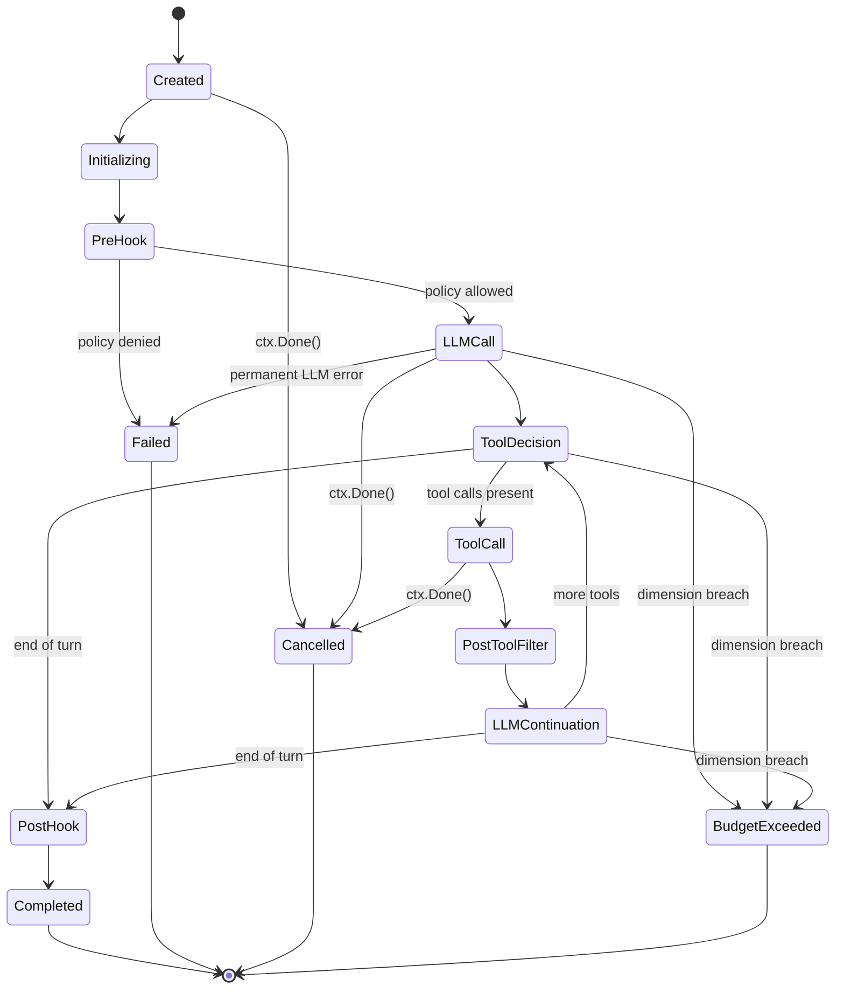

# praxis

**Enterprise agent orchestration for Go.**

`praxis` is a production-grade Go library for orchestrating LLM agents with
enterprise guardrails built in rather than bolted on: a typed invocation state
machine, a provider-agnostic LLM interface, first-class policy hooks and filter
chains at every security-sensitive boundary, four-dimensional budget
enforcement, a typed error taxonomy, mandatory OpenTelemetry observability, and
optional per-call identity signing.

---

> **Status: pre-alpha — planning phase.**
> There is no importable release yet. The only authoritative artifact at this
> point is [`docs/PRAXIS-SEED-CONTEXT.md`](docs/PRAXIS-SEED-CONTEXT.md), the
> frozen design baseline. Interfaces described here are the target shape for
> the first tagged release (`v0.1.0`) and may change until then.
> First production consumer ship is the gate for `v1.0.0`.

---

## Table of contents

- [What praxis is](#what-praxis-is)
- [Why praxis](#why-praxis)
- [Design principles](#design-principles)
- [Architecture at a glance](#architecture-at-a-glance)
- [v1.0 interface surface](#v10-interface-surface)
- [Preview: minimal invocation](#preview-minimal-invocation)
- [Roadmap](#roadmap)
- [Versioning and stability](#versioning-and-stability)
- [Project status and planning](#project-status-and-planning)
- [Contributing](#contributing)
- [Security](#security)
- [License](#license)
- [Origin](#origin)

---

## What praxis is

`praxis` is the **invocation kernel**: the component that owns a single agent
call from request to terminal state, with every security, cost, and
observability contract enforced by construction. It is deliberately narrower
than a general agent framework and deliberately wider than a direct SDK
wrapper.

It is the library a team reaches for when "call an LLM in a loop" is not
enough, and when ad-hoc glue around a raw provider SDK would compromise
auditability, cost control, or security.

**What it gives you out of the box:**

- A typed, eleven-state invocation finite state machine with allow-listed
  transitions and property-based tests.
- A provider-agnostic `llm.Provider` interface with shipped adapters for
  Anthropic and OpenAI (the latter covering Azure OpenAI via base URL).
- A four-phase policy hook model (`PreInvocation`, `PreLLMInput`,
  `PostToolOutput`, `PostInvocation`) plus pre-LLM and post-tool filter chains
  that can `Pass`, `Redact`, `Log`, or `Block`.
- Four-dimensional budget enforcement: wall-clock duration, LLM tokens, tool
  call count, cost estimate in micro-dollars.
- A typed error taxonomy (`TransientLLMError`, `PermanentLLMError`, `ToolError`,
  `PolicyDeniedError`, `BudgetExceededError`, `CancellationError`, `SystemError`)
  driving a differentiated retry policy.
- Mandatory OpenTelemetry spans and a neutral lifecycle event stream. No
  "verbose mode" — silent paths are a bug.
- Optional per-tool-call identity assertion via `identity.Signer` (Ed25519 JWT
  reference impl).

**What it does not do:**

- No HTTP or SSE handler bundled — the caller owns the transport.
- No plugin system, no WebAssembly host, no reflection magic. Extension is by
  Go interface implementation at build time.
- No hardcoded LLM pricing. Pricing is a caller-provided interface.
- No knowledge of any specific consumer's identity, tenant, agent, or event
  model. That all sits behind interfaces.

---

## Why praxis

The Go ecosystem has agent libraries, but none target the governance,
observability, and cost-control posture that production enterprise deployments
require. `praxis` fills that gap.

| Library | Strengths | Why it does not cover the praxis use case |
|---|---|---|
| **LangChainGo** | Broad surface area, many integrations, community-maintained | Thin port of a Python framework; no typed state machine, no policy hook model, no budget primitives, streaming and cancellation are best-effort |
| **Google ADK for Go** | Agent-to-agent protocol, Google-ecosystem fit | Scoped to agent protocol plumbing; no runtime governance primitives, no multi-dimensional budget, no provider abstraction stability commitment |
| **Eino (ByteDance)** | General-purpose LLM app framework, composable graph model | Application-framework orientation; policy, identity, cost, and filters are consumer concerns, not framework primitives |
| **Direct SDK use** (`anthropic-sdk-go`, `go-openai`) | Minimal, fast, no abstractions to learn | Every consumer reinvents the loop, retry classification, budget enforcement, observability contract, and tool-use normalization |

---

## Design principles

1. **Generic first, opinionated where it matters.** The state machine, error
   taxonomy, and budget dimensions are opinionated because they are
   correctness-load-bearing. Everything that touches a particular caller's
   identity, policy, or event model sits behind an interface.
2. **Compiler-enforced decoupling.** No consumer-specific identifier is
   allowed in framework code. CI greps for banned strings on every PR. The
   framework does not know the name of any consumer.
3. **Interfaces at every security seam.** Policy, credentials, identity
   signing, telemetry attribution, and price lookup are interfaces with null
   default implementations. Concrete wiring is the caller's responsibility.
4. **Typed errors, no `interface{}` payloads.** Every error returned from a
   framework method implements `errors.TypedError` with a stable `Kind()` and
   an HTTP status hint. `errors.Is` and `errors.As` work throughout.
5. **Mandatory observability.** Every state transition emits a span and a
   lifecycle event. There is no opt-out.
6. **No plugins in v1.** Extension is by Go interface implementation at build
   time.
7. **Backward compatibility is a v1.0 commitment, not a v0 one.** Until v1.0
   the API can break on any minor tag. After v1.0 the interface surface is
   frozen and v2 requires a module path bump.

---

## Architecture at a glance

A single invocation flows through an explicit finite state machine, not a
procedural loop. Hook phases are state entries, and property-based tests
generate random transition sequences to assert that only allow-listed
transitions are accepted.



The tool-use cycle `LLMContinuation → ToolDecision → ToolCall →
PostToolFilter → LLMContinuation` repeats until the LLM emits end-of-turn.
Terminal states (`Completed`, `Failed`, `Cancelled`, `BudgetExceeded`) are
immutable.

Streaming is a Go channel (`<-chan InvocationEvent`) with a 16-event buffer.
Cancellation is exclusively via `context.Context`, with soft-cancel (500 ms
grace) and hard-cancel variants. Cancelled invocations **still emit their
terminal lifecycle event** on a derived background context, so cancellation
cannot silently erase audit history.

For the full component diagram, the per-state transition rules, and the
request lifecycle sequence, see
[`docs/PRAXIS-SEED-CONTEXT.md`](docs/PRAXIS-SEED-CONTEXT.md) sections 4.1–4.5.

---

## v1.0 interface surface

Every interface below is the target shape for v1.0. Each ships with a null or
minimal default implementation, so an orchestrator can be constructed with
zero caller-supplied wiring for smoke tests and examples.

| Package | Interface | Purpose |
|---|---|---|
| `orchestrator` | `AgentOrchestrator` | Public facade. `Invoke`, `InvokeStream`. Fresh state machine per call. Safe for concurrent use. |
| `llm` | `Provider` | Provider-agnostic adapter surface. `Complete`, `Stream`, `Name`, `SupportsParallelToolCalls`, `Capabilities`. Shipped adapters: `anthropic.Provider`, `openai.Provider`. |
| `tools` | `Invoker` | Generic tool execution seam. Policy denials surface as `ToolResult{Status: StatusDenied}`, not errors. Default: `NullInvoker`. |
| `hooks` | `PolicyHook` | Policy evaluation at four named phases: `PreInvocation`, `PreLLMInput`, `PostToolOutput`, `PostInvocation`. Default: `AllowAllPolicyHook`. |
| `hooks` | `PreLLMFilter`, `PostToolFilter` | Input and output filter chains. Decisions: `Pass`, `Redact`, `Log`, `Block`. Tool outputs are untrusted by contract. |
| `budget` | `Guard` | Four-dimensional enforcement: wall-clock, tokens, tool-call count, cost. Breach ⇒ `BudgetExceeded` with dimension identified. |
| `budget` | `PriceProvider` | Maps `(provider, model, direction)` to per-token micro-dollars. Default: `StaticPriceProvider` over a caller-supplied table. No commercial prices hardcoded. |
| `errors` | `TypedError`, `Classifier` | Seven concrete types + classifier driving the retry policy. Transient LLM errors retry 3× with jittered backoff; everything else never retries. |
| `telemetry` | `LifecycleEventEmitter` | Emits neutral framework events (`EventInvocationStarted`, `…Completed`, `…Failed`, `…Cancelled`, `EventBudgetExceeded`, `EventPolicyBlocked`, `EventToolCalled`, `EventToolError`, `EventPromptInjectionSuspected`, `EventPIIRedacted`). Default: `NullEmitter`. |
| `telemetry` | `AttributeEnricher` | Contributes caller-specific attributes (tenant, agent, user, request ids — whatever the caller defines) to every span and lifecycle event. Framework has no awareness of attribute names. Default: `NullEnricher`. |
| `credentials` | `Resolver` | Per-call credential fetch. Returned `Credential` has `Close()` that zeroes secret material. Never cached by the framework, never logged, never serialized into errors. Default: `NullResolver`. |
| `identity` | `Signer` | Optional per-tool-call identity assertion returning a short-lived Ed25519 JWT. Default: `NullSigner` (empty string). |

---

## Preview: minimal invocation

> **Preview only.** Target shape for `v0.1.0`. The library is not yet
> importable; identifiers and signatures may still change before the first
> tag. This snippet exists to convey the *feel* of the public API, not to be
> copy-pasted.

```go
package main

import (
    "context"
    "fmt"

    "github.com/praxis-go/praxis/orchestrator"
    "github.com/praxis-go/praxis/llm/anthropic"
    "github.com/praxis-go/praxis/tools"
    "github.com/praxis-go/praxis/hooks"
    "github.com/praxis-go/praxis/telemetry"
)

func main() {
    provider := anthropic.NewProvider(anthropic.Config{
        APIKey: "sk-ant-...",
        Model:  "claude-opus-4-6",
    })

    orch := orchestrator.New(orchestrator.Config{
        Provider: provider,
        Invoker:  tools.NullInvoker{},
        Policy:   hooks.AllowAllPolicyHook{},
        Emitter:  telemetry.NullEmitter{},
        Enricher: telemetry.NullEnricher{},
    })

    result, err := orch.Invoke(context.Background(), orchestrator.InvocationRequest{
        AgentID: "hello-world",
        Input:   "Say hi in one sentence.",
    })
    if err != nil {
        panic(err)
    }
    fmt.Println(result.Output)
}
```

The same orchestrator swapped to `InvokeStream` returns a
`<-chan InvocationEvent` (16-event buffer) that the caller drains and
forwards to whatever transport it chooses.

---

## Roadmap

The v0.x line is the shakedown: interfaces can still change on any minor tag,
each change recorded in `CHANGELOG.md` and justified in the decisions log.

| Tag | Scope |
|---|---|
| **v0.1.0** — *First invocation* | Minimal synchronous `AgentOrchestrator`, full 11-state machine, `anthropic.Provider`, typed errors, null defaults for tools/policy/filters/telemetry, 40-line example. |
| **v0.3.0** — *Interfaces stable* | All public interfaces locked to v1.0-candidate shape. Hook and filter chain execution. `budget.Guard` with all four dimensions. `telemetry.OTelEmitter` default. Streaming path (`InvokeStream`). `openai.Provider` passing the shared conformance suite. Property-based state-machine tests in CI. |
| **v0.5.0** — *Feature complete* | 85 % coverage gate on public surface. Conformance suite green for both adapters. Benchmarks green: orchestrator overhead under 15 ms per invocation, state machine at 1 M transitions/sec/core. `identity.Ed25519Signer` reference impl. First production consumer ready to import. |
| **v1.0.0** — *API freeze* | Tagged only after the first production consumer has shipped against `v0.5.x` in production for at least one release cycle. Interface surface frozen. Breaking changes require a `v2` module path. |

---

## Versioning and stability

- **Semver throughout.** Tags are `vMAJOR.MINOR.PATCH`.
- **v0.x is unstable.** Any minor tag may break any public API. Consumers
  pinning to v0.x accept breakage risk as the price of early access.
- **v1.0+ is frozen.** Adding a method to an existing interface is a
  breaking change and requires a new interface embedding the old one,
  shipped alongside the original.
- **Deprecation window.** A v1.x interface or type may be marked deprecated
  in one minor release; it must remain functional for at least two
  subsequent minor releases before removal is considered.
- **Module path rule.** v2 and beyond use a versioned module path
  (`github.com/praxis-go/praxis/v2`). v1 consumers are never auto-upgraded.

---

## Project status and planning

Planning is organized into **six design phases**, each producing numbered
artifacts under `docs/phase-N-<slug>/` and gated by a written review. Phase 6
must be approved before implementation begins.

| # | Phase | Scope |
|---|---|---|
| 1 | **API Scope and Positioning** | What praxis is, what it is not, target consumers, v1.0 commitments. |
| 2 | **Core Runtime Design** | Invocation state machine, lifecycle, streaming transport, cancellation, concurrency model. |
| 3 | **Interface Contracts** | All public v1.0 interfaces, method surfaces, null defaults, composability rules. |
| 4 | **Observability and Errors** | OTel span structure, Prometheus metrics, slog redaction, typed error taxonomy, cardinality constraints. |
| 5 | **Security and Trust Boundaries** | Credential fetch semantics, zero-on-close, identity signing, untrusted tool output handling, key lifecycle. |
| 6 | **Release and Governance** | Semver policy, deprecation windows, release-please, CI pipeline, RFC process, code of conduct. |

The frozen baseline for all six phases is
[`docs/PRAXIS-SEED-CONTEXT.md`](docs/PRAXIS-SEED-CONTEXT.md). Phases refine
it; none override it.

---

## Contributing

`CONTRIBUTING.md` will be published alongside the `v0.1.0` tag. In the
meantime, the working conventions are:

- **Conventional commits** (`feat:`, `fix:`, `docs:`, `test:`, `refactor:`,
  `chore:`, `perf:`, `ci:`, `build:`). Releases are cut by release-please
  from the commit history.
- **Contributor Covenant 2.1** code of conduct, enforced on all project
  surfaces (issues, PRs, discussions).
- **No CLA.** Inbound contributions are under Apache 2.0, the same license
  as the project.
- **Design changes go through the phase review process.** Any change that
  touches a public interface requires a decisions-log entry.

---

## Security

A formal `SECURITY.md` with a private disclosure channel will be published
alongside `v0.1.0`. Until then, please do **not** file public issues for
vulnerabilities; reach out to the maintainers privately.

---

## License

Apache 2.0. See [`LICENSE`](LICENSE). Every source file will carry the SPDX
header `SPDX-License-Identifier: Apache-2.0`.

---

## Origin

`praxis` was designed inside a closed-source enterprise agent platform called
**Custos**, which will be its first production consumer. The framework's
scope was driven by Custos's governance, observability, and cost-control
requirements, and then deliberately generalized: every Custos-specific
concern lives in a Custos-owned adapter package, never inside `praxis`
itself. The framework is enforced to stay generic by a banned-identifier CI
job and by design review on every phase.

External users build their own adapter against the same interfaces — a
policy hook, a credentials resolver, an attribute enricher, a lifecycle event
emitter, and optionally an identity signer — with zero Custos awareness.
`praxis` is not a disguised Custos SDK, and the review process exists
precisely to keep it that way. This section and `docs/PRAXIS-SEED-CONTEXT.md`
§11–§12 are the only places where the word "Custos" is permitted to appear
in this repository.
