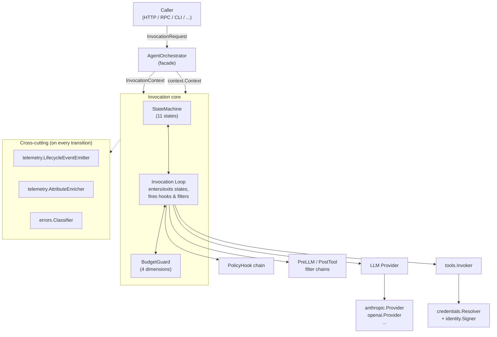
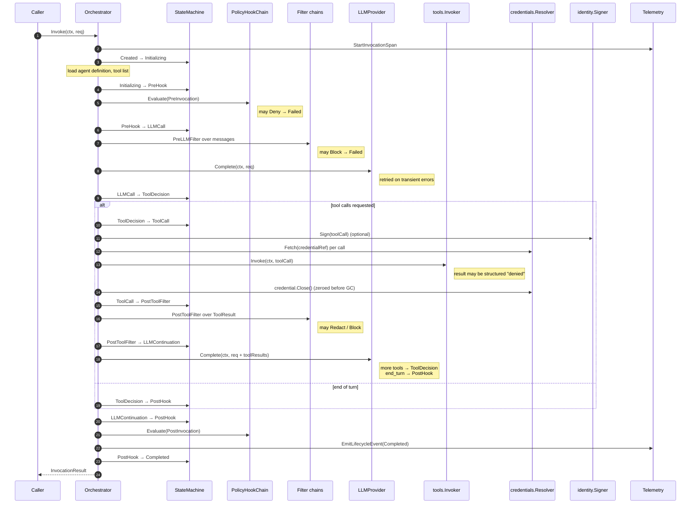

# praxis — Seed Context

> Foundational design document for `github.com/praxis-os/praxis`.
> This file is the combined PRD and working-context note for the project.
> All subsequent design phases reference it as the source of truth for scope,
> architecture, and principles.

---

## Table of contents

1. Vision
2. Positioning vs existing Go libraries
3. Design principles
4. Architecture overview
5. Interface surface (v1.0 stable contract)
6. Decoupling contract (the generic guarantee)
7. Repository layout
8. Roadmap
9. Versioning and API stability policy
10. Development process
11. Primary consumer disclosure
12. Origin
13. Open questions for praxis phase 1
14. Risks known at extraction time

---

## 1. Vision

`praxis` is a production-grade Go library for orchestrating LLM agents with
enterprise guardrails built in rather than bolted on. It provides a typed
invocation state machine, a provider-agnostic LLM interface with Anthropic and
OpenAI adapters, first-class policy hooks and filter chains at every
security-sensitive boundary, four-dimensional budget enforcement, a typed
error taxonomy, mandatory OpenTelemetry observability, and optional per-call
identity signing. It is the library a team reaches for when "call an LLM in a
loop" is not enough and ad-hoc glue would compromise auditability, cost
control, or security.

---

## 2. Positioning vs existing Go libraries

The Go ecosystem has agent libraries, but none target the governance,
observability, and cost-control posture that production enterprise deployments
require. `praxis` fills that gap.

| Library | Strengths | Why it does not cover the praxis use case |
|---|---|---|
| **LangChainGo** | Broad surface area, many integrations, community-maintained | Thin port of a Python framework; no typed state machine, no policy hook model, no budget primitives, streaming and cancellation are best-effort |
| **Google ADK for Go** | Agent-to-agent protocol, Google-ecosystem fit | Scoped to agent protocol plumbing; no runtime governance primitives, no multi-dimensional budget, no provider abstraction stability commitment |
| **Eino (ByteDance)** | General-purpose LLM app framework, composable graph model | Application framework orientation; policy, identity, cost, and filters are consumer concerns, not framework primitives |
| **Direct SDK use (anthropic-sdk-go, go-openai)** | Minimal, fast, no abstractions to learn | Every consumer reinvents the loop, retry classification, budget enforcement, observability contract, and tool-use normalization |

`praxis` is deliberately narrower than a general framework and deliberately
wider than a direct SDK wrapper. Its scope is the **invocation kernel**: the
component that owns a single agent call from request to terminal state, with
every security, cost, and observability contract enforced by construction.

---

## 3. Design principles

1. **Generic first, opinionated where it matters.** The state machine, error
   taxonomy, and budget dimensions are opinionated because they are
   correctness-load-bearing. Everything that touches a particular consumer's
   identity, policy, or event model sits behind an interface.
2. **Compiler-enforced decoupling.** No consumer-specific identifier (name,
   attribute, event type) is allowed in framework code. CI greps for banned
   strings. The framework does not know the name of any consumer.
3. **Interfaces at every security seam.** Policy, credentials, identity
   signing, telemetry attribution, and price lookup are interfaces with null
   default implementations. Concrete wiring is the caller's responsibility.
4. **Typed errors, no `interface{}` payloads.** Every error returned from a
   framework method implements `errors.TypedError` with a stable `Kind()` and
   an HTTP status hint. `errors.Is` and `errors.As` work throughout.
5. **Mandatory observability.** Every state transition emits a span and a
   lifecycle event. There is no "verbose mode" — the contract is always on.
   Silent paths are a bug.
6. **No plugins in v1.** Extension is by Go interface implementation at
   build time. No `plugin.Open`, no WebAssembly host, no reflection magic.
7. **Backward compatibility is a v1.0 commitment, not a v0 one.** Until v1.0
   the API can break on any minor tag. After v1.0 the interface surface is
   frozen and v2 requires a module path bump.

---

## 4. Architecture overview

### 4.1 Component diagram



### 4.2 Eleven-state invocation machine

The invocation is an explicit finite state machine with typed transitions,
not a procedural loop. Hook phases are state entries; property-based tests
generate random transition sequences and assert that only allow-listed
transitions are accepted.

States (terminal marked `*`):

| # | State | Purpose |
|---|---|---|
| 1 | `Created` | Invocation allocated, no work begun |
| 2 | `Initializing` | Agent config and tool list resolved |
| 3 | `PreHook` | Pre-invocation policy evaluation |
| 4 | `LLMCall` | Pre-LLM filters applied, LLM request in flight |
| 5 | `ToolDecision` | LLM response received, tool calls inspected against budget |
| 6 | `ToolCall` | Tool invoker dispatching to caller-provided invoker |
| 7 | `PostToolFilter` | Post-tool filters scrub untrusted output |
| 8 | `LLMContinuation` | Tool results injected, next LLM call |
| 9 | `PostHook` | Post-invocation policy and terminal lifecycle events |
| 10* | `Completed` | Terminal success |
| 11* | `Failed` | Terminal failure with classified `TypedError` |
| 12* | `Cancelled` | Terminal via `ctx.Done()` |
| 13* | `BudgetExceeded` | Terminal via budget dimension breach |

Terminal states are immutable. `PreHook` runs exactly once per invocation.
`LLMContinuation -> ToolDecision -> ToolCall -> PostToolFilter ->
LLMContinuation` is the tool-use cycle until the LLM emits an end-of-turn.

### 4.3 Request lifecycle sequence



### 4.4 Streaming model

Streaming uses a Go channel `<-chan InvocationEvent` with a **buffer of 16
events**. The caller drains the channel and is responsible for forwarding to
its own transport (Server-Sent Events is the canonical choice; the framework
does not bundle an HTTP handler). Backpressure is enforced at the channel
boundary: if the consumer cannot keep up, the orchestrator blocks its next
send. Block duration is bounded by `context.Context` deadline — a stuck
consumer eventually triggers cancellation and terminates the invocation. 16
was chosen to absorb typical scheduler jitter between producer and consumer
goroutines without hiding a stalled reader.

### 4.5 Cancellation model

Cancellation is exclusively via `context.Context`. Every blocking operation
in the orchestrator takes a context and respects `ctx.Done()`. Two flavors:

- **Soft cancel** (default for client disconnect): current operation is given
  a 500 ms grace window to complete so its result lands in the audit trail,
  then the invocation transitions to `Cancelled`.
- **Hard cancel** (deadline or budget breach): current operation is
  interrupted immediately and any partial result is discarded.

Critically, **cancelled invocations still emit their terminal lifecycle
event**. The post-invocation lifecycle emission runs synchronously on a
derived background context with a bounded 5 s deadline, so that cancellation
of the parent context cannot silently erase audit history. This is a deliberate
exception, documented and enforced by a single code path inside the telemetry
emitter.

---

## 5. Interface surface (v1.0 stable contract)

Every interface below is frozen at v1.0. Each ships with a null or minimal
default implementation so that an `Orchestrator` can be constructed with zero
caller-supplied wiring for smoke tests and examples.

### `orchestrator.AgentOrchestrator`
Public facade. Methods: `Invoke`, `InvokeStream`. Each call is a fresh
invocation with its own context, budget, span tree, and state machine.
Default impl: the bundled loop built on the eleven-state machine. Safe for
concurrent use.

### `llm.Provider`
Provider-agnostic interface over LLM adapters. Methods: `Complete`, `Stream`,
`Name`, `SupportsParallelToolCalls`, `Capabilities`. All provider-specific
formats (tool-use blocks, function calls, thinking blocks, streaming chunk
shapes) are absorbed inside the adapter and exposed via agnostic
`LLMRequest`, `LLMResponse`, `LLMToolCall`, `LLMToolResult`, `Message`, and
`MessagePart` types. **Shipped adapters:** `anthropic.Provider` and
`openai.Provider` (the latter also covers Azure OpenAI via base URL).

### `tools.Invoker`
Generic tool execution seam. Method: `Invoke(ctx, invocationCtx, call)
(ToolResult, error)`. The orchestrator does not know how tools are resolved,
authenticated, or routed — that is entirely the invoker's concern. A policy
denial by the invoker is returned as `ToolResult{Status: StatusDenied}`, not
as an error; the orchestrator injects it back into the LLM conversation as a
structured result. Default impl: `tools.NullInvoker` which returns
`StatusNotImplemented` for every tool.

### `hooks.PolicyHook`
Policy evaluation at a named lifecycle phase. Method: `Evaluate(ctx, phase,
input) (Decision, error)`. Four phases owned by the orchestrator:
`PreInvocation`, `PreLLMInput`, `PostToolOutput`, `PostInvocation`. A fifth
conceptual phase, **MidInvocation**, is explicitly out of scope for the
orchestrator — mid-tool-call policy enforcement belongs to the
`tools.Invoker` implementation, because only the invoker knows the runtime
details of the tool call it is about to execute. Default impl:
`hooks.AllowAllPolicyHook`.

### `hooks.PreLLMFilter` and `hooks.PostToolFilter`
Input and output filter chains. Methods: `Filter(ctx, ...) (filtered,
decisions, err)`. Filters can `Pass`, `Redact`, `Log`, or `Block`. Pre-LLM
filters run over the full message list immediately before the LLM call;
post-tool filters run over each tool result before it is appended to the
conversation. Tool outputs are treated as untrusted by contract. Default
impls: no-op pass-through filters.

### `budget.Guard` and `budget.PriceProvider`
Four-dimensional budget enforcement: wall-clock duration, total LLM tokens
(input + output), total tool call count, total cost estimate in
micro-dollars. Any dimension breach causes the invocation to transition to
`BudgetExceeded` with the offending dimension identified. `PriceProvider` is
a separate interface that maps `(provider, model, direction)` to a per-token
micro-dollar rate; the framework ships `budget.StaticPriceProvider` backed
by a caller-supplied YAML or in-code table. There is no bundled price table
for any specific provider — pricing is explicitly the caller's
responsibility.

### `errors.TypedError` and `errors.Classifier`
Typed error contract. Method set: `Kind() ErrorKind`, `HTTPStatusCode() int`,
`Unwrap() error`. Seven concrete types ship:
`TransientLLMError`, `PermanentLLMError`, `ToolError` (with sub-kind
`Network | ServerError | CircuitOpen | SchemaViolation`), `PolicyDeniedError`,
`BudgetExceededError`, `CancellationError`, `SystemError`. `Classifier.Classify(err)`
maps a raw `error` into the taxonomy and drives the differentiated retry
policy (transient LLM errors retry 3x with exponential backoff and jitter;
permanent, policy, budget, system, and schema errors never retry).

### `telemetry.LifecycleEventEmitter` and `telemetry.AttributeEnricher`
Two complementary interfaces. `LifecycleEventEmitter` emits neutral,
framework-defined lifecycle events (`EventInvocationStarted`,
`EventInvocationCompleted`, `EventInvocationFailed`, `EventInvocationCancelled`,
`EventBudgetExceeded`, `EventPolicyBlocked`, `EventToolCalled`, `EventToolError`,
`EventPromptInjectionSuspected`, `EventPIIRedacted`). `AttributeEnricher`
contributes caller-specific attributes (tenant id, agent id, user id, request
id, etc.) to every span and lifecycle event — the framework itself has no
awareness of these attributes or their names. Default impls: `NullEmitter`
and `NullEnricher`.

### `credentials.Resolver`
Method: `Fetch(ctx, credentialRef) (Credential, error)`. The returned
`Credential` has a `Close()` method that zeroes secret material in memory.
Credentials are fetched per tool call, never cached across calls inside the
framework, and never logged, spanned, or serialized into error contexts.
Default impl: `credentials.NullResolver` which returns an error for any ref.

### `identity.Signer`
Optional per-tool-call identity assertion. Method: `Sign(ctx, invocation,
toolName) (string, error)` returning a short-lived Ed25519 JWT. Callers that
do not need identity signing inject `identity.NullSigner`, which returns an
empty string. Callers that need it inject their own signer backed by their
key management system.

---

## 6. Decoupling contract (the generic guarantee)

The framework carries no knowledge of any specific consumer. This is
enforced by CI and by a short list of explicit rules.

### 6.1 Banned identifiers

A CI job greps the entire `praxis` source tree (excluding this document and
the origin section) for the following tokens. A match fails the build:

- Any consumer-specific product or organisation name.
- Any variant of a "governance-event" namespace. The framework's vocabulary is **lifecycle event**, and the corresponding Go identifiers live under a neutral `praxis.Event*` namespace.
- Hardcoded attribute names for caller identity such as tenant or
  organization id, agent id, user id. These are caller-contributed via the
  `AttributeEnricher` and must never appear as string literals in framework
  code.
- Any event or metric name that embeds a specific product namespace.

### 6.2 Semantic renames

The framework's terminology is deliberately neutral. The following renames
are applied consistently:

| Avoided term | Framework term |
|---|---|
| Governance event | Lifecycle event |
| Policy-blocked namespaced event | `praxis.EventPolicyBlocked` constant |
| Branded agent identity header | `identity.Signer` (optional) |
| Consumer-branded input/output filters | `hooks.PreLLMFilter` / `hooks.PostToolFilter` |
| Connector layer or consumer-specific tool gateway | `tools.Invoker` |

### 6.3 Caller-provided identity attribution

Identity, tenant, and request attribution is injected through
`AttributeEnricher`. At span creation time the enricher is asked for its
attribute set and the framework attaches whatever the caller provides. The
framework neither declares nor requires any specific attribute name.

### 6.4 Pricing as an interface

Per-token pricing lives behind `budget.PriceProvider`. The framework ships a
`StaticPriceProvider` that loads from a caller-supplied table and a
`NullPriceProvider` that always returns zero. No concrete price for any
commercial provider is hardcoded. Callers own the commercial relationship
with the LLM vendor, and therefore own the pricing table.

---

## 7. Repository layout

```
praxis/
├── README.md                  Install, 30-line example, links to docs
├── LICENSE                    Apache 2.0
├── CODE_OF_CONDUCT.md         Contributor Covenant 2.1
├── CONTRIBUTING.md            Dev setup, commit convention, review flow
├── SECURITY.md                Vulnerability disclosure process
├── CHANGELOG.md               release-please managed
├── go.mod / go.sum            Module: github.com/praxis-os/praxis
├── Makefile                   test, lint, bench, coverage, banned-grep
├── .github/workflows/         ci, bench, codeql, release-please
├── docs/
│   ├── PRAXIS-SEED-CONTEXT.md This document
│   ├── phase-1-foundation/    First post-seed design phase (numbered files + REVIEW.md)
│   └── architecture/          state-machine, streaming, cancellation, observability, security
├── orchestrator/              Public: AgentOrchestrator facade, request, result, event
├── state/                     Public: state machine primitives + property-based tests
├── llm/                       Public: Provider interface, agnostic request/response/message types
│   ├── conformance/           Shared adapter test suite
│   ├── anthropic/             Shipped adapter
│   ├── openai/                Shipped adapter (also covers Azure OpenAI)
│   └── mock/                  In-memory mock for consumer tests
├── tools/                     Public: Invoker interface, Invocation, Result, NullInvoker
├── hooks/                     Public: PolicyHook, PreLLMFilter, PostToolFilter, chain runners, defaults
├── budget/                    Public: Guard (4 dimensions), PriceProvider, StaticPriceProvider
├── errors/                    Public: TypedError + seven concrete types + Classifier
├── telemetry/                 Public: LifecycleEventEmitter, AttributeEnricher, OTel default, slog redaction handler
├── credentials/               Public: Resolver interface, Credential with Close(), NullResolver
├── identity/                  Public: Signer interface, Ed25519 reference impl, NullSigner
├── internal/
│   ├── loop/                  Invocation loop orchestration
│   ├── retry/                 Backoff and jitter
│   └── ctxutil/               Background-context lifecycle-emission helper
└── examples/                  minimal, tools, policy, filters, streaming
```

---

## 8. Roadmap

The v0.x line is the shakedown: interfaces can change on any minor tag,
provided the change is recorded in `CHANGELOG.md` and justified in the
phase-1 decisions log.

### v0.1.0 — First invocation
- `orchestrator.AgentOrchestrator` minimal synchronous path (no streaming).
- `state.Machine` with all 11 states and allow-listed transitions.
- `llm.Provider` interface + `anthropic.Provider` adapter.
- `errors.TypedError` and the seven concrete types.
- `tools.NullInvoker`, `hooks.AllowAllPolicyHook`, no-op filters.
- `telemetry.NullEmitter`, `telemetry.NullEnricher`.
- Minimal example: 40 lines, one LLM call, no tools, no hooks.

### v0.3.0 — Interfaces stable, primitives functional
- All public interfaces locked to their v1.0-candidate shape.
- Full hook and filter chain execution.
- `budget.Guard` with all four dimensions enforced.
- `telemetry.OTelEmitter` default implementation with span tree and the
  full lifecycle event set.
- Streaming path (`InvokeStream`) with the 16-event channel buffer.
- `openai.Provider` adapter passing the shared conformance suite.
- Property-based tests on the state machine running in CI.
- Examples for tools, custom policy, filters, and streaming.

### v0.5.0 — Feature complete
- Coverage gate at 85% line coverage on the public surface.
- LLM provider conformance suite green for both Anthropic and OpenAI.
- Benchmark suite green: orchestrator overhead under 15 ms per invocation
  (LLM and tool time excluded), state machine at 1M transitions/sec/core.
- `identity.Ed25519Signer` reference implementation and tests.
- `credentials.Resolver` shape validated against at least one non-null
  reference implementation in an example.
- All v1.0 interfaces exercised by at least one integration test.
- Ready for the first production consumer to import.

### v1.0.0 — API freeze
- Tagged only after the first production consumer has shipped against a
  `v0.5.x` line in production for at least one release cycle.
- Interface surface is frozen under the stability policy in section 9.
- Breaking changes from this point require a `v2` module path.

---

## 9. Versioning and API stability policy

- **Semver throughout.** Tags are `vMAJOR.MINOR.PATCH`.
- **v0.x is unstable.** Any minor tag may break any public API. Consumers
  pinning to v0.x accept breakage risk as the price of early access.
- **v1.0+ is frozen.** The interfaces listed in section 5 are the stability
  commitment. Adding a method to an existing interface is a breaking change
  and requires a new interface embedding the old one (e.g., `ProviderV2`),
  shipped alongside the original.
- **Deprecation window.** A v1.x interface or type may be marked deprecated
  in one minor release; it must remain functional for at least two
  subsequent minor releases before removal is considered. Removal is itself
  a breaking change requiring v2.
- **Module path rule.** v2 and beyond use a versioned module path
  (`github.com/praxis-os/praxis/v2`). v1 consumers are never auto-upgraded.
- **Changelog discipline.** Every tag has a `CHANGELOG.md` entry generated
  by release-please from conventional commits, grouped into Added, Changed,
  Deprecated, Removed, Fixed, Security.

---

## 10. Development process

- **License.** Apache 2.0. Every source file carries the SPDX header.
- **Code of conduct.** Contributor Covenant 2.1, enforced on all project
  surfaces (issues, PRs, discussions).
- **Commits.** Conventional commits (`feat:`, `fix:`, `docs:`, `test:`,
  `refactor:`, `chore:`, `perf:`, `ci:`, `build:`). Releases are cut by
  release-please from the commit history.
- **Coverage gate.** CI fails below 85% line coverage on the public package
  tree. Coverage is measured by `go test -cover ./...`.
- **Property-based state machine tests.** `gopter`-based generators produce
  random transition sequences; invariants assert that illegal transitions
  are rejected, terminal states never exit, and every path to `Completed`
  visits `PreHook`, `LLMCall`, and `PostHook` at least once. 10k iterations
  in CI, 100k in nightly.
- **LLM provider conformance suite.** A shared test suite in
  `llm/conformance/` runs against every shipped adapter with identical
  inputs. Divergence between adapters is a release blocker.
- **Benchmarks.** `go test -bench` covers single-invocation overhead,
  parallel-invocation p95 overhead, and state machine throughput. Benchmark
  deltas are reported on PRs that touch hot paths.
- **Planning harness.** Design phases live under `docs/phase-N-<slug>/` with
  numbered files (`00-plan.md`, `01-decisions-log.md`, and so on) and a
  final `REVIEW.md` that gates phase approval. Decision IDs are monotonic
  across phases.
- **CI pipeline.** On every PR: golangci-lint, `go test -race -cover`,
  `go test -bench` on a change-triggered label, `govulncheck`, CodeQL, and
  a banned-identifier grep that fails the build on any match outside this
  document and the origin section.

---

## 11. Primary consumer disclosure

`praxis` was designed inside a closed-source enterprise agent platform
called **Custos**, which will be its first production consumer. The design
work that produced this seed document happened as a dedicated planning phase
of the Custos project, and the framework's scope was driven by Custos's
governance, observability, and cost-control requirements.

The framework is nevertheless deliberately general-purpose. The extraction
was designed around a hard rule: **every Custos-specific concern lives in a
Custos-owned adapter package, never inside `praxis` itself**. That includes
Custos's policy engine wiring, its governance event schema, its credential
vault, its tenant and agent attribution, its prompt-injection and PII
filters, and its identity signing key management. None of those names or
shapes appear anywhere in this library.

External users build their own adapter against the same interfaces — a
policy hook, a credentials resolver, an attribute enricher, a lifecycle
event emitter, and optionally an identity signer — with zero Custos
awareness. The framework is not a disguised Custos SDK. If it ever starts
drifting in that direction, the banned-identifier CI job and the design
review process are expected to catch it.

This is the only section of this document, alongside the Origin section
below, where the word "Custos" is permitted to appear.

---

## 12. Origin

This framework was designed inside the Custos project's planning tree at
`docs/phase-6.1-agent-orchestrator/` on 2026-04-05, and extracted to its own
repository on the same date. The planning phase produced seven authoritative
files which remain the historical design references:

- `docs/phase-6.1-agent-orchestrator/00-plan.md` — charter and scope
- `docs/phase-6.1-agent-orchestrator/01-decisions-log.md` — eleven locked
  decisions (execution model, streaming, cancellation, retry and budget,
  error taxonomy, observability contract, multi-provider adapter pattern,
  security boundaries, cost accounting, testing strategy, plugin model)
- `docs/phase-6.1-agent-orchestrator/02-framework-architecture.md` —
  component topology, state machine, threading, error handling
- `docs/phase-6.1-agent-orchestrator/03-contracts-and-interfaces.md` — the
  v1.0 Go interface contracts
- `docs/phase-6.1-agent-orchestrator/04-applied-agentic-infra-patterns.md` —
  mapping of agentic infrastructure design patterns to framework choices
- `docs/phase-6.1-agent-orchestrator/05-implementation-roadmap.md` — the
  ten-work-item implementation plan that maps onto v0.1 through v0.5
- `docs/phase-6.1-agent-orchestrator/06-risk-register.md` — twelve
  framework-specific risks with mitigations
- `docs/phase-6.1-agent-orchestrator/REVIEW.md` — inline resolution of two
  critical issues: (a) mid-invocation policy ownership, resolved by
  assigning it to the tool invoker layer rather than the orchestrator, so
  that the orchestrator owns exactly four hook phases; and (b) lifecycle
  event naming alignment, resolved by adopting a neutral `praxis.Event*`
  namespace inside the framework while allowing consumers to map to their
  own event taxonomies in their adapter layer.

Maintainers tracing a design decision back to its rationale are encouraged
to consult those files in the Custos repository.

---

## 13. Open questions for praxis phase 1

The following items are carried over from the pre-extraction design review
and are framework-scoped. They must be resolved in the first post-extraction
planning phase before v0.3.0 can be cut.

1. **Final Go type name and signature for `tools.Invoker`.** The
   interface shape is locked conceptually, but the exact method name, the
   precise `InvocationContext` struct it receives, and whether the tool
   name lives on the context or the call struct are open. This matters
   because `tools.Invoker` is the single seam through which any consumer
   connects its own tool execution infrastructure, and its shape cannot
   drift after v1.0.
2. **Semantics of `requires_approval` in hook results.** When a
   `PolicyHook` returns a decision that says "this invocation can proceed
   only after a human approves", the framework has two plausible options:
   stall the invocation in-process and surface an approval-pending event to
   the caller, or defer the stall entirely to the caller and return an
   error-like decision that the caller handles. Each choice has
   implications for cancellation, budget accounting, and the channel
   contract in `InvokeStream`. One must be chosen and documented.
3. **`budget.Guard` / `budget.PriceProvider` hot-reload semantics.** The
   first implementation assumes prices are loaded at orchestrator
   construction time and are stable for the process lifetime. Whether the
   interface should support mid-process pricing updates (e.g., a provider
   mid-quarter price cut), and if so whether updates apply only to new
   invocations or also to in-flight ones, is open.
4. **Confirm the no-plugins position for v1.** The design locks "no plugin
   system in v1", with extension via Go interface implementation as the
   only extension path. This is the correct default, but it should be
   re-confirmed explicitly at phase 1 review so that future "should we add
   a plugin system" discussions have a clean artifact to point at.

---

## 14. Risks known at extraction time

1. **Bus factor.** Early maintainer set is small. Mitigations: rigorous
   contract documentation (this file and the phase docs), property-based
   tests and conformance suites that serve as executable specifications,
   and explicit design review gates so that every non-trivial change is
   recorded.
2. **API discipline across v0 to v1.** Velocity pressure during v0.x will
   tempt ad-hoc interface changes that should have been breaking but get
   merged as non-breaking. Mitigation: every v0.x minor release goes
   through a phase-style review with a decisions log entry for any
   interface change.
3. **Name collision.** `praxis` is a common word in the software ecosystem.
   Before the first public commit, the maintainers confirm availability on
   GitHub, on `pkg.go.dev`, and against trademark searches in the relevant
   jurisdictions. If a collision blocks the name, the rename is a one-time
   cost paid before v0.1.0.
4. **Decoupling leakage.** The framework's general-purpose posture depends
   on the banned-identifier CI job and on reviewer discipline. A subtle
   leak (for example, a hardcoded attribute key in a span) is easy to ship
   and hard to detect later. Mitigation: the banned list is audited on
   every phase review, and any newly discovered leakage category is added
   to the CI check.
