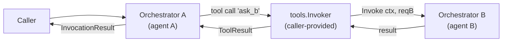

# Phase 1 — Composition Patterns

**Related decisions:** D01 (positioning), D05 (non-goals), D11 (positioning gaps not closed).
**Related artifacts:** [`03-non-goals.md`](03-non-goals.md) §Non-goal 2, [`02-positioning-and-principles.md`](02-positioning-and-principles.md) §5.
**Status:** adopted working position, gates Phases 2–5 design reviews.

---

## 1. Purpose

Non-goal 2 states that praxis does not provide multi-agent orchestration,
agent-to-agent coordination, role-based teams, shared memory, or mesh
orchestration. That commitment is correct and remains binding.

This document is the **positive counterpart** of Non-goal 2. It answers the
question that Non-goal 2 leaves open: if praxis does not coordinate agents,
how do callers who need multi-agent topologies build them on top of praxis
without the framework getting in their way?

The answer is **composition as primitive**: praxis guarantees that nested
`Invoke` calls compose correctly across its existing interfaces, so that a
multi-agent system can be assembled at the caller's layer using the
**agent-as-tool pattern**. praxis provides no coordination APIs. It does
provide the composition guarantees.

This document is input to every subsequent phase. Phases 2 through 5 must
preserve the six composition properties enumerated in §3. The `reviewer`
subagent and `review-phase` skill include a composability check against this
artifact as part of every phase review.

---

## 2. The agent-as-tool pattern

praxis models one agent call as one `AgentOrchestrator.Invoke`. A multi-agent
system is a graph of agents where some agents call others. The natural way to
express "agent A can call agent B" inside praxis's single-agent kernel is
through the `tools.Invoker` seam: agent B is exposed to agent A as a tool
whose implementation internally invokes agent B's own orchestrator.



A concrete sketch, in pseudo-Go:

```go
// agent A is configured with a tool 'ask_b' whose invoker
// delegates to a second praxis orchestrator.
orchB := praxis.NewOrchestrator(llmB, /* ... options for B ... */)

invoker := tools.InvokerFunc(func(
    ctx context.Context,
    ictx tools.InvocationContext,
    call tools.ToolCall,
) (tools.ToolResult, error) {
    switch call.Name {
    case "ask_b":
        reqB := buildRequestForB(ictx, call)
        resB, err := orchB.Invoke(ctx, reqB)
        return toToolResult(resB, err)
    default:
        return tools.ToolResult{Status: tools.StatusNotImplemented}, nil
    }
})

orchA := praxis.NewOrchestrator(llmA, praxis.WithToolInvoker(invoker))
result, err := orchA.Invoke(ctx, reqA)
```

This is not a praxis API. It is a caller-level pattern expressed entirely
through **existing** interfaces (`tools.Invoker`, `AgentOrchestrator`). praxis
does not know that agent A and agent B are related, and it does not need to.
What praxis must guarantee is that this pattern *works* — that the nested
invocation does not silently break trace correlation, budget accounting,
cancellation, error propagation, or identity chaining.

Those are the six composition properties. They are the entire contract.

---

## 3. The six composition properties

Each property is a constraint on the phase that owns it. A phase may not ship
a design that breaks any of these without an explicit amendment to this
document (recorded as a new decision with `Supersedes:` annotation per the
amendment protocol in [`01-decisions-log.md`](01-decisions-log.md) §Amendment
protocol).

### CP1 — Trace context propagation *(Phase 4)*

The nested `Invoke` call must produce a span that is a child of the caller's
current span, not a new trace root. Because praxis takes a `context.Context`
on every public method and OpenTelemetry propagates span context through
`context.Context`, this falls out of correct usage of `otel.Tracer.Start(ctx,
...)` inside the orchestrator — provided the `LifecycleEventEmitter` and the
span-start logic do not rebuild the context or drop the parent span. Phase 4
must assert this explicitly in its span-tree design and cover it with a
regression test in the conformance suite.

### CP2 — Lifecycle event correlation *(Phase 4)*

A nested invocation's lifecycle events must carry enough information for an
observability backend to reconstruct the parent-child relationship. The
framework's own `praxis.Event*` vocabulary does not need new event types, but
the emitted events must include a stable `invocation_id` for the current
invocation and a `parent_invocation_id` attribute when the current invocation
was started inside another invocation's `tools.Invoker`. The
`AttributeEnricher` remains the caller's seam for everything else; the
parent-child link is framework-owned because it is structural, not
caller-identity. Phase 4 must define where `parent_invocation_id` is read
from (the parent `InvocationContext` carried by the ambient `context.Context`)
and how it is exposed on events.

### CP3 — Budget composition *(Phase 2 / Phase 3)*

Callers must be able to enforce a **shared budget ceiling** across nested
invocations by passing the same `budget.Guard` instance into both the outer
and inner orchestrator. This requires two properties:

1. `budget.Guard` implementations are safe for concurrent use across multiple
   in-flight invocations (stated as a contract on the interface, not a
   property of the default implementation alone).
2. Budget accounting operations (token add, tool-call add, cost add,
   duration check) are idempotent per event and are not repeated when the
   nested `Invoke` bubbles its result back through the outer tool call path.

Phase 2 covers the concurrency contract; Phase 3 covers the method surface
and the documented composition semantics. Neither phase may design a Guard
API that assumes a one-to-one mapping between Guard instances and invocations.

### CP4 — Cancellation propagation *(Phase 2)*

The outer invocation's `context.Context` must cancel the inner invocation
through the normal `ctx.Done()` path. This is already the Go contract for
`context.Context` and already stated in the seed §4.5, but it must be
re-asserted as a composition property: Phase 2's cancellation model cannot
introduce any alternative cancellation channel (e.g., a cancel-only struct
field or a sideband signal) that would not cross the `tools.Invoker`
boundary. The only cancellation path is the context, so the only guarantee
needed is that the context is threaded through the tool invoker as-is.

### CP5 — Typed error propagation *(Phase 3 / Phase 4)*

When a nested `Invoke` returns a `TypedError` — particularly
`BudgetExceededError`, `PolicyDeniedError`, `ApprovalRequiredError`, or a
`CancellationError` — the outer `tools.Invoker` must be able to propagate
the original `Kind()` through its `ToolResult` return without the outer
orchestrator reclassifying it as a generic tool error. Two sub-requirements:

1. `tools.ToolResult` carries enough structure to embed a `TypedError` (or
   an error pointer) so that the outer loop's error-handling path can
   `errors.As` into the original kind.
2. The outer orchestrator's classifier does not collapse a propagated
   `BudgetExceededError` into `ToolError{SchemaViolation}`. Classifier
   precedence must prefer propagated typed errors over outer reclassification.

Phase 3 owns the `ToolResult` shape; Phase 4 owns the classifier precedence
rules. Both must co-design this property.

### CP6 — Identity chaining *(Phase 5)*

If the outer invocation is identified via `identity.Signer`, the inner
`tools.Invoker` must be able to construct a signer for the inner invocation
that can reference the outer agent's identity as "caller agent" in its claim
set. praxis does not mandate a specific claim name (that is a Phase 5
decision), but it must guarantee that:

1. The outer invocation's signed identity is readable from the
   `InvocationContext` passed to `tools.Invoker`.
2. Constructing an inner `AgentOrchestrator` with its own `identity.Signer`
   does not require any framework-level registration of the outer identity.
   The caller wires the chain in its own signer implementation.

Phase 5 owns the JWT claim set and the key-lifecycle contract for
`identity.Signer`, and must ensure the claim structure has room for a
caller-agent reference without prescribing one.

---

## 4. What this document does not do

It does not:

- Introduce any new praxis interface. All six properties are constraints on
  interfaces already enumerated in seed §5.
- Specify a multi-agent coordination protocol, a team model, a router, a
  message bus, or a shared-memory abstraction. If a caller needs those, the
  correct library is **Google ADK for Go**, as already stated in D03 and
  §5 of [`02-positioning-and-principles.md`](02-positioning-and-principles.md).
- Guarantee any particular multi-agent topology works efficiently. The
  composition pattern is correct by construction; performance characteristics
  of deeply nested invocations are the caller's concern and are not part of
  the v1.0 stability commitment.
- Override Non-goal 2. The non-goal remains intact. This document clarifies
  that "no multi-agent" does not mean "composition-hostile".

---

## 5. Phase-by-phase obligations

| Phase | Obligation | Properties owned |
|---|---|---|
| Phase 2 — Core Runtime | Cancellation model, budget concurrency contract | CP3 (concurrency half), CP4 |
| Phase 3 — Interface Contracts | `ToolResult` shape admits typed-error embedding; `budget.Guard` method surface is composition-friendly | CP3 (surface half), CP5 (shape half) |
| Phase 4 — Observability & Errors | Span child-of semantics, `parent_invocation_id` attribute, classifier precedence for propagated typed errors | CP1, CP2, CP5 (classifier half) |
| Phase 5 — Security & Trust | Outer identity readable from `InvocationContext`; claim set has room for caller-agent reference | CP6 |

Each of these phases' `00-plan.md` files will carry a **"Composability check
— see `docs/phase-1-api-scope/06-composition-patterns.md`"** line in its
constraints section, and each phase review will verify the owned properties
are preserved. Discovery that a property is not preservable under a proposed
design is a gating concern for that phase and must be resolved either by
redesign or by an explicit amendment to this document.

---

## 6. Forward record

This artifact closes a gap in the Phase 1 non-goals: it states the positive
commitment that Non-goal 2 leaves implicit. The decision to record it as a
dedicated Phase 1 artifact (rather than edit the seed or re-open D05) follows
the amendment protocol — the seed remains the extraction baseline, D05
remains the non-goals catalog, and this file becomes the composability
contract that downstream phases consult.

A future decision (expected in Phase 2, at the earliest opportunity in the
Phase 2 decisions log) will add a "Composability as primitive" subsection to
Non-goal 2 in [`03-non-goals.md`](03-non-goals.md) via the amendment protocol,
cross-referencing this document. Until that decision is recorded, this
document alone carries the composition contract.
