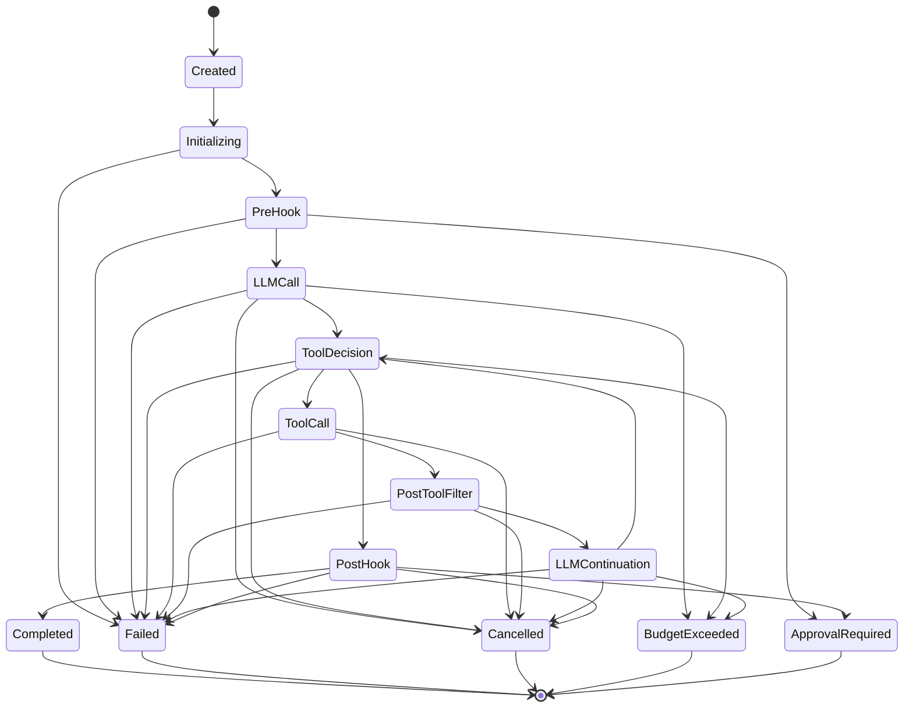

# Phase 2 — State Machine

**Scope:** canonical state list, transition allow-list, terminal rules.
**Binds:** D15, D16, D17 in `01-decisions-log.md`.
**Supersedes in part:** seed §1, §8, §4.2 per the Phase 1 amendment protocol.

---

## 1. Canonical state list

The `praxis` invocation state machine has **14 states**: 9 non-terminal and
5 terminal. The ordering is chosen so terminal states are grouped at the end,
allowing the Go representation to be a typed integer with `iota` and a
single range check for the terminal predicate.

### 1.1 Non-terminal states (9)

| # | State | Purpose | Owned events (D18) |
|---|---|---|---|
| 1 | `Created` | Invocation object allocated; no work begun | `EventTypeInvocationStarted` (on exit) |
| 2 | `Initializing` | Agent config and tool list resolved; `PriceProvider` snapshot taken (D26); wall-clock starts (D25) | `EventTypeInitialized` (on exit) |
| 3 | `PreHook` | Pre-invocation policy hook chain (`PreInvocation` phase) | `EventTypePreHookStarted`, `EventTypePreHookCompleted` |
| 4 | `LLMCall` | Pre-LLM filters applied; LLM request in flight | `EventTypeLLMCallStarted`, `EventTypeLLMCallCompleted` |
| 5 | `ToolDecision` | LLM response received; tool calls inspected against budget | `EventTypeToolDecisionStarted` |
| 6 | `ToolCall` | Tool invoker dispatching; credentials fetched; identity signing optional | `EventTypeToolCallStarted`, `EventTypeToolCallCompleted` |
| 7 | `PostToolFilter` | Post-tool filter chain scrubs untrusted output | `EventTypePostToolFilterStarted`, `EventTypePostToolFilterCompleted` |
| 8 | `LLMContinuation` | Tool results injected into conversation; budget re-check; next LLM call prepared | `EventTypeLLMContinuationStarted` |
| 9 | `PostHook` | Post-invocation policy hook chain (`PostInvocation` phase) | `EventTypePostHookStarted`, `EventTypePostHookCompleted` |

### 1.2 Terminal states (5)

| # | State | Enters from | Terminal event (D18) |
|---|---|---|---|
| 10 | `Completed` | `PostHook` | `EventTypeInvocationCompleted` |
| 11 | `Failed` | `Initializing`, `PreHook`, `LLMCall`, `ToolDecision`, `ToolCall`, `PostToolFilter`, `LLMContinuation`, `PostHook` | `EventTypeInvocationFailed` |
| 12 | `Cancelled` | `LLMCall`, `ToolDecision`, `ToolCall`, `PostToolFilter`, `LLMContinuation`, `PostHook` | `EventTypeInvocationCancelled` |
| 13 | `BudgetExceeded` | `LLMCall`, `ToolDecision`, `LLMContinuation` | `EventTypeBudgetExceeded` |
| 14 | `ApprovalRequired` | `PreHook`, `PostHook` | `EventTypeApprovalRequired` |

Terminal states have no outgoing edges.

### 1.3 Reconciliation with the seed

| Seed reference | Reconciliation |
|---|---|
| Seed §1 "11-state machine" narrative | Superseded by D15. Narrative rounding, not a semantic split. |
| Seed §8 "11 states" in v0.1.0 roadmap | Superseded by D15. Update v0.1.0 scope to "all 14 states and allow-listed transitions". |
| Seed §4.1 component diagram label ("11 states") | Superseded. The diagram is illustrative; the authoritative count is D15. |
| Seed §4.2 "13 numbered states" table | Superseded by D15 + D17. Seed §4.2 enumerated 13 states with 4 terminals; D17 adds `ApprovalRequired` as a fifth terminal. |
| Seed §4.2 "4 terminal states" | Superseded. Five terminals: `Completed`, `Failed`, `Cancelled`, `BudgetExceeded`, `ApprovalRequired`. |

No seed text is edited in place. D15 and D17 are the authoritative records
per the Phase 1 amendment protocol.

---

## 2. Transition allow-list (D16)

Every legal `(from, to)` edge is listed below. Every unlisted edge is
illegal and must be rejected by the state machine at runtime.

| From | Allowed transitions |
|---|---|
| `Created` | `Initializing` |
| `Initializing` | `PreHook`, `Failed` |
| `PreHook` | `LLMCall`, `Failed`, `ApprovalRequired` |
| `LLMCall` | `ToolDecision`, `Failed`, `Cancelled`, `BudgetExceeded` |
| `ToolDecision` | `ToolCall`, `PostHook`, `Failed`, `Cancelled`, `BudgetExceeded` |
| `ToolCall` | `PostToolFilter`, `Failed`, `Cancelled` |
| `PostToolFilter` | `LLMContinuation`, `Failed`, `Cancelled` |
| `LLMContinuation` | `ToolDecision`, `Failed`, `Cancelled`, `BudgetExceeded` |
| `PostHook` | `Completed`, `Failed`, `ApprovalRequired`, `Cancelled` |
| `Completed` | *(terminal)* |
| `Failed` | *(terminal)* |
| `Cancelled` | *(terminal)* |
| `BudgetExceeded` | *(terminal)* |
| `ApprovalRequired` | *(terminal)* |

### 2.1 Rationale for specific edges

- **`Initializing -> Failed`.** Captures tool-list resolution failures and
  `PriceProvider` lookup failures at the earliest substantive work point.
- **`PreHook -> ApprovalRequired`.** Primary approval trigger: a
  `PolicyHook` at `PreInvocation` returns an approval-required decision.
- **`PostHook -> ApprovalRequired`.** Secondary trigger: a post-invocation
  policy review of a completed turn demands human oversight.
- **`ToolDecision -> BudgetExceeded`.** Budget re-check before tool dispatch;
  a breach here prevents entry to `ToolCall`.
- **`LLMContinuation -> BudgetExceeded`.** Budget re-check at the loop's
  re-entry point catches multi-turn cost accumulation (including the
  token-dimension post-call overshoot from C3).
- **`ToolCall -> Cancelled`.** Hard cancel while a tool invoke is in flight;
  partial result discarded. The 500 ms soft grace is handled at the
  cancellation layer (D21), not as a distinct state transition.
- **`ToolCall -> BudgetExceeded` is not listed.** Tool-call count is
  evaluated at `ToolDecision` before dispatch; cost and wall-clock re-checks
  happen at `LLMContinuation` after the tool returns. `ToolCall` is
  I/O-bound and does not perform budget arithmetic.

### 2.2 Rationale for excluded edges

- **`ToolCall -> ApprovalRequired` is not legal.** Tool invokers express
  denials as `ToolResult{Status: StatusDenied}` per seed §5; the
  orchestrator injects that back into the conversation as a structured
  result. Approval is a policy-hook privilege.
- **`LLMCall -> ApprovalRequired` is not legal.** Pre-LLM filters can
  `Block` (routes to `Failed`); they cannot demand approval.
- **`Created -> Cancelled` is not legal.** Cancellation before substantive
  work routes through `Initializing -> Failed` if the orchestrator detects a
  precondition violation, or is simply not observed (the caller never
  received an `InvocationResult`). Cancellation only becomes meaningful
  after the invocation is doing work.
- **`PreHook -> Cancelled` is not legal.** Pre-invocation hook evaluation
  is treated as atomic for the purposes of cancellation; a cancel during
  hook evaluation is honored at the next state boundary (`LLMCall`).

---

## 3. State diagram



---

## 4. Terminal immutability rule

Once the state machine enters any terminal state, no further `Transition`
call succeeds. Attempts to transition out of a terminal state are a
programmer error:

- In debug builds, they may panic via an explicit state-machine assertion.
- In production builds, they return a classified `SystemError` and are
  recorded via a `telemetry.LifecycleEventEmitter` event for investigation.
- They never silently corrupt the state.

This rule is the foundation for the soft/hard cancel precedence decisions
in D21: because terminal state is immutable, a cancel signal arriving after
`ApprovalRequired` or `BudgetExceeded` has been entered cannot overwrite
the terminal. The governance invariant — that approval and budget breaches
appear as themselves in the audit trail, never as cancellations — follows
directly.

---

## 5. Canonical tool cycle

The tool-use loop repeats the cycle:

```
ToolDecision -> ToolCall -> PostToolFilter -> LLMContinuation -> ToolDecision
```

until the LLM emits an end-of-turn response (routing `ToolDecision ->
PostHook`) or a terminal condition intervenes (`Failed`, `Cancelled`,
`BudgetExceeded`). The state machine itself does not impose a maximum cycle
count; cycle-count budgeting is enforced by the `budget.Guard`
tool-call-count dimension, which is checked at `ToolDecision` and at
`LLMContinuation`.

Parallel tool calls (provider advertises `SupportsParallelToolCalls`) are
handled within a single `ToolCall` → `PostToolFilter` pair: the loop
goroutine dispatches all calls concurrently (D24), collects results on the
loop goroutine, then emits the full set of tool-cycle events before
transitioning to `LLMContinuation`. Concern C2 in the decisions log
documents the resulting observability constraint.

---

## 6. Go representation note (advisory for Phase 3)

Phase 3 decides the Go type. The recommended shape:

- `state.State` as a typed integer (`type State uint8`) with `iota`
  constants in the order listed in §1.1–§1.2 (non-terminals first, terminals
  last).
- A predicate `func (s State) IsTerminal() bool { return s >= Completed }`
  backed by the ordering.
- The D16 adjacency table as a static `map[State][]State` literal in the
  `state` package, exposed read-only and used by both the runtime and the
  property-based tests.
- Illegal transitions return a `errors.TypedError` whose `Kind()` is
  `ErrorKindSystem` (seed §5 taxonomy).

Phase 3 may adjust field names and the exact representation; the 14-state
count and the adjacency table itself are load-bearing and not re-opened
without a D15/D16 amendment.
