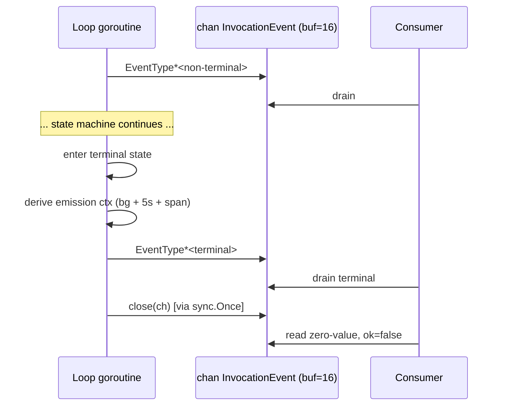

# Phase 2 — Streaming and Events

**Scope:** `InvokeStream` event taxonomy, ordering guarantees, channel close
protocol, backpressure, zero-wiring minimum event set.
**Binds:** D18, D19, D20, D27 in `01-decisions-log.md`.
**Refines:** seed §4.4.

---

## 1. Transport contract

`AgentOrchestrator.InvokeStream` returns a `<-chan InvocationEvent` with a
**buffer of 16** (seed §4.4, retained as working default). The loop
goroutine is the sole producer (D24) and the sole closer (D19). The caller
is responsible for draining the channel in its own goroutine(s); the
framework does not bundle an SSE handler or any other transport.

Ordering of the next three sections:

- **§2** enumerates the 19 event types and their emission points.
- **§3** lists the ordering guarantees.
- **§4** gives the canonical event subsequences for the zero-wiring paths.
- **§5** specifies the close protocol and the backpressure rules.
- **§6** pins the `InvocationEvent` struct shape as prose, to be finalized
  in Phase 3.

---

## 2. Event type enumeration (D18)

All 19 event types are exported from the `praxis` package under the
`EventType*` prefix. Names contain no banned identifier (seed §6.1) and no
consumer-specific namespace.

### 2.1 Non-terminal events (14)

| Event type | Emitted at | Notes |
|---|---|---|
| `EventTypeInvocationStarted` | `Created -> Initializing` | First event on every stream |
| `EventTypeInitialized` | `Initializing -> PreHook` | Agent config resolved, price snapshot taken (D26), wall-clock started (D25) |
| `EventTypePreHookStarted` | entry to `PreHook` | Pre-invocation policy chain begins |
| `EventTypePreHookCompleted` | `PreHook -> LLMCall` | All pre-invocation policies returned `Allow` |
| `EventTypeLLMCallStarted` | entry to `LLMCall` | Pre-LLM filters applied, request in flight |
| `EventTypeLLMCallCompleted` | `LLMCall -> ToolDecision` | LLM response received |
| `EventTypeToolDecisionStarted` | entry to `ToolDecision` | Budget re-check before dispatch. **No `*Completed` bracket:** `ToolDecision` is a synchronous in-loop check (budget arithmetic + tool-call inspection), not an I/O-bound operation. The next observable event is either `EventTypeToolCallStarted` (tool cycle continues), `EventTypePostHookStarted` (end of turn), or a terminal event (budget breach, failure, cancel). This asymmetry with I/O-bound states is deliberate — emitting a `Completed` bracket for a purely synchronous transition would add noise without observability value. |
| `EventTypeToolCallStarted` | `ToolDecision -> ToolCall` | One per tool call; carries tool name and call ID |
| `EventTypeToolCallCompleted` | `ToolCall -> PostToolFilter` | Tool invocation returned |
| `EventTypePostToolFilterStarted` | entry to `PostToolFilter` | One per tool result |
| `EventTypePostToolFilterCompleted` | `PostToolFilter -> LLMContinuation` | Filter chain produced output |
| `EventTypeLLMContinuationStarted` | entry to `LLMContinuation` | Tool results injected; next LLM call prepared |
| `EventTypePostHookStarted` | entry to `PostHook` | Post-invocation policy chain begins |
| `EventTypePostHookCompleted` | entry to terminal from `PostHook` | All post-invocation policies returned a terminal-advancing decision |

### 2.2 Terminal events (5)

Each of the five terminal states has a 1:1 event type.

| Event type | Terminal state | Carries |
|---|---|---|
| `EventTypeInvocationCompleted` | `Completed` | `InvocationResult` fields |
| `EventTypeInvocationFailed` | `Failed` | non-nil `Err` satisfying `errors.TypedError` |
| `EventTypeInvocationCancelled` | `Cancelled` | soft-vs-hard cancel marker |
| `EventTypeBudgetExceeded` | `BudgetExceeded` | offending dimension + current `BudgetSnapshot` |
| `EventTypeApprovalRequired` | `ApprovalRequired` | conversation snapshot + approval metadata for caller-owned resume (D07) |

**Total: 19 event types.**

---

## 3. Ordering guarantees

The orchestrator enforces the following ordering guarantees. Each is
validated by the property-based test suite (see `06-state-machine-invariants.md`,
INV-11 through INV-17).

1. **First event.** `EventTypeInvocationStarted` is always the first event
   on every stream. It is never omitted, never reordered, and is emitted
   before any state work begins.
2. **Last event.** Exactly one terminal event (from the five in §2.2) is
   the last event on every stream, immediately before channel close.
3. **Exactly-one-terminal.** No stream emits two terminal events.
4. **Tool-cycle brackets.** For any tool call with ID `C`, the four events
   `EventTypeToolCallStarted{C}`, `EventTypeToolCallCompleted{C}`,
   `EventTypePostToolFilterStarted{C}`, `EventTypePostToolFilterCompleted{C}`
   appear in that order before the next `EventTypeLLMContinuationStarted`.
5. **Parallel tool-call dispatch ordering.** Under parallel tool dispatch
   (D06 + D24, revised during Phase 2 review), the loop goroutine emits
   events in two bursts for the batch:
   - **Burst 1 (before dispatch):** all `EventTypeToolCallStarted` events
     for the batch, in call-ID order. These arrive on the channel **before**
     any tool sub-goroutine runs, so the "has started" semantic is correct.
   - **Burst 2 (after `errgroup.Wait`):** all `EventTypeToolCallCompleted`
     events followed by all `EventTypePostToolFilterStarted` and
     `EventTypePostToolFilterCompleted` events, in call-ID order.
   Per Concern C2, per-tool completion ordering is not preserved in the
   event stream: consumers see all `*Started` events up front, then a pause
   for the slowest tool, then all `*Completed` and post-filter events in a
   burst. Each call ID's four events remain contiguous within Burst 1 (one
   event) and Burst 2 (three events).
6. **`LLMCall` brackets.** `EventTypeLLMCallStarted` always precedes
   `EventTypeLLMCallCompleted` for the same LLM call.
7. **Hook brackets.** `EventTypePreHookStarted` precedes
   `EventTypePreHookCompleted`; `EventTypePostHookStarted` precedes
   `EventTypePostHookCompleted`. If the stream terminates mid-hook (e.g.,
   `PreHook -> Failed` or `PreHook -> ApprovalRequired`), the matching
   `*Completed` is not emitted.
8. **No-send-after-close.** No event is emitted after the channel is
   closed; the channel is closed exactly once (D19).

---

## 4. Canonical event subsequences

### 4.1 Zero-wiring, one-turn, no-tools (D27)

With `llm.Provider` injected and all other wiring at null defaults:

```
1.  EventTypeInvocationStarted
2.  EventTypeInitialized
3.  EventTypePreHookStarted
4.  EventTypePreHookCompleted
5.  EventTypeLLMCallStarted
6.  EventTypeLLMCallCompleted
7.  EventTypeToolDecisionStarted
8.  EventTypePostHookStarted
9.  EventTypePostHookCompleted
10. EventTypeInvocationCompleted
[channel close]
```

**Total: 10 events.** Every state on the path emits at least one event. The
null `hooks.AllowAllPolicyHook` still produces the `PreHook*` and `PostHook*`
brackets — the event sequence is structurally determined by the state
machine traversal, not by whether hook implementations are non-null.

### 4.2 Zero-wiring, one-tool, two-turn

One tool call, two LLM turns, all other wiring null. The sequence inserts
a tool-cycle subsequence between `EventTypeToolDecisionStarted` and the
second LLM call:

```
1.  EventTypeInvocationStarted
2.  EventTypeInitialized
3.  EventTypePreHookStarted
4.  EventTypePreHookCompleted
5.  EventTypeLLMCallStarted
6.  EventTypeLLMCallCompleted
7.  EventTypeToolDecisionStarted
8.  EventTypeToolCallStarted        (call ID = C1)
9.  EventTypeToolCallCompleted      (call ID = C1)
10. EventTypePostToolFilterStarted  (call ID = C1)
11. EventTypePostToolFilterCompleted (call ID = C1)
12. EventTypeLLMContinuationStarted
13. EventTypeLLMCallStarted
14. EventTypeLLMCallCompleted
15. EventTypeToolDecisionStarted
16. EventTypePostHookStarted
17. EventTypePostHookCompleted
18. EventTypeInvocationCompleted
[channel close]
```

**Total: 18 events.**

### 4.3 Terminal divergences

For every terminal path, the stream begins identically to the path above
and diverges at the terminal transition. Examples:

- **`PreHook -> Failed`:** `…, EventTypePreHookStarted, EventTypeInvocationFailed, [close]`.
- **`PreHook -> ApprovalRequired`:** `…, EventTypePreHookStarted, EventTypeApprovalRequired, [close]`.
- **`LLMCall -> BudgetExceeded`:** `…, EventTypeLLMCallStarted, EventTypeBudgetExceeded, [close]`. Note that `EventTypeLLMCallCompleted` is **not** emitted — the terminal event replaces the normal `*Completed` event.
- **`ToolCall -> Cancelled` (hard cancel):** `…, EventTypeToolCallStarted, EventTypeInvocationCancelled, [close]`.

---

## 5. Close protocol and backpressure

### 5.1 Close protocol (D19)

The stream channel is closed exactly once, by the loop goroutine, via a
`sync.Once`-guarded wrapper in a deferred call. The terminal event is sent
first; the close follows. Consumers draining the channel until it closes
always see the terminal event before the close, either buffered in the
channel or delivered under the terminal emission context (§5.3).



### 5.2 Backpressure (D20)

Every send in the loop goroutine uses the canonical `select { case ch <- e:
case <-ctx.Done(): }` pattern. There are no non-blocking sends; no event is
ever silently dropped on a non-terminal path.

- Under normal flow, the 16-event buffer absorbs scheduler jitter between
  producer and consumer. The producer never blocks unless the buffer fills.
- If the consumer stalls and the buffer fills, the producer blocks on the
  send. The `ctx.Done()` arm is the only mechanism that can unblock it.
- If the parent context is cancelled while the producer is blocked, the
  `ctx.Done()` arm fires, the state machine transitions to `Cancelled`, and
  the terminal event send is attempted under the terminal emission context
  (D22 — derived from `context.Background()` with 5s deadline, not the
  cancelled parent). See §5.3.

### 5.3 Terminal event delivery under backpressure

Terminal event sends are the only sends that use a context independent of
the caller's parent context. This is a deliberate exception (seed §4.5,
extended by D22 to all five terminals):

1. The loop goroutine enters a terminal state.
2. `internal/ctxutil.DetachedWithSpan(parentCtx, 5 * time.Second)` returns
   an emission context derived from `context.Background()` with a 5s
   deadline and the invocation's OTel span re-attached via
   `trace.ContextWithSpanContext`. See Concern C1.
3. `telemetry.LifecycleEventEmitter.Emit(emissionCtx, terminalEvent)` is
   called synchronously.
4. The terminal `InvocationEvent` is sent to the stream channel via a
   `select { case ch <- e: case <-emissionCtx.Done(): }`. If the consumer
   is still not reading at 5s, the terminal event is dropped — but the
   channel is still closed in step 5.
5. `sync.Once` closes the channel.

**Invariant.** Under any consumer behavior short of total stalling
(>5s without a read), the terminal event is delivered before channel close.
Only a catastrophically dead consumer sees a bare close.

---

## 6. `InvocationEvent` struct shape (prose — Phase 3 finalizes)

Every `InvocationEvent` carries at least:

| Field | Type (Phase 3 finalizes) | Presence |
|---|---|---|
| `Type` | `EventType` (typed constant) | always |
| `InvocationID` | `string` (opaque) | always, non-empty |
| `State` | `state.State` | always — state from which event was emitted |
| `At` | `time.Time` | always — wall-clock at emission |
| `Err` | `error` implementing `errors.TypedError` | non-nil only on `EventTypeInvocationFailed` |
| `ToolCallID` | `string` | non-empty only on tool-cycle events |
| `ToolName` | `string` | non-empty only on `EventTypeToolCallStarted` |
| `BudgetSnapshot` | `budget.BudgetSnapshot` | always — zero-value-safe when `budget.Guard` is null |

The struct is value-copyable: no pointer fields transfer ownership, so
consumers may store events safely (e.g., in a bounded history buffer) without
reasoning about aliasing.

Phase 3 assigns the final Go types (especially whether `EventType` is a
typed string or typed integer), decides whether `InvocationEvent` lives in
the `praxis` root package or the `orchestrator` sub-package, and finalizes
the `BudgetSnapshot` shape.

---

## 7. Decoupling contract compliance

No event type name, field name, or type in this document contains any
banned identifier per seed §6.1: no `custos`, no `reef`, no
`governance_event`, no hardcoded `org.id` / `agent.id` / `user.id` /
`tenant.id`, no consumer-branded namespace. The `EventType*` prefix under
`praxis.*` is the canonical neutral namespace per seed §6.2.

Caller-specific attribution (tenant, agent, user, request IDs) reaches the
lifecycle event stream via `telemetry.AttributeEnricher` (Phase 4), which
contributes opaque key-value attributes. The `praxis.InvocationEvent`
struct itself carries no caller-specific field.
