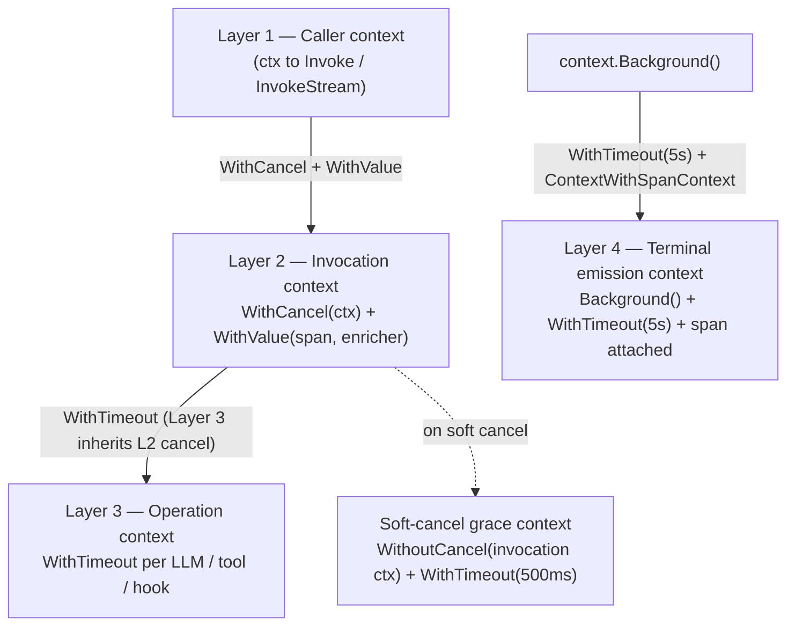
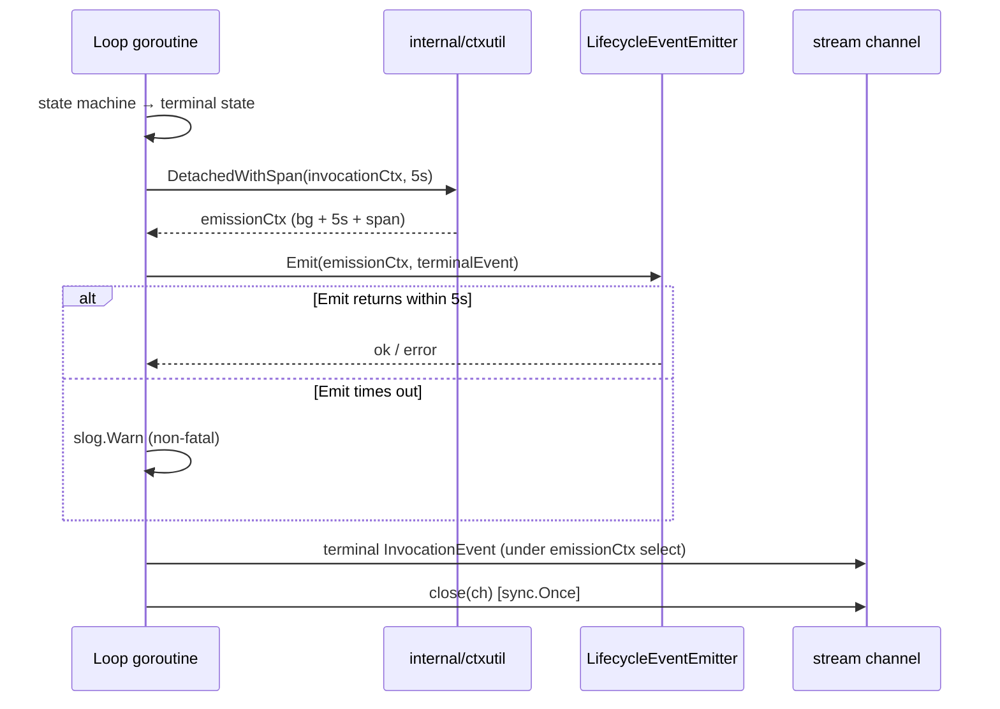

# Phase 2 — Cancellation and Context Propagation

**Scope:** soft/hard cancel matrix, terminal lifecycle emission invariant,
context propagation model, budget wall-clock boundary.
**Binds:** D21, D22, D23, D25, D26 in `01-decisions-log.md`.
**Refines:** seed §4.5, seed §4.4.

---

## 1. Two flavors of cancel (seed §4.5, confirmed)

`praxis` supports two cancellation flavors, both driven exclusively by
`context.Context`. This section confirms seed §4.5 without modification and
extends its rules to cover `ApprovalRequired` and `BudgetExceeded` terminal
interactions (D21).

| Flavor | Trigger | Behavior |
|---|---|---|
| **Soft cancel** | Client disconnect; `ctx.Cancel()` from the caller with no deadline | Current in-flight operation is given a 500 ms grace window to complete so its result lands in the audit trail, then transitions to `Cancelled`. |
| **Hard cancel** | Deadline elapsed (`ctx.Deadline()` passed); budget dimension breach detected by the orchestrator | Current operation is interrupted immediately; partial result is discarded; transitions to `Cancelled` (for deadline) or `BudgetExceeded` (for budget breach). |

The orchestrator distinguishes soft from hard cancel by inspecting
`ctx.Err()` alone:

- `errors.Is(ctx.Err(), context.Canceled)` → **soft cancel** (caller
  invoked `cancel()` manually, e.g., on client disconnect). The 500 ms
  grace window applies to in-flight operations.
- `errors.Is(ctx.Err(), context.DeadlineExceeded)` → **hard cancel** (the
  caller's deadline elapsed). No grace window; current operation is
  interrupted immediately.

The presence of a deadline on the parent context is **not** part of the
discriminant: a caller can set a generous timeout and then manually
`cancel()` before the deadline fires, producing `context.Canceled` (soft
cancel) even though the parent has a deadline. An earlier draft of this
document described the discriminant as "ctx.Err() and the presence of a
deadline," which is imprecise; the pinned rule is `ctx.Err()` type alone.

Budget-exceeded termination is a third path that is neither soft nor hard
cancel in this sense — it is orchestrator-driven self-termination via the
Layer 2 cancel handle (D23), not caller-context cancellation. The loop
detects it by checking the budget state directly, not via `ctx.Err()`.

The distinction is internal to the loop and is not exposed as a separate
API.

---

## 2. Cancel precedence matrix (D21)

The following matrix governs what happens when a cancel signal arrives at
each point in an invocation's lifetime. "Grace" means the 500 ms soft-cancel
window applies; "immediate" means the transition is taken on the next loop
iteration without delay.

| Situation when cancel arrives | Soft cancel outcome | Hard cancel outcome |
|---|---|---|
| `Created`, `Initializing` | Not observable (no edge from `Created`/`Initializing` to `Cancelled`). Precondition failures route to `Failed`. | Same |
| `PreHook` in progress | Hook evaluation is atomic (not interruptible). `PreHook -> Cancelled` is not legal per D16. The loop exits `PreHook` normally to its chosen next state (`LLMCall` or `ApprovalRequired`), then honors cancel at `LLMCall` entry (see §2.3). | Same |
| `LLMCall` in flight | 500 ms grace, then `Cancelled` | Immediate `Cancelled`; partial LLM response discarded |
| `ToolDecision` | `Cancelled` on next iteration (no in-flight I/O to grace) | Same |
| `ToolCall` in flight | 500 ms grace, then `Cancelled`. Operations inside the tool call that respect context cancellation — including `credentials.Resolver.Fetch` — must receive a `context.WithoutCancel`-derived context (C4). | Immediate `Cancelled`; tool result discarded |
| `PostToolFilter` in progress | 500 ms grace, then `Cancelled` | Immediate `Cancelled` |
| `LLMContinuation` (between I/O) | `Cancelled` on next iteration | Same |
| `PostHook` evaluating `ApprovalRequired` decision | **`ApprovalRequired` wins.** Terminal is set; cancel is ignored. | Same |
| `PostHook` evaluating normal completion | 500 ms grace if an I/O-bound hook is in flight, then `Cancelled` | Immediate `Cancelled` |
| Buffer-blocked channel send (non-terminal event) | **No grace.** `ctx.Done()` unblocks send; `Cancelled` on next iteration | Same |
| Buffer-blocked channel send (terminal event) | Terminal event send uses emission context (D22), not the cancelled parent. Delivery proceeds under the 5s emission deadline. | Same |
| After any terminal state entry | **Ignored.** Terminal state is immutable per D15/D16 rules. | Same |

### 2.1 Load-bearing precedence rules

1. **Terminal state is immutable.** Any cancel arriving after a terminal
   transition is ignored. The terminal event is still emitted on the
   emission context. This preserves the governance invariant: approval and
   budget breaches appear as themselves in the audit trail, never as
   cancellations.
2. **Soft-cancel grace applies only to in-flight operations.** It does not
   apply to buffer-blocked sends. A stuck consumer is treated as a hard-
   cancel trigger — the orchestrator does not wait 500 ms per event for a
   consumer that is not reading.
3. **Budget breach always wins.** If a soft cancel and a budget dimension
   breach arrive at the same loop iteration, the terminal is
   `BudgetExceeded`. Budget is a correctness invariant; cancel is a UX
   feature.
4. **Approval-required always wins.** If a soft cancel arrives while a
   `PolicyHook` is returning an approval-required decision, the terminal
   is `ApprovalRequired`. Governance precedence.

### 2.3 Cancel-during-`PreHook`: event-sequence pin

The matrix row above leaves the observable event stream ambiguous. Phase 2
pins the sequence explicitly:

1. `PreHook` completes its hook chain (atomic for cancel purposes).
2. `EventTypePreHookCompleted` is emitted.
3. Transition `PreHook -> LLMCall` is taken.
4. At the top of the `LLMCall` state handler, the loop checks
   `ctx.Done()` **before** emitting `EventTypeLLMCallStarted`. This check
   is the "next state boundary" referenced in the matrix.
5. If the check fires, the loop transitions `LLMCall -> Cancelled`
   without emitting `EventTypeLLMCallStarted`.
6. Terminal event `EventTypeInvocationCancelled` is emitted on the
   emission context (D22), then the channel is closed.

**Observed event sequence** for cancel-during-`PreHook`:

```
…, EventTypePreHookStarted, EventTypePreHookCompleted, EventTypeInvocationCancelled
[channel close]
```

`EventTypeLLMCallStarted` is **not** emitted on this path. The rule —
"check `ctx.Done()` at state entry **before** emitting the state's
`*Started` event" — is a general loop invariant, not a special case for
`PreHook`. Phase 3 must enforce it in the generated loop code.

### 2.4 Interaction with `credentials.Resolver` (Concern C4)

During the 500 ms soft-cancel grace window, the loop goroutine passes a
`context.WithoutCancel`-derived context (layered with a 500 ms
`context.WithTimeout`) to any in-flight operation that respects context
cancellation. This includes, critically, `credentials.Resolver.Fetch`. A
naive implementation that passes the still-cancelled parent context would
make soft cancel behaviorally identical to hard cancel for any tool call
that requires credential fetch — the resolver would see the cancelled
parent and fail immediately.

Phase 5 must document this expectation explicitly in the
`credentials.Resolver` contract. Phase 3 must ensure the operation-context
helper used internally by the loop routes through `context.WithoutCancel`
on the soft-cancel path.

### 2.5 Go version dependency

`context.WithoutCancel` was introduced in Go 1.21. The project's minimum is
Go 1.23+, so this is always available without a version guard.

---

## 3. Context propagation model (D23)

Context propagation follows four layers. Layers 1–3 form a normal
parent-child cancellation chain. Layer 4 is deliberately detached.

### 3.1 Layer diagram



Layer 4 is deliberately rooted at `context.Background()` rather than at
Layer 1/2, so caller cancellation cannot prevent the terminal lifecycle
event from reaching the emitter.

### 3.2 Layer semantics

**Layer 1 — Caller context.** The `ctx` passed to `Invoke` or `InvokeStream`.
The orchestrator does not modify it. It is the root of the cancellation
chain for Layers 2–3.

**Layer 2 — Invocation context.** Derived from Layer 1 via
`context.WithCancel` plus one or more `context.WithValue` calls to attach
the invocation's OTel span and any values contributed by
`telemetry.AttributeEnricher`. The orchestrator holds the cancel handle
and uses it to self-terminate on budget breach or approval decisions
without depending on the caller to cancel. All `ctx.Done()` checks in the
loop run against Layer 2, not Layer 1 directly.

**Layer 3 — Operation context.** Each blocking operation (LLM call, tool
call, hook evaluation) gets a child context derived from Layer 2 via
`context.WithTimeout` (operation timeout from `InvocationRequest` or
adapter defaults). Layer 3 inherits Layer 2 cancellation, so a Layer 2
cancel propagates to all in-flight operations.

**Layer 3 under soft cancel.** When a soft cancel is observed and the
current operation is mid-flight, the loop derives a temporary grace
context:

```
graceCtx, graceCancel := context.WithTimeout(
    context.WithoutCancel(invocationCtx),
    500 * time.Millisecond,
)
```

This context carries the invocation's values (span, enricher output) but
is insulated from the Layer 2 cancellation. The in-flight operation
completes (or the 500 ms deadline fires), then the loop advances to
`Cancelled`.

**Layer 4 — Terminal emission context.** Derived from `context.Background()`
with `WithTimeout(5 * time.Second)`. The invocation's OTel span is attached
via `trace.ContextWithSpanContext` (see Concern C1). Layer 4 is used **only**
for the synchronous terminal `LifecycleEventEmitter.Emit` call and the
terminal `InvocationEvent` send to the stream channel. It is independent of
Layers 1–3 for cancellation, which means a cancelled caller context cannot
prevent the terminal lifecycle event from reaching the emitter.

### 3.3 Why the orchestrator owns a Layer 2 cancel handle

If the orchestrator only held Layer 1 (the caller's context), it would have
no way to express budget or approval terminals as context cancellation —
only as error returns. This would break the invariant that "every blocking
operation in the loop respects `ctx.Done()`" (seed §4.5) because the loop
would have to check error sentinels at every operation boundary in
addition to the context. Holding a Layer 2 cancel handle unifies caller-
driven cancellation and orchestrator-driven self-termination under a
single idiomatic Go pattern.

---

## 4. Terminal lifecycle emission invariant (D22)

### 4.1 The invariant

Every terminal state entry — `Completed`, `Failed`, `Cancelled`,
`BudgetExceeded`, `ApprovalRequired` — triggers a synchronous terminal
lifecycle event emission running on a Layer 4 emission context (see §3.2).
The parent invocation context is not in the emission derivation chain.
Cancellation of the parent context cannot prevent the terminal event from
reaching the `telemetry.LifecycleEventEmitter`.

This invariant extends seed §4.5's original statement (which referenced
four terminals) to all five terminals, including `ApprovalRequired`.

### 4.2 Emission sequence



### 4.3 Non-negotiable behaviors

- **The 5-second deadline is not configurable in v1.0.** It is the bounded
  window within which a correctly-implemented emitter must complete a
  synchronous call to its sink under degraded network conditions. An
  emitter that cannot complete in 5s indicates an emitter implementation
  problem, not a framework tuning knob.
- **Emission failure is non-fatal to channel close.** If `Emit` returns an
  error or times out, the terminal `InvocationEvent` is still sent to the
  stream channel, the timeout/error is logged via `slog` at WARN level, and
  the channel is still closed. The audit trail is degraded (the lifecycle
  event may be missing from the external collector) but the caller-facing
  API contract — "stream closes with a terminal event" — is honored.
- **The `internal/ctxutil` package provides the single helper** that
  implements Layer 4 derivation with span re-attachment. No other code path
  may construct a Layer 4 context independently. This prevents the
  re-implementation-drift failure mode where one terminal path forgets to
  attach the span and emits unattributable lifecycle events.

---

## 5. Budget wall-clock boundary (D25) + `PriceProvider` snapshot (D26)

### 5.1 Boundary

- **Wall-clock start:** entry to `Initializing`. The same instant at which
  the `PriceProvider` snapshot is taken (D26). `Created` is allocation-only
  and is excluded.
- **Wall-clock stop:** terminal state entry. The 5-second terminal
  emission window (§4) is **excluded** from the measured duration.

### 5.2 Rationale

Excluding `Created` from the measured window prevents scheduling latency
under orchestrator load from consuming the caller's budget. Excluding the
terminal emission window prevents the meta-circular failure where
orchestrator bookkeeping causes `BudgetExceeded` on an invocation that
completed its work within budget.

### 5.3 Interaction with `ApprovalRequired`

When the state machine enters `ApprovalRequired`, wall-clock stops. The
caller's out-of-process approval workflow (which may take hours or days)
is not billed to this invocation's wall-clock dimension. If the caller
later submits a resume invocation (D07), the resume is a separate `Invoke`
call with its own `Initializing` entry and its own wall-clock start.

### 5.4 Token-cost dimension caveat (Concern C3)

Wall-clock, tool-call count, and wall-cost are checked at known
deterministic points. The token dimension is unique: the framework only
knows the token count of an LLM response **after** the provider returns it.
A budget check for tokens at `LLMCall -> ToolDecision` can therefore only
observe, not prevent, an overshoot of up to one LLM call's output-token
contribution. Phase 4's `BudgetExceededError` model must document this
explicitly: the `amount_exceeded` value may reflect a post-call discovery,
not a pre-call rejection.

This is the only budget dimension where over-budget-by-design is possible.
It is a physical consequence of the provider API, not a framework bug.

### 5.5 Go primitives

`time.Now()` at `Initializing` entry; `time.Since(start)` at terminal
state entry. No additional stdlib primitives required. The wall-clock
value is stored on the per-invocation `BudgetSnapshot` so every event can
carry a snapshot (see `03-streaming-and-events.md` §6).
