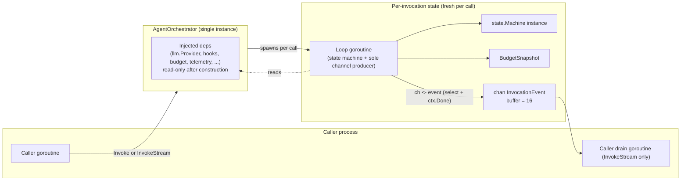

# Phase 2 — Concurrency Model

**Scope:** goroutine topology, concurrent-safety guarantee of
`AgentOrchestrator`, sole-producer rule, parallel tool-call dispatch.
**Binds:** D24 in `01-decisions-log.md`.
**Refines:** seed §5 ("safe for concurrent use"), seed §4.4.

---

## 1. Headline decision

**One goroutine per invocation.** The state-machine loop runs in a single
goroutine that advances transitions and sends events. There is no shared
worker pool across invocations. There is no producer/consumer split
*within* a single invocation.

This is the smallest topology that satisfies seed §5's "safe for concurrent
use" guarantee without introducing cross-invocation shared state.

---

## 2. Per-invocation topology

### 2.1 Lifecycle per `Invoke` call

1. Caller calls `Invoke(ctx, req)`.
2. Orchestrator allocates per-invocation state: new `state.Machine`, new
   `BudgetSnapshot` seeded from the `PriceProvider` (D26), new `chan
   InvocationEvent` (buffer 16), new Layer 2 invocation context (D23).
3. Orchestrator spawns the loop goroutine (one `go` statement).
4. For `Invoke`: the calling goroutine drains the channel internally,
   collecting the terminal event and returning `(InvocationResult, error)`.
   It blocks until the channel closes.
5. For `InvokeStream`: the orchestrator immediately returns the receive-end
   of the channel to the caller. The caller drains it in its own
   goroutine(s). The orchestrator does not own the consumer side.
6. The loop goroutine runs until it enters a terminal state, emits the
   terminal lifecycle event (D22), sends the terminal `InvocationEvent`,
   closes the channel via `sync.Once`, and exits.

### 2.2 Loop goroutine responsibilities

The loop goroutine is responsible for:

- Advancing the state machine (checking D16 transition legality).
- Calling injected dependencies (`llm.Provider.Complete`,
  `tools.Invoker.Invoke`, `hooks.PolicyHook.Evaluate`, etc.) under Layer 3
  operation contexts.
- Running the budget check at the four budget-check points
  (`ToolDecision`, `LLMContinuation`, terminal exit — plus passive
  wall-clock tracking throughout).
- Sending `InvocationEvent` values to the stream channel using the
  canonical `select + ctx.Done()` backpressure pattern.
- Emitting lifecycle events via `telemetry.LifecycleEventEmitter` on each
  state transition, with the terminal emission using the Layer 4 context.
- Closing the stream channel via `sync.Once` after the terminal event is
  sent.

The loop goroutine is **the sole producer** on the stream channel. No
other goroutine — not tool-call sub-goroutines, not hook callbacks, not
telemetry emitters — may send to the channel.

---

## 3. Concurrent-safety guarantee of `AgentOrchestrator`

A single `AgentOrchestrator` instance is **safe for N concurrent
`Invoke`/`InvokeStream` calls** (seed §5). The guarantee holds because:

1. **Per-invocation allocation.** All mutable state (state machine
   instance, budget snapshot, stream channel, invocation context) is
   allocated fresh on every call and owned by exactly one loop goroutine.
   There is no shared mutable state between invocations.
2. **Read-only injected dependencies.** The orchestrator's injected
   fields (`llm.Provider`, `hooks.PolicyHook`, `tools.Invoker`,
   `budget.Guard`, `budget.PriceProvider`, `telemetry.LifecycleEventEmitter`,
   `telemetry.AttributeEnricher`, `credentials.Resolver`, `identity.Signer`,
   `errors.Classifier`) are set at construction and never mutated. Their
   implementations **must be safe for concurrent use** — this is a contract
   the godoc on every Phase 3 interface will state explicitly.
3. **Isolation of cancellation.** Cancellation of one invocation's Layer 2
   context (whether by caller or by orchestrator self-termination) is
   isolated to that invocation's loop goroutine. No other invocation is
   affected.

### 3.1 What "safe for concurrent use" does **not** mean

The seed §5 guarantee does not mean:

- **Multi-tenancy.** `praxis` has no notion of tenants. Tenant isolation is
  entirely a caller concern, expressed via `telemetry.AttributeEnricher`
  and whatever tenant-scoped injection the caller performs when
  constructing per-request orchestrators or when resolving credentials.
- **Fair scheduling across invocations.** The orchestrator holds no
  scheduler. Concurrent invocations run as concurrent goroutines under the
  Go runtime scheduler, with no fairness guarantees from the framework.
- **Cross-invocation backpressure.** One invocation's budget, cancel, or
  close behavior does not affect another. If a consumer stalls on one
  `InvokeStream`, only that invocation's loop goroutine blocks.

### 3.2 What implementations of injected interfaces must guarantee

Every v1.0 interface's godoc (Phase 3) will carry the clause:
**"Implementations must be safe for concurrent use."** This is load-bearing
for the concurrent-safety guarantee above. The framework itself does not
serialize calls into injected dependencies; if the caller's
`tools.Invoker` is not goroutine-safe, concurrent invocations using the
same orchestrator will race through it.

---

## 4. Parallel tool-call dispatch (interaction with D06)

When the LLM returns multiple tool calls in a single response and the
provider's `Capabilities().SupportsParallelToolCalls` is true, the loop
goroutine dispatches the tool calls concurrently. The dispatch pattern
(revised after the Phase 2 reviewer found a naming-contract violation in
the original "collect all then emit" design):

1. At `ToolDecision -> ToolCall`, the loop goroutine iterates the batch in
   call-ID order and sends one `EventTypeToolCallStarted` per tool call
   **before** dispatch. All `*Started` events are on the channel before
   any tool sub-goroutine runs, preserving the "has started, not yet
   completed" semantic of the event name.
2. The loop goroutine then spawns N sub-goroutines (one per tool call in
   the batch) using `golang.org/x/sync/errgroup`. Each sub-goroutine calls
   `tools.Invoker.Invoke(ctx, invCtx, call)` with a Layer 3 operation
   context derived from the invocation context.
3. The loop goroutine waits on `errgroup.Wait()` for all sub-goroutines to
   complete.
4. After the wait returns, the loop goroutine iterates the collected
   results in call-ID order and sends `EventTypeToolCallCompleted`,
   `EventTypePostToolFilterStarted`, `EventTypePostToolFilterCompleted`
   for each call ID, in that order. All four-event brackets are
   contiguous per call ID.
5. **All events are sent from the loop goroutine**, not from sub-goroutines.
   The sole-producer invariant is preserved.

### 4.1 What consumers observe under parallel dispatch (Concern C2, revised)

After the revision above:

- `EventTypeToolCallStarted` events arrive **before** tool execution. A
  consumer using this event to set a "tool in progress" UI indicator is
  semantically correct — the tool has just been dispatched and is running.
- `EventTypeToolCallCompleted` and subsequent post-filter events arrive
  **after** the slowest tool in the batch has returned. A consumer waiting
  for per-tool completion to interleave with its matching `Started` will
  see all `Started` events up front, then a pause for the batch's slowest
  tool, then all `Completed`/`PostToolFilter*` events in a burst.
- Events for distinct call IDs within the same batch are **not**
  interleaved with their execution. Consumers cannot tell which tool
  finished first from the event stream alone; `At` timestamps reflect
  emission time from the loop goroutine, not tool return time.

This is the residual observability constraint of the v1.0 runtime. Phase 3's
`InvocationEvent` godoc must state it explicitly: under parallel dispatch,
individual tool completion ordering is not preserved in the event stream.
Consumers who need per-tool completion ordering should use a sequential
`llm.Provider` that does not advertise `SupportsParallelToolCalls`, or
attach their own timing at the `tools.Invoker` layer.

The alternative — letting sub-goroutines send their own `*Completed`
events directly to the stream channel — would break the sole-producer
invariant and require a mutex or a linearization channel. Concurrent sends
on a buffered channel are safe in Go but produce non-deterministic
ordering that other invariants (INV-15) cannot tolerate. For v1.0 the
sole-producer guarantee wins. Per-tool completion streaming is a v2
concern.

### 4.2 `golang.org/x/sync/errgroup` dependency

`errgroup` is a recorded dependency of `praxis` under `golang.org/x/sync`.
It is used for the parallel tool dispatch above and nowhere else in the
runtime. In-scope per the project's dependency stance (which permits
`golang.org/x/` extensions when genuinely needed).

The alternative — a manual `sync.WaitGroup` + error channel — is more
verbose and error-prone. Recording the choice here (C5) avoids
re-litigation during implementation.

---

## 5. Goroutine count per invocation (accounting)

For an ordinary single-turn invocation with no tools, the goroutine count
per invocation is **1** — just the loop goroutine.

For an invocation with N parallel tool calls in a single batch, the peak
goroutine count is **1 + N** during the batch dispatch window, dropping
back to 1 after the batch completes. For sequential batches (a tool cycle
that repeats), peaks and drops are observed per batch.

There is no background goroutine owned by the orchestrator for any
purpose — no metrics reporter, no heartbeat, no cleanup worker. Every
goroutine is scoped to an invocation and exits when the invocation
terminates. Orchestrator `Close` (if Phase 3 adds one) does not need to
coordinate goroutine shutdown because no goroutines outlive their
invocation.

---

## 6. Rejected alternatives

### 6.1 Shared worker pool

A shared worker pool would require a work queue, a bounded concurrency
cap shared across invocations, and goroutine-lifecycle management not
scoped to an invocation. It would introduce cross-invocation backpressure
(one slow invocation would block the pool for others) and shared mutable
state (the queue). Rejected for v1.0. Linear memory per invocation is
acceptable; the alternative degrades the concurrent-safety guarantee.

### 6.2 Producer/consumer split within an invocation

A design with a state-machine loop goroutine plus a separate sender
goroutine (with an internal channel between them) was considered. It
offers no observable benefit: backpressure from the external channel
would stall the sender goroutine, which would in turn stall the loop
goroutine via the internal channel, because the loop must wait for the
sender to preserve event ordering. The synchronization cost eliminates
the benefit, and the extra goroutine plus internal channel adds cost per
invocation. Rejected.

### 6.3 Parallel tool calls send events from sub-goroutines

Letting tool sub-goroutines send events directly to the stream channel
would break the sole-producer invariant. It is technically safe in Go
(multiple goroutines can send to a buffered channel) but produces
non-deterministic event ordering across parallel calls — one tool's
`ToolCallStarted` could be interleaved with another tool's
`ToolCallCompleted`. This would force consumers to re-order by
`ToolCallID` + timestamp, which is a worse contract than "batch-unit
delivery in deterministic order". Rejected for v1.0; the per-tool streaming
visibility gap is recorded as Concern C2.

---

## 7. Summary table

| Aspect | Decision |
|---|---|
| Goroutines per ordinary invocation | 1 (loop goroutine) |
| Goroutines per invocation during N-way parallel tool batch | 1 + N, then back to 1 |
| Channel producer | Loop goroutine only (sole-producer rule) |
| Channel closer | Loop goroutine only, via `sync.Once` |
| Cross-invocation shared state | None (read-only injected deps excluded) |
| Orchestrator background goroutines | None |
| Parallel tool dispatch primitive | `golang.org/x/sync/errgroup` |
| Concurrent-safety requirement on injected deps | Every implementation must be safe for concurrent use (godoc contract, Phase 3) |
