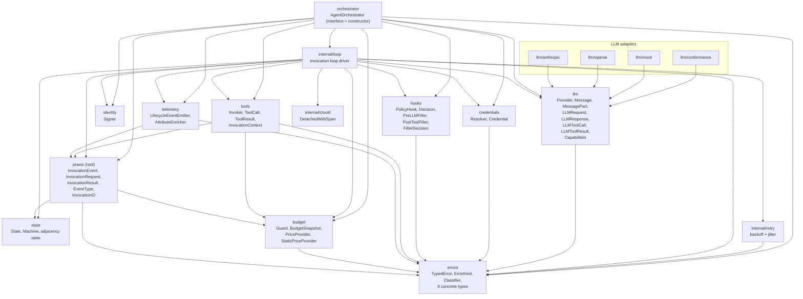

# Go Architect: Package Layout and Type Placement — Phase 3

**Author:** go-architect subagent
**Phase:** 3 — Interface Contracts
**Consumes:** seed §7, D01–D15, D15–D28, Phase 3 `00-plan.md`
**Produces:** package dependency graph, type placement decisions, constructor
pattern, internal vs exported boundaries, null-implementation placement.

> **D51 reconciliation note.** This document was produced before the reviewer
> pass. D51 resolved the contradiction between this document's
> `orchestrator/` sub-package approach and D32's root-package approach by
> adopting the sub-package layout (this document's recommendation). However,
> specific details (option function names, BudgetSnapshot field names, zero-wiring
> example code) may differ from the canonical definitions in the numbered
> artifact files. Where this document conflicts with `02-orchestrator-api.md`,
> `05-budget-interfaces.md`, or `01-decisions-log.md`, the numbered artifacts
> are authoritative.

---

## 1. The Core Problem: Cross-Cutting Types

Before drawing a package graph, the fundamental tension must be named
explicitly: several types are consumed by many packages, and the wrong
placement creates import cycles.

**The problematic triad:**

- `InvocationEvent` references `state.State`, `budget.BudgetSnapshot`, and
  `errors.TypedError` (all three from separate packages in the seed layout).
- `tools.InvocationContext` references `budget.BudgetSnapshot` and
  potentially `state.State`.
- The `orchestrator` package must import all leaf packages — but leaf
  packages must not import `orchestrator`.

The seed §7 layout does not address this. If `InvocationEvent` lives in
`orchestrator/`, and `orchestrator` imports `budget`, `errors`, `state`, and
`telemetry`, and `telemetry` imports `orchestrator` for `InvocationEvent`,
you have a cycle:

```
orchestrator → telemetry → orchestrator   (CYCLE)
```

The resolution is a shared-types layer — a `praxis` root package that holds
types referenced by multiple packages. This is the standard Go solution
(analogous to `net/http` defining `Handler` and `Request` in the same
package that the mux, transport, and client all use).

---

## 2. Package Layout

```
github.com/MODULE_PATH_TBD/
├── praxis.go                 Root package: shared types (InvocationEvent,
│                             InvocationRequest, InvocationResult,
│                             EventType constants, InvocationID type)
│
├── orchestrator/             AgentOrchestrator interface + constructor
│   └── orchestrator.go
│
├── state/                    State type, Machine interface, adjacency table
│   └── state.go
│
├── llm/                      Provider interface + agnostic message types
│   ├── llm.go                (Message, MessagePart, LLMRequest, LLMResponse,
│   │                          LLMToolCall, LLMToolResult, Capabilities)
│   ├── conformance/          Shared adapter test suite
│   ├── anthropic/            Shipped adapter
│   ├── openai/               Shipped adapter (also Azure via base URL)
│   └── mock/                 In-memory mock for consumer tests
│
├── tools/                    Invoker interface, ToolCall, ToolResult,
│   └── tools.go              InvocationContext, NullInvoker
│
├── hooks/                    PolicyHook, Decision, PreLLMFilter,
│   └── hooks.go              PostToolFilter, FilterDecision, chain runners,
│                             AllowAllPolicyHook, no-op filters
│
├── budget/                   Guard, PriceProvider, BudgetSnapshot,
│   └── budget.go             StaticPriceProvider, NullGuard,
│                             NullPriceProvider
│
├── errors/                   TypedError, ErrorKind, Classifier,
│   └── errors.go             eight concrete types, default Classifier
│
├── telemetry/                LifecycleEventEmitter, AttributeEnricher,
│   └── telemetry.go          NullEmitter, NullEnricher
│
├── credentials/              Resolver, Credential, NullResolver
│   └── credentials.go
│
├── identity/                 Signer, NullSigner
│   └── identity.go
│
├── internal/
│   ├── loop/                 Invocation loop (state machine driver)
│   ├── retry/                Backoff + jitter
│   └── ctxutil/              DetachedWithSpan (background ctx + span)
│
└── examples/
    ├── minimal/
    ├── tools/
    ├── policy/
    ├── filters/
    └── streaming/
```

---

## 3. Package Dependency Graph



**Packages that have zero imports from the praxis tree (pure leaf nodes):**

- `state` — depends only on stdlib
- `errors` — depends only on stdlib
- `credentials` — depends on `errors` only
- `identity` — depends only on stdlib
- `hooks` — depends on `errors` only
- `llm` — depends on `errors` only
- `ictxutil` (`internal/ctxutil`) — depends only on stdlib and OTel SDK

---

## 4. Type Placement Decisions

### 4.1 `InvocationEvent` and `EventType`

**Package:** `praxis` (root package)

**Rationale.** `InvocationEvent` references `state.State`,
`budget.BudgetSnapshot`, and `errors.TypedError` (Phase 2 §6 table). The
caller draining a `<-chan InvocationEvent` imports `praxis`; the
`telemetry.LifecycleEventEmitter.Emit` method takes an `InvocationEvent`
argument, so `telemetry` must import the type. If `InvocationEvent` lived
in `orchestrator`, and `telemetry` imported `orchestrator`, and `orchestrator`
imported `telemetry` (which it must to inject a `LifecycleEventEmitter`), the
cycle would be:

```
orchestrator → telemetry → orchestrator   (CYCLE — broken by this decision)
```

Placing `InvocationEvent` in the root `praxis` package breaks this cycle:
`telemetry` imports `praxis` (not `orchestrator`); `orchestrator` imports
`telemetry`. No cycle.

The `EventType` constants (`EventTypeInvocationStarted`, etc.) live alongside
`InvocationEvent` in the root `praxis` package, consistent with the seed §6.2
naming convention `praxis.Event*`.

### 4.2 `InvocationRequest` and `InvocationResult`

**Package:** `praxis` (root package)

**Rationale.** These are the primary caller-visible request and response
types. `AgentOrchestrator.Invoke(ctx, InvocationRequest) (InvocationResult,
error)` is the entry point. Callers import `praxis` for the request/result
types and `orchestrator` to construct the facade. Placing them in
`orchestrator` would force callers to import `orchestrator` just to build a
request, creating an awkward two-import entry for simple use cases. Placing
them in `praxis` root keeps the 5-line smoke path clean:

```go
import "MODULE_PATH_TBD/praxis"
import "MODULE_PATH_TBD/orchestrator"
```

`InvocationResult` carries `[]Message` (conversation history), so it
references `llm.Message`. This means `praxis` root imports `llm`. That is
acceptable: `llm` is a pure leaf (no import from the praxis tree), so there
is no cycle risk.

**Alternative considered:** Keep them in `orchestrator`. Rejected: creates
the caller-facing import split described above and complicates the README
example.

### 4.3 `InvocationContext` (passed to `tools.Invoker`)

**Package:** `tools`

**Rationale.** `InvocationContext` is only ever created by the orchestration
loop and consumed by `tools.Invoker` implementations. It does not need to be
in the root package. Placing it in `tools` keeps the `tools.Invoker` interface
self-contained.

`InvocationContext` carries:
- `InvocationID string` — opaque identifier
- `BudgetSnapshot budget.BudgetSnapshot` — read-only snapshot at dispatch time
- `SpanContext trace.SpanContext` — for nested trace correlation (CP1), using
  only the OTel span context type, not a full `context.Context` duplication
- `IdentityToken string` — the outer identity token if signed (CP6, may be
  empty)

This means `tools` imports `budget` (for `BudgetSnapshot`) and the OTel SDK
(for `trace.SpanContext`). Both are acceptable. The OTel dependency in `tools`
is isolated to the `SpanContext` type — a lightweight value struct from
`go.opentelemetry.io/otel/trace`.

**Cycle check:** `tools` imports `budget` and `errors`. `budget` imports
`errors`. Neither `budget` nor `errors` imports `tools`. No cycle.

### 4.4 `BudgetSnapshot`

**Package:** `budget`

**Rationale.** It is a value type describing the state of a `budget.Guard`.
It is owned conceptually by the budget package and exported from there.
Packages that need it (e.g., `tools` for `InvocationContext`, `praxis` root
for `InvocationEvent`) import `budget`. `budget` is a leaf that imports only
`errors`, so this does not create cycles.

Shape (Phase 3 finalizes field names and types per D35):

```go
// budget.BudgetSnapshot is a value-copyable point-in-time view of budget
// consumption. It is cheap to allocate: no heap allocation in the zero case.
type BudgetSnapshot struct {
    WallClockElapsed   time.Duration
    InputTokens        int64
    OutputTokens       int64
    ToolCallCount      int64
    EstimatedCostMicro int64           // micro-dollars, integer to avoid float drift
    ExceededDimension  BudgetDimension // zero value = no breach
}
```

### 4.5 `Message` and `MessagePart`

**Package:** `llm`

**Rationale.** `Message` and `MessagePart` are the LLM-agnostic conversation
types. They are only meaningful in the context of an LLM interaction. Placing
them in `llm` keeps the LLM abstraction layer cohesive. `InvocationRequest`
(in `praxis` root) carries an initial `[]llm.Message` and `InvocationResult`
carries the final `[]llm.Message`, so the root `praxis` package imports `llm`.
This is a one-directional dependency; `llm` imports only `errors`.

**Alternative considered:** A separate `msg` package. Rejected: unnecessary
package fragmentation. `llm` is already a well-scoped package, and `Message`
is not used by any package that does not already import `llm`.

### 4.6 `ErrorKind` enum

**Package:** `errors`

**Rationale.** `ErrorKind` is the taxonomy backing `errors.TypedError.Kind()`.
It belongs in the same package as the interface it supports. `errors` is a
pure leaf (stdlib only).

### 4.7 `state.State` type and adjacency table

**Package:** `state`

**Rationale.** The state machine is a self-contained concern. The adjacency
table (D16 allow-list) belongs in `state` alongside the type, exposed as a
read-only `map[State][]State` for both the runtime loop and the property-based
tests. `state` imports nothing from the praxis tree.

The `state.Machine` public surface is also in `state`. `internal/loop` imports
`state` but `state` does not import `internal/loop` — one-directional
dependency.

---

## 5. Import Cycle Analysis

### 5.1 Known tension points

**Tension 1: `InvocationEvent` references multiple packages.**

`InvocationEvent` (Phase 2 §6) carries:
- `State state.State`
- `Err error` (satisfying `errors.TypedError`)
- `BudgetSnapshot budget.BudgetSnapshot`

If `InvocationEvent` lives in `orchestrator`:
- `orchestrator` imports `state`, `budget`, `errors` ✓
- `telemetry` imports `orchestrator` to hold `InvocationEvent` ✓
- `orchestrator` imports `telemetry` to inject `LifecycleEventEmitter` — **CYCLE**

Resolution: `InvocationEvent` lives in `praxis` root.
- `praxis` imports `state`, `budget`, `errors` ✓
- `telemetry` imports `praxis` ✓
- `orchestrator` imports `telemetry` ✓
- `orchestrator` imports `praxis` ✓
- No cycle anywhere in this chain.

**Tension 2: `tools.InvocationContext` references `budget.BudgetSnapshot`.**

- `tools` imports `budget` ✓
- `budget` imports `errors` ✓
- `errors` imports nothing from the praxis tree ✓
- `orchestrator` imports `tools` ✓
- No cycle.

**Tension 3: `errors` types referenced by every package.**

`errors` is a pure leaf. Every package may import `errors` without risk.
This is the same pattern as `io.EOF` — the error sentinel package sits at
the bottom of the import graph.

**Tension 4: `hooks.Decision` may carry a `TypedError`.**

A `PolicyHook` returning `Deny` may want to include a typed error in the
`Decision` for caller inspection. `hooks` imports `errors`. No cycle: `errors`
does not import `hooks`.

### 5.2 Complete DAG (textual)

Topological order from leaves to root (each package imports only packages
listed before it):

```
Level 0 (pure leaves):
  state, errors, identity, ictxutil (internal/ctxutil)

Level 1 (imports Level 0 only):
  budget    → errors
  hooks     → errors
  llm       → errors
  iretry    → errors
  credentials → errors

Level 2 (imports Level 0–1):
  praxis    → state, budget, errors, llm
  tools     → budget, errors  (+OTel trace SDK)
  telemetry → praxis, errors  (+OTel SDK)

Level 3 (imports Level 0–2):
  iloop     → state, errors, budget, telemetry, tools, hooks, llm,
               credentials, identity, praxis, ictxutil, iretry

Level 4 (public facade):
  orchestrator → praxis, llm, tools, hooks, budget, errors,
                  telemetry, credentials, identity, iloop

Level 5 (adapters, no reverse imports):
  llm/anthropic  → llm
  llm/openai     → llm
  llm/mock       → llm
  llm/conformance → llm
```

Zero cycles anywhere in this graph. Each level only imports packages from
earlier levels.

### 5.3 Cross-cutting imports that need explicit justification

| Importer | Importee | Why |
|---|---|---|
| `praxis` (root) | `llm` | `InvocationRequest`/`Result` carry `[]llm.Message` |
| `praxis` (root) | `budget` | `InvocationEvent` carries `BudgetSnapshot` |
| `praxis` (root) | `state` | `InvocationEvent` carries `State` |
| `tools` | `budget` | `InvocationContext` carries `BudgetSnapshot` |
| `telemetry` | `praxis` | `Emit` takes `praxis.InvocationEvent` |
| `orchestrator` | all level 0–2 | facade aggregates all dependencies |

No surprises in the list above. The root `praxis` package is the intended
aggregation point for types shared across packages.

---

## 6. Constructor Pattern and Functional Options

### 6.1 Design decision

Use `type Option func(*config)` with an unexported `config` struct. This is
the canonical Go functional-option pattern (Dave Cheney, `google/go-cloud`
style). The alternative — an `Option interface{ apply(*config) }` — adds an
extra type and is only justified when options need to implement multiple
methods. `praxis` options are single-application functions; the function type
wins for simplicity and inline readability.

### 6.2 The `config` struct

```go
// config holds all optional dependencies for an AgentOrchestrator.
// It lives in the orchestrator package (unexported). The zero value
// is valid and produces null/noop implementations for everything.
type config struct {
    invoker    tools.Invoker
    policyHook hooks.PolicyHook
    preLLM     hooks.PreLLMFilter
    postTool   hooks.PostToolFilter
    guard      budget.Guard
    prices     budget.PriceProvider
    emitter    telemetry.LifecycleEventEmitter
    enricher   telemetry.AttributeEnricher
    resolver   credentials.Resolver
    signer     identity.Signer
    classifier errors.Classifier
    // non-interface options
    invocationIDFunc func() string // defaults to uuidv7 generator
}
```

All pointer fields default to `nil`. The constructor (`New`) fills nil fields
with their null implementations before returning.

### 6.3 Option functions

All Option functions live in the `orchestrator` package:

```go
type Option func(*config)

func WithInvoker(v tools.Invoker) Option {
    return func(c *config) { c.invoker = v }
}

func WithPolicyHook(v hooks.PolicyHook) Option {
    return func(c *config) { c.policyHook = v }
}

func WithPreLLMFilter(v hooks.PreLLMFilter) Option {
    return func(c *config) { c.preLLM = v }
}

func WithPostToolFilter(v hooks.PostToolFilter) Option {
    return func(c *config) { c.postTool = v }
}

func WithBudgetGuard(v budget.Guard) Option {
    return func(c *config) { c.guard = v }
}

func WithPriceProvider(v budget.PriceProvider) Option {
    return func(c *config) { c.prices = v }
}

func WithLifecycleEmitter(v telemetry.LifecycleEventEmitter) Option {
    return func(c *config) { c.emitter = v }
}

func WithAttributeEnricher(v telemetry.AttributeEnricher) Option {
    return func(c *config) { c.enricher = v }
}

func WithCredentialResolver(v credentials.Resolver) Option {
    return func(c *config) { c.resolver = v }
}

func WithIdentitySigner(v identity.Signer) Option {
    return func(c *config) { c.signer = v }
}

func WithErrorClassifier(v errors.Classifier) Option {
    return func(c *config) { c.classifier = v }
}

// WithInvocationIDFunc overrides the default UUIDv7 invocation ID generator.
// The provided function must return a non-empty string and be safe for
// concurrent use.
func WithInvocationIDFunc(f func() string) Option {
    return func(c *config) { c.invocationIDFunc = f }
}
```

### 6.4 The `New` constructor

```go
// New constructs a new AgentOrchestrator with the given LLM provider and
// optional configuration. provider is the sole required dependency; all
// other dependencies default to null or noop implementations (see package
// docs for the full default set). New panics if provider is nil.
//
// The returned orchestrator is safe for concurrent use across multiple
// Invoke and InvokeStream calls.
func New(provider llm.Provider, opts ...Option) *Orchestrator {
    if provider == nil {
        panic("orchestrator.New: provider must not be nil")
    }
    cfg := &config{}
    for _, o := range opts {
        o(cfg)
    }
    // Fill nil fields with their null implementations.
    if cfg.invoker == nil {
        cfg.invoker = tools.NullInvoker{}
    }
    if cfg.policyHook == nil {
        cfg.policyHook = hooks.AllowAllPolicyHook{}
    }
    if cfg.preLLM == nil {
        cfg.preLLM = hooks.NullPreLLMFilter{}
    }
    if cfg.postTool == nil {
        cfg.postTool = hooks.NullPostToolFilter{}
    }
    if cfg.guard == nil {
        cfg.guard = budget.NullGuard{}
    }
    if cfg.prices == nil {
        cfg.prices = budget.NullPriceProvider{}
    }
    if cfg.emitter == nil {
        cfg.emitter = telemetry.NullEmitter{}
    }
    if cfg.enricher == nil {
        cfg.enricher = telemetry.NullEnricher{}
    }
    if cfg.resolver == nil {
        cfg.resolver = credentials.NullResolver{}
    }
    if cfg.signer == nil {
        cfg.signer = identity.NullSigner{}
    }
    if cfg.classifier == nil {
        cfg.classifier = errors.DefaultClassifier{}
    }
    if cfg.invocationIDFunc == nil {
        cfg.invocationIDFunc = defaultInvocationID // UUIDv7 via stdlib rand
    }
    return &Orchestrator{provider: provider, cfg: cfg}
}
```

### 6.5 Zero-wiring smoke path

Five lines (the README example):

```go
provider := anthropic.New(os.Getenv("ANTHROPIC_API_KEY"))
orch := orchestrator.New(provider)
req := praxis.InvocationRequest{
    Messages: []llm.Message{{Role: llm.RoleUser, Parts: []llm.MessagePart{{Text: "Hello"}}}},
    Model:    "claude-sonnet-4-5-20250514",
}
result, err := orch.Invoke(ctx, req)
fmt.Println(result.Response.Parts[0].Text)
```

`orchestrator.New` takes one argument. No import needed beyond `orchestrator`,
`praxis`, `llm`, and the chosen adapter. No construction ceremony.

### 6.6 Why `panic` on nil provider, not an error return

`New` panics on a nil provider rather than returning an error because:

1. A nil provider is a programmer error, not a runtime condition. The
   orchestrator cannot do any useful work without a provider; this is
   equivalent to `http.NewServeMux()` receiving a nil handler registry.
2. Returning `(*Orchestrator, error)` pollutes every construction site with
   an error check that can never be triggered in correct code, and it
   complicates the one-liner README example.
3. Precedent: `http.NewRequestWithContext`, `sql.Open`, and other stdlib
   constructors panic on structural programming errors. The community
   convention for "this is always the caller's fault" is panic-at-init-time.

For all other nil dependencies, the nil check is satisfied by the null
implementation insertion above — no panic, no error.

---

## 7. Internal vs Exported Boundaries

### 7.1 Rule

A package is `internal/` if and only if **all three** of these hold:

1. It carries no stable public interface (no method surface that a consumer
   would implement or depend on).
2. It is an implementation detail of the orchestrator's invocation kernel
   that a consumer should never need to import directly.
3. Exporting it would create a premature stability commitment for a concern
   that may evolve with the implementation.

### 7.2 The three `internal/` packages

**`internal/loop/`**
The invocation state-machine driver. It wires together all injected
dependencies into the actual goroutine that runs a single invocation. A
consumer never imports this. Its interface to the `orchestrator` package is
a single function:

```go
// internal/loop
func Run(ctx context.Context, cfg *loop.Config, ch chan<- praxis.InvocationEvent)
```

`loop.Config` holds the assembled, nil-checked dependencies plus the
per-invocation state (state machine instance, budget snapshot). It is
unexported at the outer level (the `orchestrator` package creates it and
passes it in).

**`internal/retry/`**
Backoff and jitter logic for transient LLM errors. Parameterized by
`errors.Classifier` output to drive retry/no-retry decisions. Consumers
never need to configure retry behavior directly; they control it by
providing an `errors.Classifier`. The retry algorithm itself is an
implementation detail.

**`internal/ctxutil/`**
The `DetachedWithSpan` helper (Phase 2 §5.3, Concern C1). Creates a
`context.Background()`-derived context with a bounded deadline and
re-attaches the invocation OTel span. This is a technical plumbing helper
with no consumer-visible semantics.

### 7.3 What is NOT in `internal/`

The following are exported because consumers need them:

- `state.Machine` — consumers who write property-based tests or custom loop
  implementations import this.
- `budget.BudgetSnapshot` — consumers inspect this from `InvocationEvent`.
- `errors` concrete types — consumers use `errors.As` against them.
- All null implementations — consumers use them in tests.

**Anti-pattern avoided.** Using `internal/` as a catch-all for "not ready
yet" is explicitly rejected. Every `internal/` package has a coherent,
named boundary reason above. Future implementation code that does not fit
one of those three reasons belongs in an exported package.

---

## 8. Null Implementation Placement

### 8.1 Decision: co-locate with the interface

Null implementations live in the **same package as the interface** they
implement. Rationale:

- Co-location is the canonical Go pattern for null objects (e.g.,
  `io.Discard` in `io`, `http.NoBody` in `net/http`).
- It avoids a `defaults/` or `null/` package that would become a grab-bag
  with no coherent boundary of its own.
- It keeps the test setup import list short: a test that wants `NullInvoker`
  already imports `tools` for the `Invoker` interface.
- The name uniqueness problem (two packages both defining a `NullSomething`)
  is avoided by package qualification: `tools.NullInvoker`,
  `telemetry.NullEmitter`, `credentials.NullResolver`.

### 8.2 Null implementation catalog

| Interface | Null implementation | Package |
|---|---|---|
| `tools.Invoker` | `tools.NullInvoker` | `tools` |
| `hooks.PolicyHook` | `hooks.AllowAllPolicyHook` | `hooks` |
| `hooks.PreLLMFilter` | `hooks.NullPreLLMFilter` | `hooks` |
| `hooks.PostToolFilter` | `hooks.NullPostToolFilter` | `hooks` |
| `budget.Guard` | `budget.NullGuard` | `budget` |
| `budget.PriceProvider` | `budget.NullPriceProvider` | `budget` |
| `telemetry.LifecycleEventEmitter` | `telemetry.NullEmitter` | `telemetry` |
| `telemetry.AttributeEnricher` | `telemetry.NullEnricher` | `telemetry` |
| `credentials.Resolver` | `credentials.NullResolver` | `credentials` |
| `identity.Signer` | `identity.NullSigner` | `identity` |
| `errors.Classifier` | `errors.DefaultClassifier` | `errors` |

### 8.3 `budget.StaticPriceProvider`

`budget.StaticPriceProvider` is not a null implementation — it is a useful
non-null default. It also lives in `budget/`. Consumers who supply a price
table use it directly.

### 8.4 No `defaults/` package

A `defaults/` package was considered (centralizes all null objects, simplifies
wiring by importing one package). Rejected because:

1. `defaults` would import every other package in the tree (to hold all null
   types), making it the highest node in the import graph with no consumer.
2. It would become a transitive dependency of every test that imports it,
   pulling in OTel, Anthropic SDK, and OpenAI SDK even when the test only
   needs `NullInvoker`.
3. The constructor already fills in all null defaults automatically. Callers
   who write tests do not need to import nulls explicitly — the orchestrator
   supplies them.

---

## 9. Notable Boundary Decisions and Trade-offs

### 9.1 `praxis` root package as shared-type hub

**Decision:** The root package holds `InvocationEvent`, `InvocationRequest`,
`InvocationResult`, `EventType` constants, and the `InvocationID` type.

**Trade-off:** The root package has more imports than a minimal root package
would (it imports `llm`, `budget`, `state`, `errors`). This is the explicit
cost of breaking the cycle. The alternative — scattering these types across
`orchestrator` or `telemetry` — creates cycles that are architecturally
worse. The root package being the cycle-breaker is a well-established Go
pattern.

**What the root package does NOT hold:** `AgentOrchestrator`, `New`, or any
behavior. It is strictly a type container. The `orchestrator` package holds
the interface and its constructor.

### 9.2 `orchestrator` package holds interface AND constructor

**Decision:** `orchestrator.AgentOrchestrator` (the interface) and
`orchestrator.New` (the constructor returning a concrete
`*orchestrator.Orchestrator`) live in the same package.

**Trade-off:** This means `orchestrator` imports every other package in the
tree (through its constructor). An alternative — a separate `orchestrator/v1`
for the interface and `orchestrator/impl` for the concrete struct — avoids this
but fragments the primary entry point without benefit. The import weight of the
`orchestrator` package is acceptable; it is the integration point by
definition.

### 9.3 `state.Machine` as an exported type

**Decision:** `state.Machine` is exported despite being an internal concern
of the invocation loop.

**Rationale:** The Phase 2 `02-state-machine.md` §6 advisory explicitly
recommends exposing the adjacency table read-only. The property-based test
suite (`gopter`) generates random transition sequences; those tests may live
in `state/` (package tests) or in a consuming test package that needs to
construct a `Machine` instance. Keeping `Machine` exported supports both.

An `internal/state/` placement would prevent external test packages from
constructing machines for property-based testing, which is a first-class
concern (seed §10).

### 9.4 OTel SDK import in `tools`

**Decision:** `tools.InvocationContext` carries a `trace.SpanContext` from
`go.opentelemetry.io/otel/trace`, which is a third-party import.

**Justification:** The CP1 composition pattern (nested trace correlation)
requires the invoker to propagate the outer span into its tool execution.
`trace.SpanContext` is a value struct with no heap allocation — exactly the
right coupling point. The alternative (carrying an opaque `map[string]any`
for span propagation) would force every invoker to know about OTel's
propagation format, which is worse coupling. OTel is an approved dependency
per the project's dependency stance.

---

## 10. `go.mod` Notes

Minimum Go version: **1.23** (locked by Phase 3 plan — `context.WithoutCancel`,
`log/slog`, and range-over-integer available without version guards).

Expected `go.mod` direct dependencies in the core module:

```
golang.org/x/sync                          — errgroup for parallel tool dispatch (C5)
go.opentelemetry.io/otel                   — span context in tools.InvocationContext
go.opentelemetry.io/otel/trace             — trace.SpanContext type
go.opentelemetry.io/otel/sdk               — telemetry default implementation
github.com/anthropics/anthropic-sdk-go     — llm/anthropic adapter only
github.com/openai/openai-go                — llm/openai adapter only
github.com/prometheus/client_golang        — telemetry metrics (Phase 4)
```

The Anthropic and OpenAI SDK imports are strictly isolated to their adapter
sub-packages (`llm/anthropic/`, `llm/openai/`). They do not appear in any
top-level package or in `internal/`. A consumer who uses only the Anthropic
adapter does not transitively compile the OpenAI SDK — Go's per-package
compilation ensures this.

**No `replace` directives in the main module.** The `examples/` directory
may use `replace` directives in their own `go.mod` files (each example is a
self-contained module) but the main `github.com/MODULE_PATH_TBD` module does
not.

---

## 11. Summary of Key Architectural Decisions

| Concern | Decision | Primary reason |
|---|---|---|
| Shared cross-cutting types | `praxis` root package | Break `orchestrator ↔ telemetry` cycle |
| `InvocationEvent` placement | `praxis` root | Referenced by `telemetry`, `orchestrator`, and callers — root is the only cycle-free location |
| `InvocationRequest` / `InvocationResult` placement | `praxis` root | Caller convenience; avoids two-import entry point |
| `EventType` constants | `praxis` root | Co-located with `InvocationEvent`; matches `praxis.Event*` namespace in seed §6.2 |
| `BudgetSnapshot` placement | `budget` | Owned by `budget`, imported where needed |
| `Message`, `MessagePart` placement | `llm` | Cohesive with LLM abstraction layer |
| `ErrorKind` placement | `errors` | Owned by error taxonomy package |
| `state.State` and adjacency table | `state` | Self-contained; exported for property tests |
| Null implementations | Same package as interface | Canonical Go pattern; avoids `defaults/` grab-bag |
| Constructor | `func New(llm.Provider, ...Option) *Orchestrator` | D12 compliance; panic on nil provider |
| Option type | `type Option func(*config)` | Simpler than interface-based; no multi-method requirements |
| `internal/` boundary rule | Only for implementation details with no consumer-visible surface | Prevents `internal/` sprawl |
| `internal/loop/` | Invocation loop driver | No consumer ever imports loop internals |
| `internal/retry/` | Backoff/jitter | Implementation detail of retry policy |
| `internal/ctxutil/` | `DetachedWithSpan` | Technical plumbing, no consumer semantics |
