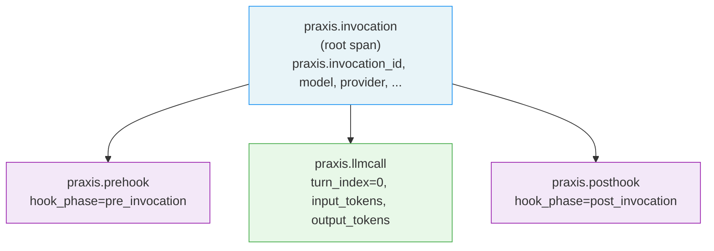
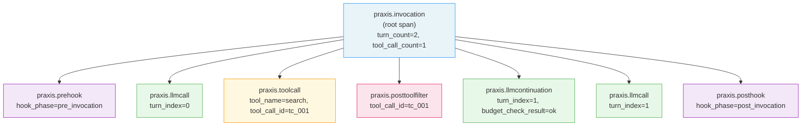
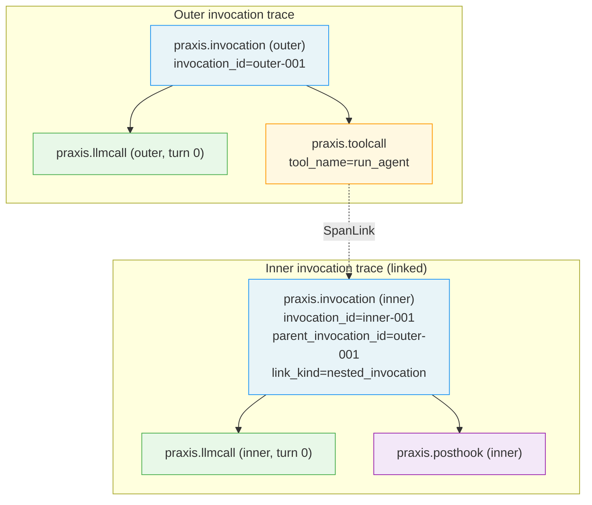

# Phase 4 — OTel Span Tree

**Decisions:** D53, D54, D55, D56
**Cross-references:** `03-metrics.md` (cardinality), `06-filter-event-mapping.md`
(AttributeEnricher flow), Phase 3 `08-telemetry-interfaces.md` (interfaces)

---

## 1. Overview

Every `praxis` invocation produces exactly one root OTel span
(`praxis.invocation`). Each I/O-bound and policy-evaluation phase of the
invocation produces a child span. Synchronous in-process checks (`ToolDecision`)
share the root span context — they do not get their own child span.

The span tree is the primary high-cardinality observability surface. Enricher
attributes (org ID, user ID, tenant ID) live on spans exclusively. They never
appear on Prometheus metrics labels (D57, D60).

---

## 2. Root span

**Name:** `praxis.invocation`

**Opened at:** `Initializing` state entry (before `AttributeEnricher.Enrich`
is called, so the enricher receives the root span context per the Phase 3
contract). Enricher attributes are set on the root span immediately after
`Enrich` returns.

**Closed at:** terminal state entry, after:
1. The terminal `InvocationEvent` has been emitted via
   `LifecycleEventEmitter.Emit`.
2. `span.SetAttributes` has been called with terminal-phase attributes.
3. `span.SetStatus` has been called (see terminal status mapping below).
4. For error terminals: `span.RecordError(err)` has been called.

**Root span attribute set:**

| Attribute key | Type | Source | Notes |
|---|---|---|---|
| `praxis.invocation_id` | string | framework | Unique per invocation; unbounded; span only |
| `praxis.model` | string | `InvocationRequest.Model` | Bounded; also a metric label |
| `praxis.provider` | string | `llm.Provider.Name()` | Bounded; also a metric label |
| `praxis.terminal_state` | string | framework (set at close) | One of 5 terminal state names |
| `praxis.error_kind` | string | framework (set at close) | One of 8 `ErrorKind` values; empty on `Completed`/`ApprovalRequired` |
| `praxis.parent_invocation_id` | string | `tools.InvocationContext` | Non-empty for nested invocations only (D56) |
| `praxis.turn_count` | int | framework (set at close) | Number of LLM turns completed |
| `praxis.tool_call_count` | int | framework (set at close) | Total tool calls dispatched |
| `praxis.input_tokens_total` | int | `BudgetSnapshot` | Cumulative input tokens at close |
| `praxis.output_tokens_total` | int | `BudgetSnapshot` | Cumulative output tokens at close |
| `praxis.cost_microdollars_total` | int | `BudgetSnapshot` | Cumulative cost at close |
| `praxis.elapsed_ms` | int | framework (wall-clock) | Invocation duration in milliseconds |
| *(enricher attributes)* | string | `AttributeEnricher.Enrich` | Caller-defined; attached at span open |

**Enricher attribute key constraint:** if an enricher attribute key matches a
`praxis.*` key, the framework key wins and the enricher's value for that key is
silently dropped. This prevents enrichers from overwriting core signals.

---

## 3. Child spans

### 3.1 `praxis.prehook`

**Opened at:** `PreHook` state entry.
**Closed at:** `PreHook` exit (to `LLMCall`, `Failed`, or `ApprovalRequired`).

| Attribute key | Type | Notes |
|---|---|---|
| `praxis.hook_phase` | string | `"pre_invocation"` |
| `praxis.hook_count` | int | Number of `PolicyHook` implementations evaluated |
| `praxis.verdict` | string | `"allow"`, `"deny"`, `"require_approval"`, or `"log"` |
| `praxis.audit_note` | string | Non-empty if `VerdictLog` (D64) |

### 3.2 `praxis.llmcall`

**Opened at:** `LLMCall` state entry (after pre-LLM filters complete).
**Closed at:** `LLMCall` exit.

| Attribute key | Type | Notes |
|---|---|---|
| `praxis.model` | string | Repeated from root for easy filtering without root span join |
| `praxis.provider` | string | Repeated from root |
| `praxis.turn_index` | int | 0-based turn number within the invocation |
| `praxis.input_tokens` | int | Tokens in this call's prompt |
| `praxis.output_tokens` | int | Tokens in this call's completion |
| `praxis.llm_status_code` | int | HTTP status from the provider, if available |
| `praxis.pii_redacted` | bool | `true` if `EventTypePIIRedacted` was emitted during pre-LLM filters |
| `praxis.injection_suspected` | bool | `true` if `EventTypePromptInjectionSuspected` was emitted |

**Note on raw content:** the message list and LLM response content are never
set as span attributes. They may contain user-provided content subject to
redaction rules (D58). Callers who need content in traces must implement a
`LifecycleEventEmitter` that writes to a content-aware backend.

### 3.3 `praxis.toolcall`

**Opened at:** `ToolCall` state entry, one span per tool call in the batch.
Under parallel dispatch (D24), all `praxis.toolcall` spans are created before
any tool goroutine runs, so the parent context (the current root span context)
is consistent.

**Closed at:** when the tool goroutine for this call completes.

| Attribute key | Type | Notes |
|---|---|---|
| `praxis.tool_name` | string | Bounded (tool set is finite per invocation) |
| `praxis.tool_call_id` | string | Per-call ID from the LLM response; unbounded; span only |
| `praxis.tool_subkind` | string | `ToolSubKind` value if the call fails; empty on success |
| `praxis.tool_status` | string | `"ok"`, `"error"`, `"denied"` |

### 3.4 `praxis.posttoolfilter`

**Opened at:** `PostToolFilter` state entry, one span per tool result.
**Closed at:** `PostToolFilter` exit for this result.

| Attribute key | Type | Notes |
|---|---|---|
| `praxis.tool_call_id` | string | Correlates with `praxis.toolcall` span |
| `praxis.pii_redacted` | bool | `true` if `EventTypePIIRedacted` was emitted |
| `praxis.injection_suspected` | bool | `true` if `EventTypePromptInjectionSuspected` was emitted |

### 3.5 `praxis.llmcontinuation`

**Opened at:** `LLMContinuation` state entry.
**Closed at:** `LLMContinuation` exit (budget re-check + next-call preparation complete).

| Attribute key | Type | Notes |
|---|---|---|
| `praxis.turn_index` | int | 0-based turn number of the upcoming LLM call |
| `praxis.budget_check_result` | string | `"ok"` or `"exceeded"` |
| `praxis.exceeded_dimension` | string | Non-empty if budget check fails (D62/C3) |

### 3.6 `praxis.posthook`

**Opened at:** `PostHook` state entry.
**Closed at:** `PostHook` exit (to `Completed`, `Failed`, `ApprovalRequired`,
or `Cancelled`).

| Attribute key | Type | Notes |
|---|---|---|
| `praxis.hook_phase` | string | `"post_invocation"` |
| `praxis.hook_count` | int | Number of `PolicyHook` implementations evaluated |
| `praxis.verdict` | string | Final verdict |
| `praxis.audit_note` | string | Non-empty if `VerdictLog` (D64) |

---

## 4. Why `ToolDecision` has no child span

`ToolDecision` is a synchronous in-process computation:

1. Inspect the LLM response for tool calls.
2. Call `budget.Guard.Check`.
3. Route to `ToolCall` (tool calls present, budget OK), `PostHook` (no tool
   calls), `BudgetExceeded`, `Cancelled`, or `Failed`.

This is pure CPU work with no I/O, no blocking, and no external calls. It
completes in sub-microsecond time in the common case. Creating an OTel span
allocates a `Span` struct, records a start timestamp, and defers an `End` call
— all for a span that would be too short-lived to carry meaningful timing
information. The `EventTypeToolDecisionStarted` lifecycle event provides
sufficient observability for the routing decision without span overhead.

---

## 5. Terminal span status mapping (D53)

| Terminal state | `span.SetStatus` | `span.RecordError` |
|---|---|---|
| `Completed` | `codes.Ok, ""` | No |
| `Failed` | `codes.Error, err.Kind()` | Yes (`TypedError`) |
| `Cancelled` | `codes.Error, "cancellation"` | Yes (`CancellationError`) |
| `BudgetExceeded` | `codes.Error, "budget_exceeded"` | Yes (`BudgetExceededError`) |
| `ApprovalRequired` | `codes.Ok, ""` | No |

`ApprovalRequired` is set to `codes.Ok` because it is a deliberate pause, not
a failure (D53 rationale). The `praxis.terminal_state` attribute on the root
span lets consumers distinguish `Completed` from `ApprovalRequired` without
treating either as an error.

---

## 6. C1 resolution: `DetachedWithSpan` (D54)

Terminal lifecycle emission runs under a Layer 4 context (derived from
`context.Background()` + 5-second deadline, per D22/D23). This context is
created after the caller's context is cancelled, so the invocation's OTel span
context would be lost unless explicitly re-attached.

`internal/ctxutil.DetachedWithSpan` solves this by carrying the full
`trace.Span` into the Layer 4 context via `trace.ContextWithSpan`.

**Sequence for terminal emission:**

```
1. Caller context cancelled (or terminal condition reached naturally)
2. Orchestrator captures span reference (held in per-invocation state)
3. Orchestrator calls: ctx4 := ctxutil.DetachedWithSpan(span)
   (ctx4 = context.Background() + 5s deadline + span re-attached)
4. Orchestrator sets terminal attributes on span via span.SetAttributes
5. Orchestrator calls span.SetStatus and (for errors) span.RecordError
6. Orchestrator calls emitter.Emit(ctx4, terminalEvent)
   (emitter can call trace.SpanFromContext(ctx4) to access the live span)
7. Orchestrator calls span.End()
8. Orchestrator closes the InvokeStream channel
```

Steps 4–7 happen sequentially on the orchestrator's loop goroutine. The 5-second
deadline on `ctx4` caps the time available to `Emit`. If `Emit` blocks past the
deadline, the orchestrator proceeds to `span.End()` regardless.

**Why the full Span and not just SpanContext:** if only `SpanContext` was
stored, `trace.ContextWithRemoteSpanContext` would be used instead, making the
span a "remote" span in the eyes of the OTel SDK. The `LifecycleEventEmitter`
would receive a context whose `SpanFromContext` returns a no-op span, preventing
the emitter from adding attributes or recording exceptions on the actual span.

---

## 7. CP1: Nested orchestrator span correlation (D55)

When a tool's `Invoker` implementation internally calls a nested
`AgentOrchestrator`, the inner orchestrator creates a new root span with a
`SpanLink` to the outer span.

The outer orchestrator populates `tools.InvocationContext.SpanContext` with its
current span context before dispatching the tool call. The inner orchestrator
reads this at `Initializing` entry and attaches the link when opening its root
span.

```
praxis.invocation (outer)
  praxis.llmcall (outer, turn 0)
  praxis.toolcall (outer, tool="run_analysis")
    [link --> praxis.invocation (inner)]

praxis.invocation (inner)          <-- new root, not a child
  [link_kind="nested_invocation"]  <-- link attribute
  praxis.llmcall (inner, turn 0)
  ...
```

This structure allows tracing backends to display the inner invocation as a
linked trace while keeping the outer trace's depth bounded. The `praxis.link_kind = "nested_invocation"` link attribute distinguishes nested invocation links
from other link types (e.g., async approval resume links).

---

## 8. CP2: `parent_invocation_id` on nested spans (D56)

The inner invocation's root span (`praxis.invocation`) carries the attribute
`praxis.parent_invocation_id` = the outer invocation's `InvocationID`. This
attribute is set by the framework from `tools.InvocationContext.ParentInvocationID`
at `Initializing` entry.

`praxis.parent_invocation_id` is a span-only attribute. It is not a Prometheus
label (it would have unbounded cardinality — one value per outer invocation).
Consumers who need to group inner invocations by their outer parent use span
queries, not metric queries.

---

## 9. Span tree diagrams

### 9.1 Single-turn invocation (no tool calls)



**Lifecycle:** root span opened at `Initializing`, `praxis.prehook` opened and
closed during `PreHook`, `praxis.llmcall` during `LLMCall`, `praxis.posthook`
during `PostHook`, root span closed at `Completed` entry.

### 9.2 Two-turn invocation with one tool call



**Note:** all child spans share the root span as their parent. The span tree is
one level deep for non-nested invocations. This keeps trace rendering simple and
avoids depth-limit issues in tracing backends.

**`ToolDecision` state** (between `praxis.llmcall` turn 0 and
`praxis.toolcall`) is not represented by a child span per D53. The routing
decision is observable via `EventTypeToolDecisionStarted` and via the
`praxis.toolcall` span's existence.

### 9.3 Nested orchestrator invocation



The inner invocation's root span is not a child of `praxis.toolcall` (outer).
The dashed `SpanLink` expresses the "triggered by" relationship. Each
invocation's trace is navigable independently, and the link allows backends to
show the full causal chain.

---

## 10. No-op tracer compatibility

The span tree design works with a no-op tracer provider. When
`trace.NewNoopTracerProvider()` is configured:

- All `span.SetAttributes`, `span.SetStatus`, `span.RecordError`, and
  `span.End` calls are no-ops.
- `trace.ContextWithSpan` and `trace.SpanFromContext` work correctly (they
  operate on the no-op span).
- `DetachedWithSpan` correctly re-attaches the no-op span; `Emit` receives
  a context whose `trace.SpanFromContext` returns the no-op span without
  panicking.
- Performance overhead is the cost of the `trace.Span` interface dispatch only
  (no allocation for no-op implementations).

Framework construction defaults to `trace.NewNoopTracerProvider()` when no
OTel provider is configured, satisfying the "must work without a full OTel
pipeline" requirement from the project brief.
