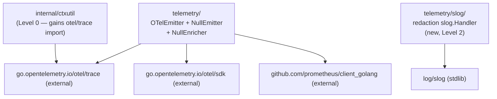

# Go Architect: Phase 4 Validation — Observability and Error Model

**Author:** go-architect subagent
**Phase:** 4 — Observability and Error Model
**Validates against:** Phase 3 `go-architect-package-layout.md` (package DAG,
import graph, `go.mod` dependency list)
**Consumes:** Phase 4 `00-plan.md`, Phase 3 `go-architect-package-layout.md`

---

## 1. Import Cycle Analysis: Adding `OTelEmitter` to `telemetry/`

**Finding: CLEAR — no new cycles introduced.**

The Phase 3 DAG places `telemetry` at Level 2, importing `praxis` (root) and
`errors`. Both are earlier levels (0 and 2 respectively). Adding an
`OTelEmitter` concrete type inside `telemetry/` expands the package's
implementation surface but does not change its import set within the praxis
tree. The new imports it requires are all external:

- `go.opentelemetry.io/otel/trace` — already approved, already in `go.mod`
- `go.opentelemetry.io/otel/sdk/trace` — already approved, already in `go.mod`
- `github.com/prometheus/client_golang/prometheus` — already approved, already
  in `go.mod`

Neither OTel SDK nor the Prometheus client imports anything from the praxis
module tree, so the DAG topology is unchanged. The `telemetry` package remains
at Level 2.

**Cycle check:**

```
OTelEmitter needs:
  praxis (root)  — already imported by telemetry (Level 2 → Level 1, safe)
  errors         — already imported by telemetry (Level 2 → Level 0, safe)
  otel SDK       — external, no reverse import
  prometheus     — external, no reverse import
```

No new intra-tree edges. No cycle risk.

---

## 2. Prometheus Metric Registration

**Recommendation: co-locate metric registration inside `telemetry/` alongside
`OTelEmitter`. Do not create a `telemetry/metrics/` sub-package. Do not
register from the orchestrator constructor.**

### Option analysis

**Option A — `telemetry/` (recommended)**

`OTelEmitter` is the natural owner of Prometheus metric handles: it emits
lifecycle events and is the only component that records metric observations.
Registration happens inside `NewOTelEmitter(...)` or a package-level `init`
function (prefer the former — `init`-based registration is difficult to test
and complicates multiple-registry scenarios). This keeps the Prometheus
dependency isolated to `telemetry/`; packages at Level 0–1 never see it.

A caller who does not wire an `OTelEmitter` incurs no Prometheus import cost
at all. The `NullEmitter` path compiles with zero Prometheus symbols.

**Option B — `telemetry/metrics/` sub-package**

Splitting metrics into a sub-package only makes sense if there are multiple,
independently usable metric exporters (e.g., a `StatsD` exporter alongside a
Prometheus exporter). For `v1.0`, there is one metrics target. A sub-package
adds a level of indirection with no consumer benefit. Rejected for `v1.0`;
reassess if a second metrics backend is added in `v1.x`.

**Option C — orchestrator constructor**

Placing registration in `orchestrator.New` would require `orchestrator` to
import Prometheus directly, spreading the metrics dependency to the highest
node in the graph. Every consumer of `orchestrator` would transitively compile
Prometheus even when using a custom `LifecycleEventEmitter`. This contradicts
the isolation goal established in Phase 3 §8.4. Rejected.

### Registration guard

`OTelEmitter` must accept a `prometheus.Registerer` (default:
`prometheus.DefaultRegisterer`) as a constructor parameter rather than
hard-coding the default registry. This makes the emitter testable (inject
`prometheus.NewRegistry()` per test) and supports multi-tenant deployments
where callers manage their own registries. This is a MINOR design constraint
to encode in D57.

---

## 3. slog Redaction Handler Placement

**Recommendation: a new `telemetry/slog/` sub-package.**

### Option analysis

**Option A — `telemetry/` (not recommended)**

Adding a `slog.Handler` implementation to `telemetry/` imports `log/slog`
into the package. This is a stdlib-only import (no cycle risk), but it mixes
two distinct concerns inside one package: lifecycle event emission (OTel spans,
Prometheus metrics) and log-level structured logging. The redaction handler is
independently useful — a caller may want to use the redaction handler without
wiring an `OTelEmitter`. Mixing them makes the two concerns inseparable.

**Option B — `telemetry/slog/` (recommended)**

A dedicated sub-package has a clean, single-responsibility boundary: "a
`slog.Handler` wrapper that redacts credential and PII fields." It imports
`log/slog` (stdlib) and `telemetry` (for the redacted-field constant list if
shared). Callers who do not use slog structured logging skip this package
entirely. The sub-package sits at Level 3 if it imports `telemetry`, or at
Level 2 if it is self-contained with its own redacted-field list. The latter
is cleaner.

Self-contained variant: `telemetry/slog/` imports only `log/slog` (stdlib) and
defines its own constant set for redacted field names. `telemetry/` does not
import `telemetry/slog/` — the dependency arrow is one-directional only if a
consumer needs both. No cycle is possible in either direction.

**Option C — `internal/` (not recommended)**

The redaction handler has a consumer-visible surface: callers who want
structured logging wrap their `slog.Logger` with it. Making it `internal/`
would prevent callers from using it independently, defeating its purpose.
Rejected.

### Impact on import graph

`telemetry/slog/` adds a new Level 2 leaf (if self-contained) or a new Level
3 node (if it imports `telemetry/`). Either way, no existing package imports
it from inside the praxis tree, so the topology is clean.

```
Level 2 (self-contained):
  telemetry/slog → log/slog (stdlib only)

Level 3 (if shared constants needed):
  telemetry/slog → telemetry, log/slog
```

Prefer the self-contained variant unless there is a concrete shared-constant
use case. Shared constant definitions can be extracted to a narrow internal
struct and copied rather than shared across packages.

---

## 4. New Dependency Validation

Phase 4 adds no dependencies beyond what Phase 3 already approved. The
complete addition to Phase 3 `go.mod` section is:

| Package | Already in Phase 3 `go.mod` | Status |
|---|---|---|
| `go.opentelemetry.io/otel` | Yes (Phase 3 §10) | Safe |
| `go.opentelemetry.io/otel/trace` | Yes (Phase 3 §10) | Safe |
| `go.opentelemetry.io/otel/sdk` | Yes (Phase 3 §10) | Safe |
| `github.com/prometheus/client_golang` | Yes (Phase 3 §10) | Safe |
| `log/slog` | stdlib (Go 1.21+, min is 1.23) | Safe |

**Finding: CLEAR — no new third-party dependencies.**

Phase 4 is budget-neutral on the dependency graph. The `go.mod` file requires
no new `require` directives. The Prometheus client remains isolated to
`telemetry/` as established in Phase 3.

One caveat: if `telemetry/slog/` is created as a sub-package with its own
`package` declaration, it must share the same `go.mod` (it is not a separate
module). This is standard Go sub-package behavior — no action required.

---

## 5. AttributeEnricher Cardinality Boundary

**Finding: CLEAR — the proposed design is implementable within the existing
package structure.**

The Phase 4 plan establishes that `AttributeEnricher.Enrich` attributes flow
to OTel spans but NOT to Prometheus labels. This boundary is enforced by the
`OTelEmitter` implementation, which is the sole consumer of both the enricher
output and the Prometheus metric handles. No new interface changes are needed
and no new package imports are introduced.

The enforcement mechanism:

1. `AttributeEnricher.Enrich(ctx) map[string]string` is called once at
   `Initializing` state (Phase 3 `08-telemetry-interfaces.md` contract).
2. `OTelEmitter.Emit(event)` applies the enricher attributes to the OTel span
   via `span.SetAttributes(...)`.
3. `OTelEmitter.Emit(event)` records Prometheus observations using only
   framework-defined label values (model name, error kind, terminal state). The
   enricher map is NOT read during Prometheus observation.

This separation is purely an implementation convention enforced within the
`OTelEmitter` struct. It requires no interface amendments in `telemetry/`,
`praxis/`, or `errors/`. D60 should document this as an invariant of the
`OTelEmitter` implementation contract, not as a restriction on the
`AttributeEnricher` interface.

**Risk flag (IMPORTANT):** The interface contract on `AttributeEnricher` does
not enforce the cardinality boundary — it relies on `OTelEmitter` observing
it. A custom `LifecycleEventEmitter` could break the cardinality boundary.
D60 should include a godoc note on `AttributeEnricher.Enrich` warning that
high-cardinality return values are safe for OTel spans but callers must not
apply them as Prometheus label dimensions. This is a documentation contract,
not a compile-time enforcement.

---

## 6. `DetachedWithSpan` (C1): Full `trace.Span` vs `trace.SpanContext`

**Finding: CLEAR — carrying `trace.Span` is safe and preferred. No import
cycle risk.**

### Import analysis

`internal/ctxutil` is at Level 0 (pure leaf, stdlib only in Phase 3). Adding
a `trace.Span` field requires importing `go.opentelemetry.io/otel/trace`.

- Phase 3 §10 already lists this as an approved dependency (it is already
  imported by `tools` for `InvocationContext.SpanContext`).
- `go.opentelemetry.io/otel/trace` is a lightweight package: it defines the
  `Span` interface and `SpanContext` value struct. It has no transitive
  dependency on the praxis module tree.
- `internal/ctxutil` remains at Level 0 in the topological sense: it imports
  only OTel (`external`) and stdlib. It still has no intra-praxis imports.

**Finding: CLEAR — `internal/ctxutil` gains one external import
(`go.opentelemetry.io/otel/trace`) that is already in `go.mod`. No cycle, no
new dependency.**

### Design preference: full `trace.Span`

Carrying a full `trace.Span` (not just `trace.SpanContext`) is architecturally
preferable because:

1. The terminal lifecycle event emitter needs to add attributes to the root
   invocation span before closing it (e.g., final state, error kind, token
   counts from `BudgetSnapshot`). With only a `SpanContext`, the emitter
   cannot add attributes — the span is effectively read-only from the outside.
2. OTel's `trace.Span` interface is the correct type for "I need to write to
   this span later." `trace.SpanContext` is for "I need to propagate
   correlation IDs" — a weaker semantic.
3. The detached context is an internal implementation detail (`internal/ctxutil`
   is never imported by consumers). The added coupling to `trace.Span` is
   contained within the `internal/` boundary.

D54 should resolve C1 in favor of full `trace.Span`.

### `DetachedWithSpan` revised signature

```go
// internal/ctxutil
import "go.opentelemetry.io/otel/trace"

// DetachedWithSpan returns a context.Background()-derived context with
// the provided span attached and a bounded deadline. The original
// context's cancellation is not propagated; this is intentional for
// terminal lifecycle emission after the caller context is cancelled (C1).
func DetachedWithSpan(span trace.Span, deadline time.Time) context.Context
```

The returned context carries the span via `trace.ContextWithSpan`, so
`trace.SpanFromContext` retrieves it in the emitter. No new function signatures
on public-facing packages are needed.

---

## 7. Updated Import Graph (Phase 4 additions)

The following additions augment the Phase 3 DAG. No existing edges change.



All new edges point outward to external packages. No new intra-praxis edges
are introduced by Phase 4.

---

## 8. Summary Table

| Concern | Finding | Severity |
|---|---|---|
| `OTelEmitter` in `telemetry/` introduces import cycle | No cycle — OTel SDK and Prometheus are external | CLEAR |
| Prometheus registration placement | Co-locate in `telemetry/`; accept `prometheus.Registerer` parameter | Recommendation |
| slog handler placement | New `telemetry/slog/` sub-package, self-contained | Recommendation |
| New third-party dependencies in Phase 4 | None — all already in Phase 3 `go.mod` | CLEAR |
| `AttributeEnricher` cardinality boundary | Implementable as `OTelEmitter` convention; requires godoc note on interface | IMPORTANT (doc only) |
| `DetachedWithSpan` carrying `trace.Span` | Safe — adds one approved external import to `internal/ctxutil` | CLEAR |
| Go minimum version impact | None — all new stdlib usage (`log/slog`) available since Go 1.21; minimum is 1.23 | CLEAR |

**No BLOCKER findings.** Phase 4 is structurally compatible with the Phase 3
package layout.

---

## 9. Constraints for D53–D64 Authors

The following constraints flow from this validation. They should be encoded in
the relevant decision records.

**D54 (DetachedWithSpan):** Resolve C1 in favor of full `trace.Span`. Update
`internal/ctxutil` to import `go.opentelemetry.io/otel/trace`. Document that
this is the only new intra-praxis import that Phase 4 introduces.

**D57 (Prometheus metrics):** Metric registration belongs in `telemetry/`.
`NewOTelEmitter` must accept a `prometheus.Registerer` parameter (not
hard-code `prometheus.DefaultRegisterer`). This is testability hygiene, not
optional.

**D58 (slog integration):** The redaction `slog.Handler` belongs in
`telemetry/slog/` as a self-contained sub-package. It must not import
`telemetry/` unless there is a concrete shared-constant requirement — prefer
duplication of the constant set to creating an inward dependency arrow.

**D60 (AttributeEnricher flow):** Document as a godoc invariant that
`AttributeEnricher.Enrich` return values are safe for OTel span attributes
(high cardinality OK) but MUST NOT be used as Prometheus label dimensions.
The `OTelEmitter` implementation enforces this boundary; custom emitter
authors are warned by the interface doc.
