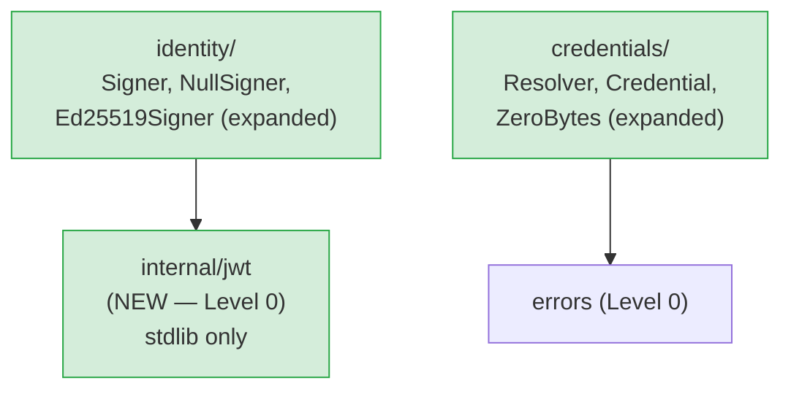

# Go Architect: Phase 5 Validation — Security and Trust Boundaries

**Author:** go-architect subagent
**Phase:** 5 — Security and Trust Boundaries
**Validates against:** Phase 3 `go-architect-package-layout.md`, Phase 3
`09-credentials-and-identity.md`, Phase 4 `go-architect-validation.md`
**Consumes:** Phase 5 `00-plan.md`, Phase 2 `04-cancellation-and-context.md`

---

## 1. Credential Zeroing in Go

### 1.1 The Dead-Store Elimination Problem

Go's compiler (gc) performs dead-store elimination: if a write to a variable
is never subsequently read by live code, the compiler may omit the write
entirely. For a `Credential.Close()` implementation that zeroes the secret
byte slice before returning, this is a real risk. The pattern:

```go
func (c *secretCredential) Close() error {
    for i := range c.buf {
        c.buf[i] = 0   // UNSAFE: may be elided if c.buf is unreachable after this
    }
    c.buf = nil
    return nil
}
```

After `c.buf = nil`, the backing array is unreachable from Go code. The
compiler can correctly observe that the zero writes produce no visible effect
after `Close()` returns, and elide them. This is not a hypothetical: the Go
compiler has been documented to eliminate such patterns in practice (see Go
issue #21245 "crypto: secure zeroing of memory").

### 1.2 `runtime.KeepAlive` as a Compiler Fence

`runtime.KeepAlive(x)` tells the compiler "treat `x` as live at this point in
the program." When called after the zeroing loop, it prevents the backing
array from being considered unreachable at the time of the zero writes, which
prevents dead-store elimination of those writes.

The correct pattern:

```go
func (c *secretCredential) Close() error {
    if c.buf == nil {
        return nil // idempotent: already closed
    }
    b := c.buf
    c.buf = nil
    for i := range b {
        b[i] = 0
    }
    runtime.KeepAlive(b)  // compiler fence: b must be live through the zeroing loop
    return nil
}
```

Critically, `KeepAlive` must be called AFTER the zero loop, not before, so
that the liveness window covers the writes. Calling it before is a no-op.

The `runtime.KeepAlive` approach is documented in the Go standard library
itself: `crypto/tls` and `crypto/rsa` use this pattern for key material.

### 1.3 `crypto/subtle` as an Alternative

`crypto/subtle.ConstantTimeCopy` and `crypto/subtle` generally exist for
timing-side-channel resistance, not for memory clearing. They offer no
guarantee against dead-store elimination of a subsequent zero write.

`golang.org/x/sys/unix.Mlock`/`Munlock` exists but is OS-specific and
inappropriate for a cross-platform library.

`crypto/subtle` does not provide a `ZeroBytes` equivalent. It is not the
right tool for this problem.

### 1.4 Recommendation: `runtime.KeepAlive`-Guarded Zeroing

The recommended approach is the `runtime.KeepAlive` pattern. It is:

- Defined behavior in Go's memory model documentation.
- Used in the Go standard library (`crypto/`) for the same purpose.
- Zero third-party dependencies.
- Stable across Go versions (available since Go 1.7).

### 1.5 `credentials.ZeroBytes` Utility Function

Phase 5 key question Q2 asks whether the framework should provide a
`ZeroBytes` utility. The answer is yes, for two reasons:

1. It centralizes the compiler-fence pattern so `Credential` implementors do
   not need to rediscover it independently.
2. It is the only place in the codebase that carries a comment explaining
   WHY `runtime.KeepAlive` is necessary — that explanation should appear
   exactly once.

**Placement:** `credentials` package. The utility is used exclusively in the
context of credential lifecycle; placing it in `credentials` keeps it
co-located with `Credential.Close()` implementations and does not require
any new package import.

```go
package credentials

import "runtime"

// ZeroBytes overwrites b with zero bytes.
//
// ZeroBytes uses runtime.KeepAlive to prevent the Go compiler from
// eliminating the zero writes via dead-store optimization. Callers
// must use this function (not a plain loop) when zeroing secret material
// that will be made unreachable immediately after zeroing (e.g., inside
// Credential.Close).
//
// ZeroBytes is a no-op if b is nil or empty.
func ZeroBytes(b []byte) {
    for i := range b {
        b[i] = 0
    }
    runtime.KeepAlive(b)
}
```

A canonical `Credential` implementation using this utility:

```go
type secretCredential struct {
    buf    []byte
    closed bool
}

func (c *secretCredential) Value() []byte {
    return c.buf
}

func (c *secretCredential) Close() error {
    if c.closed {
        return nil // idempotent
    }
    c.closed = true
    ZeroBytes(c.buf)
    c.buf = nil
    return nil
}
```

### 1.6 Go Issues and Proposals

- **Go issue #21245** ("crypto: secure zeroing of memory") — documents the
  dead-store elimination risk and the `KeepAlive` mitigation. Closed as
  working-as-designed: `KeepAlive` is the intended mechanism.
- **Go proposal #16192** ("cmd/compile: add memclr intrinsic for zeroing") —
  separately discusses performance, not security. Not relevant here.
- The Go specification defines `KeepAlive` as: "KeepAlive marks its argument
  as currently reachable. This ensures that the object is not freed, and its
  finalizer is not run, before the point in the program where KeepAlive is
  called." This guarantee extends to preventing dead-store elimination of
  writes that precede the call.

---

## 2. Ed25519 JWT Without External Dependencies

### 2.1 `crypto/ed25519` Sufficiency

`crypto/ed25519` has been in the Go standard library since Go 1.13. The
project minimum is Go 1.23. The package provides:

- `ed25519.PrivateKey` and `ed25519.PublicKey` types.
- `ed25519.Sign(privateKey, message []byte) []byte` for signing.
- `ed25519.Verify(publicKey, message, sig []byte) bool` for verification.

This is everything needed to produce a valid Ed25519-signed JWT. No
`golang.org/x/crypto` package is required; `crypto/ed25519` in stdlib is the
canonical package and `golang.org/x/crypto/ed25519` was the pre-1.13
predecessor. Using stdlib is strictly preferred.

### 2.2 Minimal JWT Construction

A JWT is three base64url-encoded JSON segments separated by `.`:

```
base64url(header) + "." + base64url(claims) + "." + base64url(signature)
```

where `signature = Ed25519.Sign(privateKey, base64url(header)+"."+base64url(claims))`.

The complete construction using only stdlib:

```go
package internal/jwt  // see §2.5 on package placement

import (
    "crypto/ed25519"
    "encoding/base64"
    "encoding/json"
    "fmt"
    "time"
)

// Header is the JWT JOSE header.
type Header struct {
    Algorithm string `json:"alg"`
    Type      string `json:"typ"`
    KeyID     string `json:"kid,omitempty"`
}

// Claims is the JWT registered + praxis custom claim set.
// All time values are Unix seconds (int64) per RFC 7519 §4.1.
type Claims struct {
    Issuer         string `json:"iss,omitempty"`
    Subject        string `json:"sub,omitempty"`
    Audience       string `json:"aud,omitempty"`  // single string; RFC 7519 allows array too
    ExpiresAt      int64  `json:"exp"`
    IssuedAt       int64  `json:"iat"`
    JWTID          string `json:"jti"`
    // praxis custom claims
    InvocationID   string `json:"praxis.invocation_id"`
    ToolName       string `json:"praxis.tool_name"`
    // extension point: callers embed additional claims by providing
    // a map[string]any that is merged at serialization time (see Build)
}

var b64 = base64.RawURLEncoding  // RFC 7519: URL-safe base64, NO padding

// Build constructs and signs a JWT, returning the compact serialization.
// privateKey must be an ed25519.PrivateKey (64 bytes).
// extra is merged into the claims JSON after standard fields; it must not
// overlap with reserved claim names. extra may be nil.
func Build(privateKey ed25519.PrivateKey, header Header, claims Claims, extra map[string]any) (string, error) {
    headerJSON, err := json.Marshal(header)
    if err != nil {
        return "", fmt.Errorf("jwt: marshal header: %w", err)
    }

    // Merge claims with extra fields.
    claimsJSON, err := marshalClaims(claims, extra)
    if err != nil {
        return "", fmt.Errorf("jwt: marshal claims: %w", err)
    }

    headerEnc := b64.EncodeToString(headerJSON)
    claimsEnc := b64.EncodeToString(claimsJSON)
    signingInput := headerEnc + "." + claimsEnc

    sig := ed25519.Sign(privateKey, []byte(signingInput))
    sigEnc := b64.EncodeToString(sig)

    return signingInput + "." + sigEnc, nil
}

// marshalClaims serializes claims to JSON, merging extra fields.
// Extra fields that collide with a registered claim name are silently
// ignored to prevent accidental override of security-critical fields.
func marshalClaims(claims Claims, extra map[string]any) ([]byte, error) {
    // Marshal the typed claims first.
    base, err := json.Marshal(claims)
    if err != nil {
        return nil, err
    }
    if len(extra) == 0 {
        return base, nil
    }

    // Unmarshal into a map to merge, then re-marshal.
    merged := make(map[string]any)
    if err := json.Unmarshal(base, &merged); err != nil {
        return nil, err
    }
    for k, v := range extra {
        if _, reserved := merged[k]; !reserved {
            merged[k] = v
        }
    }
    return json.Marshal(merged)
}
```

### 2.3 Edge Cases

**URL-safe base64, no padding.** RFC 7519 §2 mandates base64url encoding
(RFC 4648 §5) WITHOUT padding characters. This is `base64.RawURLEncoding` in
Go. Using `base64.URLEncoding` (which adds `=` padding) produces
non-conforming JWTs. The `b64` variable above encodes this constraint once.

**JSON canonicalization.** RFC 7519 does not require canonical JSON
serialization for the payload. `encoding/json` produces deterministic output
for struct types (fields are serialized in declaration order). The
`marshalClaims` round-trip through `map[string]any` for extra fields loses
field ordering, but this is acceptable: the signature is computed over the
exact bytes that will be transmitted, so ordering consistency is only needed
for verification, and the verifier receives the same bytes. No external
JSON canonicalization library is required.

**`aud` claim as string vs array.** RFC 7519 §4.1.3 allows `aud` to be either
a single string JSON value or a JSON array of strings. For simplicity, the
`Claims` struct above uses a single string. Phase 5's D70 decision record
should explicitly choose one form and document it. The `internal/jwt` helper
can support both by changing `Audience` to `[]string` and using a custom
`json.Marshaler` that emits a bare string for single-element slices — but
this adds complexity. Recommendation: mandate a single string for `aud` in
v1.0.

**`jti` uniqueness.** The `jti` claim (JWT ID) must be unique per RFC 7519
§4.1.7. The `Ed25519Signer` implementation is responsible for generating a
unique ID per call. The `internal/jwt` helper does not generate it; the caller
provides it. For uniqueness, the signer should derive `jti` from the
invocation ID and a monotonic counter or from `crypto/rand`.

**`exp` clock skew.** Short-lived tokens (60s per D72 draft) should not add
a clock-skew buffer in the framework — that is the verifier's concern. The
framework sets `exp = iat + lifetime` exactly.

### 2.4 RFC 7519 Compliance

The construction above produces a spec-compliant JWT because:

1. The JOSE header contains `"alg": "EdDSA"` (the registered algorithm
   identifier for Ed25519 per RFC 8037) and `"typ": "JWT"`.
2. The claims object contains all required registered claims with correct
   JSON types (numeric dates as `int64`, not `float64`).
3. The compact serialization format (three base64url segments joined by `.`)
   matches RFC 7519 §7.2.
4. The signature covers `BASE64URL(header) || "." || BASE64URL(claims)`,
   which is exactly the JWS signing input per RFC 7515 §7.2.

One nuance: the algorithm identifier for Ed25519 in JWT is `"EdDSA"` (RFC
8037), not `"Ed25519"`. The `Header.Algorithm` field in the helper must be
set to `"EdDSA"` by the caller. The `Ed25519Signer` constructor sets this
internally; callers of the `Signer` interface never see the raw header.

### 2.5 `internal/jwt` Package Placement

An `internal/jwt` helper package is appropriate. Rationale:

- JWT construction is used only by `identity.Ed25519Signer`. No other package
  in the praxis tree needs to construct JWTs.
- Making it `internal/` prevents consumers from depending on its exact
  serialization behavior, which could create an accidental stability
  commitment. The `identity.Signer` interface is the stable surface; the JWT
  format is an implementation detail of the reference implementation.
- The package has no intra-praxis imports (only `crypto/ed25519`,
  `encoding/base64`, `encoding/json`, `fmt`, `time` from stdlib).

**Placement in the DAG.** `internal/jwt` sits at Level 0 (pure leaf). It
belongs alongside `internal/loop`, `internal/retry`, and `internal/ctxutil`
in the `internal/` directory.

Updated package tree addition:

```
internal/
    loop/      invocation loop driver
    retry/     backoff + jitter
    ctxutil/   DetachedWithSpan
    jwt/       Ed25519 JWT construction helper (NEW — Phase 5)
```

`identity/` imports `internal/jwt`. This adds one new intra-praxis import
edge:

```
identity → internal/jwt   (Level 0 → Level 0, safe)
```

The `identity` package remains at Level 0 in the topological sort; it has
no imports from any other praxis package. Adding the `internal/jwt` dependency
does not change that — both are at Level 0 (pure stdlib).

---

## 3. `context.WithoutCancel` Pattern Validation

### 3.1 Availability

`context.WithoutCancel` was added in Go 1.21 (https://pkg.go.dev/context#WithoutCancel).
The project minimum is Go 1.23. The function is available without any version
guard. No build tags are needed.

### 3.2 Exact Context Derivation for C4

Phase 2 `04-cancellation-and-context.md` §2 (D21 matrix, `ToolCall` row)
states: "Operations inside the tool call that respect context cancellation —
including `credentials.Resolver.Fetch` — must receive a
`context.WithoutCancel`-derived context (C4)."

The exact derivation in `internal/loop`:

```go
// softCancelCredentialFetch performs a credential fetch during the
// soft-cancel grace window. It detaches from the invocation context's
// cancellation signal while preserving all context values (span, enricher
// attributes, trace propagation).
//
// The 500 ms timeout ensures the grace window is bounded: if the vault
// or credential provider is unreachable, the credential fetch fails fast
// rather than blocking the shutdown path indefinitely.
func softCancelCredentialFetch(
    invocationCtx context.Context,
    resolver credentials.Resolver,
    ref credentials.CredentialRef,
) (credentials.Credential, error) {
    // context.WithoutCancel returns a copy of invocationCtx that is never
    // cancelled, but carries all values (span context, trace, enricher
    // attributes). This prevents the cancelled invocationCtx from
    // immediately aborting an in-flight credential fetch during the
    // soft-cancel grace window.
    graceCtx := context.WithoutCancel(invocationCtx)

    // Bound the grace window. The 500 ms cap matches the soft-cancel grace
    // window defined in D21. The context.WithTimeout creates a new deadline
    // on the already-detached graceCtx, ensuring the fetch cannot block
    // longer than the remaining grace budget.
    fetchCtx, cancel := context.WithTimeout(graceCtx, 500*time.Millisecond)
    defer cancel()

    return resolver.Fetch(fetchCtx, ref)
}
```

This pattern is called from the invocation loop's tool-call dispatch path,
only when the orchestrator has detected a soft-cancel signal
(`errors.Is(invocationCtx.Err(), context.Canceled)`). In the non-cancelled
case, `invocationCtx` is passed directly to `resolver.Fetch` without
wrapping.

### 3.3 Value Preservation

`context.WithoutCancel` preserves all values set on the parent context. The
Go documentation states: "WithoutCancel returns a copy of parent that is not
cancelled when parent is cancelled. The returned context returns no Deadline
or Err, and its Done channel is nil." Critically, `Value(key)` on the
returned context delegates to the parent, so OTel span contexts, trace IDs,
and any values set via `context.WithValue` by the orchestrator or the caller
are all available to `resolver.Fetch`.

Verification: `trace.SpanFromContext(graceCtx)` returns the same span as
`trace.SpanFromContext(invocationCtx)`. The `Resolver` implementation can
add span events to the active span during the fetch without additional
instrumentation setup.

### 3.4 Idiomatic Pattern Confirmation

This is the idiomatic Go pattern for "I need to outlive the parent
cancellation but inherit its values." It is used in production Go code for
exactly this class of cleanup operations (e.g., emitting audit events after
a request context is cancelled). There is no standard library alternative
that provides the same guarantee. Using a `context.Background()` derivative
would lose all context values; `context.WithoutCancel` is the correct choice.

**One constraint:** The `graceCtx` produced by `context.WithoutCancel` has
no deadline. The `context.WithTimeout` wrapper is mandatory — without it, a
hung vault or credential provider would block the goroutine indefinitely
during shutdown. The 500 ms timeout must always be applied.

---

## 4. Package Dependency Analysis

### 4.1 `identity` Package Imports

```
identity/
    identity.go           — Signer interface, NullSigner
    ed25519_signer.go     — Ed25519Signer concrete type
```

Stdlib imports for `identity`:
- `context` — Signer.Sign takes context.Context
- `crypto/ed25519` — PrivateKey type, Sign function
- `crypto/rand` — for jti generation in Ed25519Signer
- `fmt` — error wrapping
- `time` — token lifetime calculation

Intra-praxis imports for `identity`:
- `internal/jwt` — JWT construction helper

**No third-party dependencies.** The `identity` package is stdlib-only plus
the internal JWT helper. It does not import OTel, Prometheus, or any LLM SDK.
The `go.mod` dependency footprint is unchanged by adding this package.

### 4.2 `credentials` Package Imports

```
credentials/
    credentials.go        — Resolver, Credential, CredentialRef, NullResolver
    zero.go               — ZeroBytes utility
```

Stdlib imports for `credentials`:
- `context` — Resolver.Fetch takes context.Context
- `runtime` — runtime.KeepAlive in ZeroBytes
- `fmt` — NullResolver error construction

Intra-praxis imports for `credentials`:
- `errors` — NullResolver returns a *errors.SystemError (already established)

**No third-party dependencies.** The `credentials` package is stdlib-only
plus the intra-praxis `errors` dependency (already in the Phase 3 DAG).

### 4.3 `internal/jwt` Package Imports

Stdlib imports for `internal/jwt`:
- `crypto/ed25519` — signing
- `encoding/base64` — base64url encoding
- `encoding/json` — header and claims serialization
- `fmt` — error wrapping
- `time` — time.Now(), time.Duration

**No third-party dependencies.** This is the expected outcome; it is the
primary justification for building the JWT helper in-house rather than
importing a third-party JWT library.

### 4.4 Updated Level 0 DAG Annotation

```
Level 0 (pure leaves, stdlib + internal only):
    state       → (stdlib only)
    errors      → (stdlib only)
    identity    → (stdlib only + internal/jwt)
    internal/jwt → (stdlib only)
    internal/ctxutil → (stdlib + otel/trace external)
    internal/retry   → errors
```

`credentials` remains at Level 1 (imports `errors`). No other level
assignments change.

### 4.5 Confirmed Zero Third-Party Dependencies

Both `identity` and `credentials` have zero third-party dependencies. The
`internal/jwt` helper has zero third-party dependencies. This outcome is a
first-class goal (Phase 5 plan §Assumptions): the reference Ed25519Signer
"constructs JWTs manually or uses a minimal internal helper" specifically to
avoid vendoring a JWT library.

---

## 5. `NewEd25519Signer` Constructor

### 5.1 Key Input: `ed25519.PrivateKey` Directly

The constructor should accept an `ed25519.PrivateKey` directly, not an
`io.Reader`. Rationale:

- `ed25519.PrivateKey` is the stdlib's canonical type for Ed25519 private keys
  (64 bytes: 32-byte seed + 32-byte public key). Callers already have a typed
  key after calling `ed25519.GenerateKey` or loading from a key store.
- `io.Reader` is appropriate for constructors that need to generate or derive
  key material. `NewEd25519Signer` is NOT a key generator — key generation and
  lifecycle management are the caller's responsibility (production consumers
  use their KMS). Accepting `io.Reader` would imply the constructor can
  generate keys, which is outside the reference implementation's scope.
- Accepting a raw `ed25519.PrivateKey` keeps the type system working for the
  caller: the compiler rejects passing a wrong-algorithm key type.

### 5.2 Option Function Alignment

Phase 3 `go-architect-package-layout.md` §6.1 establishes the pattern:
`type Option func(*config)` with an unexported `config` struct. The
`NewEd25519Signer` constructor follows the same pattern for any configurable
parameters, keeping consistency across the API surface.

```go
package identity

import (
    "crypto/ed25519"
    "fmt"
    "time"
)

// SignerOption configures an Ed25519Signer.
// The option type is named SignerOption (not Ed25519SignerOption) to match
// the decisions log (D73) and 03-identity-signing.md §4.
type SignerOption func(*ed25519SignerConfig)

type ed25519SignerConfig struct {
    issuer    string
    lifetime  time.Duration
    keyID     string
    // extraClaims is a static map of caller-defined claims merged into
    // every token. Shallow-copied at construction time. May be nil.
    extraClaims map[string]any
}

// WithIssuer sets the "iss" (issuer) claim. Default: "praxis" (per D70).
// Production callers must set a deployment-specific issuer.
func WithIssuer(iss string) SignerOption {
    return func(c *ed25519SignerConfig) { c.issuer = iss }
}

// WithTokenLifetime sets the token lifetime. The "exp" claim is set to
// time.Now().Add(lifetime). Defaults to 60 seconds if not specified.
// Minimum: 5 seconds. Maximum: 300 seconds.
// Values outside the [5s, 300s] range are rejected at construction time
// with an error (per D72), not silently clamped.
func WithTokenLifetime(d time.Duration) SignerOption {
    return func(c *ed25519SignerConfig) {
        c.lifetime = d
        // Validation is deferred to NewEd25519Signer, which returns an
        // error if the lifetime is outside [5s, 300s]. This keeps the
        // option function simple and error reporting centralized.
    }
}

// WithKeyID sets the "kid" (key ID) header parameter. Callers who rotate
// keys should set a stable key identifier so that verifiers can locate
// the correct public key from a JWKS endpoint. If not set, "kid" is
// omitted from the header.
func WithKeyID(kid string) SignerOption {
    return func(c *ed25519SignerConfig) { c.keyID = kid }
}

// WithExtraClaims adds static caller-defined claims to every token.
// Claims are merged into the payload before signing. The map is
// shallow-copied at construction time; subsequent mutations have no effect.
//
// If a key collides with a mandatory registered or custom claim key
// (e.g., "iss", "sub", "praxis.invocation_id"), the mandatory claim wins
// and the caller's value is silently dropped.
//
// Callers who need per-call dynamic claims must implement their own Signer.
// Per D71, the reference implementation uses a static map, not a function.
func WithExtraClaims(claims map[string]any) SignerOption {
    return func(c *ed25519SignerConfig) {
        c.extraClaims = make(map[string]any, len(claims))
        for k, v := range claims {
            c.extraClaims[k] = v
        }
    }
}

// Ed25519Signer is the reference identity.Signer implementation.
// It produces short-lived Ed25519 JWTs per the praxis identity signing
// contract (Phase 5 D70–D74).
//
// Ed25519Signer is safe for concurrent use.
type Ed25519Signer struct {
    key ed25519.PrivateKey
    cfg ed25519SignerConfig
}

// NewEd25519Signer constructs an Ed25519Signer from the given private key.
//
// key must be a valid ed25519.PrivateKey (64 bytes). NewEd25519Signer returns
// an error if key is nil or has incorrect length. It does NOT accept a nil
// key silently — a nil key is always a programmer error because the Signer
// cannot produce any tokens without it.
//
// The default token lifetime is 60 seconds. Override with WithTokenLifetime.
//
// Example:
//
//   _, priv, err := ed25519.GenerateKey(rand.Reader)
//   if err != nil { ... }
//   signer, err := identity.NewEd25519Signer(priv,
//       identity.WithIssuer("my-agent-service"),
//       identity.WithTokenLifetime(30*time.Second),
//   )
func NewEd25519Signer(key ed25519.PrivateKey, opts ...SignerOption) (Signer, error) {
    if key == nil {
        return nil, fmt.Errorf("identity.NewEd25519Signer: key must not be nil")
    }
    if len(key) != ed25519.PrivateKeySize {
        return nil, fmt.Errorf(
            "identity.NewEd25519Signer: key has wrong length: got %d, want %d",
            len(key), ed25519.PrivateKeySize,
        )
    }
    cfg := ed25519SignerConfig{
        issuer:   "praxis",          // default per D70
        lifetime: 60 * time.Second,  // default per D72
    }
    for _, o := range opts {
        o(&cfg)
    }
    // Validate lifetime bounds (D72: 5s minimum, 300s maximum).
    if cfg.lifetime < 5*time.Second || cfg.lifetime > 300*time.Second {
        return nil, fmt.Errorf(
            "identity.NewEd25519Signer: token lifetime %v outside allowed range [5s, 300s]",
            cfg.lifetime,
        )
    }
    return &Ed25519Signer{key: key, cfg: cfg}, nil
}
```

### 5.3 Error Conditions

| Condition | Error message | Notes |
|---|---|---|
| `key == nil` | `"identity.NewEd25519Signer: key must not be nil"` | Programmer error; returned as error (not panic) per the pattern established for non-mandatory deps |
| `len(key) != 64` | `"identity.NewEd25519Signer: key has wrong length: got N, want 64"` | Guards against passing a seed (32 bytes) instead of the full private key |
| Invalid option value | `NewEd25519Signer` returns error | e.g., `WithTokenLifetime` with a value outside [5s, 300s] is rejected at construction time per D72 |

**Why return error, not panic?** The Phase 3 constructor pattern (`orchestrator.New`)
panics on nil `llm.Provider` because a nil provider makes the entire
`Orchestrator` non-functional and is an unconditional programmer error.
`NewEd25519Signer`'s key validation follows a slightly different contract:
the `identity.Signer` interface has a null implementation (`NullSigner`), so
the question of "what happens without a key" has an answer — use `NullSigner`.
A caller who accidentally passes a nil key has a recoverable programmer error.
Returning an error (rather than panicking) preserves the caller's ability to
fall back to `NullSigner` in low-privilege environments. This is consistent
with stdlib constructors like `x509.ParsePKCS8PrivateKey` which return errors
for invalid key material.

### 5.4 `Sign` Method

```go
// Sign implements identity.Signer. It constructs and signs a JWT asserting
// the agent's identity for the given invocation and tool call.
//
// Sign is safe for concurrent use.
func (s *Ed25519Signer) Sign(ctx context.Context, invocationID string, toolName string) (string, error) {
    now := time.Now()
    jti, err := generateJTI()  // crypto/rand-based unique ID, see §2.3
    if err != nil {
        return "", fmt.Errorf("identity: generate jti: %w", err)
    }

    extra := s.cfg.extraClaims // static map, may be nil

    token, err := jwt.Build(
        s.key,
        jwt.Header{
            Algorithm: "EdDSA",  // RFC 8037
            Type:      "JWT",
            KeyID:     s.cfg.keyID,
        },
        jwt.Claims{
            Issuer:       s.cfg.issuer,
            ExpiresAt:    now.Add(s.cfg.lifetime).Unix(),
            IssuedAt:     now.Unix(),
            JWTID:        jti,
            InvocationID: invocationID,
            ToolName:     toolName,
        },
        extra,
    )
    if err != nil {
        return "", fmt.Errorf("identity: sign token: %w", err)
    }
    return token, nil
}
```

---

## 6. Updated Import Graph (Phase 5 Additions)

The following additions augment the Phase 4 DAG. No existing edges change.



Green nodes are modified or added in Phase 5. All new edges point to packages
at the same or lower level. No new third-party dependencies are introduced.

---

## 7. Summary Table

| Concern | Finding | Severity |
|---|---|---|
| Credential zeroing via plain loop | UNSAFE — compiler may elide dead stores | BLOCKER — use `credentials.ZeroBytes` |
| `runtime.KeepAlive` as zeroing fence | Correct, stdlib-documented mechanism | CLEAR |
| `crypto/subtle` for zeroing | Not applicable — wrong tool for this problem | CLEAR (negative finding) |
| `credentials.ZeroBytes` utility | Recommended — centralizes KeepAlive pattern | Recommendation |
| `crypto/ed25519` sufficiency | Yes — stdlib since Go 1.13, min is 1.23 | CLEAR |
| JWT construction without third-party dep | Achievable with `encoding/json` + `encoding/base64` + `crypto/ed25519` | CLEAR |
| `base64.RawURLEncoding` requirement | Mandatory per RFC 7519 — `=` padding produces non-conforming JWTs | IMPORTANT (correctness) |
| Algorithm identifier in JWT header | Must be `"EdDSA"` (RFC 8037), not `"Ed25519"` | IMPORTANT (correctness) |
| `internal/jwt` package placement | Level 0 leaf — correct; no cycle risk | CLEAR |
| `context.WithoutCancel` availability | Go 1.21+; project min is 1.23 — available unconditionally | CLEAR |
| `context.WithoutCancel` value preservation | Yes — delegates to parent for all `Value(key)` queries | CLEAR |
| `WithoutCancel` without timeout guard | UNSAFE — credential fetch can block indefinitely; always wrap with `context.WithTimeout` | IMPORTANT |
| `identity` package third-party deps | Zero — stdlib + `internal/jwt` only | CLEAR |
| `credentials` package third-party deps | Zero — stdlib + `errors` (intra-praxis, Level 0) only | CLEAR |
| `internal/jwt` third-party deps | Zero — stdlib only | CLEAR |
| `NewEd25519Signer` key input type | `ed25519.PrivateKey` (not `io.Reader`) — correct for a non-generating constructor | CLEAR |
| Option pattern alignment | `type SignerOption func(*ed25519SignerConfig)` — consistent with Phase 3 §6.1 and D73 | CLEAR |
| Nil key behavior | Return error (not panic) — recoverable programmer error; NullSigner is the fallback | Recommendation |
| `go.mod` impact | None — no new `require` directives needed | CLEAR |
| Go minimum version impact | None — all patterns available since Go 1.21; minimum is 1.23 | CLEAR |

**No BLOCKER findings after applying the `credentials.ZeroBytes` recommendation.**
The plain-loop zeroing anti-pattern (identified as a blocker above) is
resolved by the `ZeroBytes` utility defined in §1.5. Phase 5 D67 and D68
should mandate use of `credentials.ZeroBytes` in the `Credential.Close()`
implementation contract.
