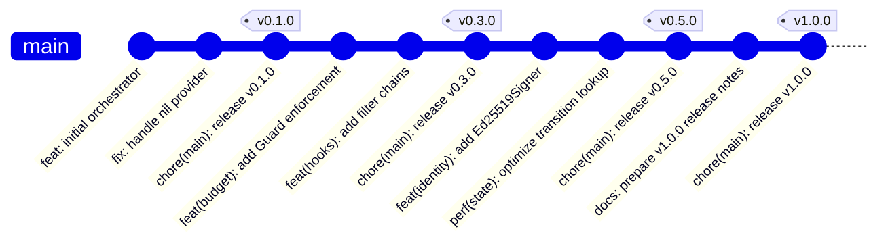

# Phase 6 — Release Process

**Related decisions:** D82 (branch strategy), D83 (conventional commits), D84
(release-please), D98 (tag signing).

---

## 1. Conventional Commits

All commits to `main` follow the conventional commit specification. The commit
message format is:

```
<type>(<scope>): <description>

[optional body]

[optional footer(s)]
```

### 1.1 Allowed Types

| Type | Purpose | Changelog section | Version bump |
|---|---|---|---|
| `feat` | New feature | Added | minor (v0.x) |
| `fix` | Bug fix | Fixed | patch |
| `docs` | Documentation only | Documentation | none |
| `test` | Adding or correcting tests | Testing | none |
| `refactor` | Code change that neither fixes a bug nor adds a feature | Changed | none |
| `perf` | Performance improvement | Performance | patch |
| `chore` | Maintenance (deps, CI config, tooling) | hidden | none |
| `ci` | CI pipeline changes | hidden | none |
| `build` | Build system changes | hidden | none |

### 1.2 Scope

Optional. When used, it is the package name:

```
feat(budget): add MaxToolCalls enforcement
fix(llm/anthropic): handle empty tool-use response
docs(orchestrator): clarify InvokeStream channel semantics
```

### 1.3 Breaking Changes

Breaking changes are signalled by a `BREAKING CHANGE:` footer:

```
feat(orchestrator): change InvokeStream return type

BREAKING CHANGE: InvokeStream now returns (<-chan InvocationEvent, error)
instead of <-chan InvocationEvent. Callers must check the error before
draining the channel.
```

During v0.x, `BREAKING CHANGE:` triggers a minor version bump.
After v1.0, `BREAKING CHANGE:` triggers a major version bump (which blocks
the release — see §4).

### 1.4 Enforcement

`commitsar` validates all commits in a PR branch. It is a required status
check on `main` (D94). Commits that fail validation cannot be merged.

The `Signed-off-by:` line required by the DCO (D92) is separate from the
conventional commit format and appears in the footer:

```
feat(hooks): add ChainPolicyHooks composition helper

Signed-off-by: Jane Developer <jane@example.com>
```

---

## 2. release-please

### 2.1 How It Works

release-please monitors `main` for conventional commits. When it detects
unreleased changes, it opens (or updates) a release PR titled
`chore(main): release vX.Y.Z`. The PR contains:

- An updated `CHANGELOG.md` with entries grouped by commit type.
- An updated `internal/version/version.go` with the new version constant.
- A version bump determined by the commit types since the last release.

When the maintainer merges the release PR, the release workflow:
1. Creates a git tag (`vX.Y.Z`).
2. Creates a GitHub release with the changelog as the body.
3. GitHub's release attestation (Sigstore-based) is automatically attached.

### 2.2 Configuration

`release-please-config.json` at repo root:

```json
{
  "$schema": "https://raw.githubusercontent.com/googleapis/release-please/main/schemas/config.json",
  "packages": {
    ".": {
      "release-type": "go",
      "bump-minor-pre-major": true,
      "bump-patch-for-minor-pre-major": false,
      "always-update": true,
      "changelog-sections": [
        {"type": "feat", "section": "Added"},
        {"type": "fix", "section": "Fixed"},
        {"type": "docs", "section": "Documentation"},
        {"type": "perf", "section": "Performance"},
        {"type": "refactor", "section": "Changed"},
        {"type": "test", "section": "Testing"},
        {"type": "chore", "section": "Maintenance", "hidden": true},
        {"type": "ci", "section": "CI", "hidden": true},
        {"type": "build", "section": "Build", "hidden": true}
      ],
      "extra-files": ["internal/version/version.go"]
    }
  }
}
```

`.release-please-manifest.json` at repo root:

```json
{
  ".": "0.0.0"
}
```

### 2.3 Version Bumping Rules

| v0.x | After v1.0 |
|---|---|
| `feat:` → bump minor (0.X.0) | `feat:` → bump minor (1.X.0) |
| `fix:` / `perf:` → bump patch (0.x.X) | `fix:` / `perf:` → bump patch (1.x.X) |
| `BREAKING CHANGE:` → bump minor (0.X.0) | `BREAKING CHANGE:` → bump major (X.0.0) |

The `bump-minor-pre-major` and `bump-patch-for-minor-pre-major` flags ensure
that release-please keeps standard pre-v1 semver semantics: `feat:` bumps the
minor version, `fix:`/`perf:` bump the patch version, and `BREAKING CHANGE:`
bumps the minor rather than the major. `bump-patch-for-minor-pre-major: false`
is important here: setting it to `true` would downgrade pre-v1 `feat:` commits
to patch releases.

praxis adds one workflow-level override on top of release-please: for releases
below `v1.0.0`, any unreleased `feat`, `feature`, conventional-commit `!`, or
`BREAKING CHANGE:` causes the release PR to target the next odd minor
(`v0.1.x -> v0.3.0`, `v0.3.x -> v0.5.0`). Pure `fix:`/`perf:` releases remain
patch releases (`v0.1.1`, `v0.1.2`, ...).

`always-update: true` keeps an already-open release PR in sync with the newly
generated files even when release-please decides the rendered release notes are
unchanged. This matters for praxis because the odd-minor override is computed
in the workflow at runtime rather than stored permanently in the manifest.

The release workflow also passes `--signoff` when generating the release PR
commit so the DCO check stays green, then dispatches the `CI` workflow against
the `release-please--branches--main` branch. That explicit dispatch is needed
because pushes made with the workflow token do not automatically trigger the
normal `pull_request` workflow for the generated release branch. The required
CI jobs therefore publish commit statuses back onto the release branch commit
when they run under `workflow_dispatch`, so branch protection still receives
the expected `lint`, `test`, `commitsar`, `banned-grep`, `spdx-check`, and
`dco` contexts.

### 2.4 The `version.go` File

```go
// SPDX-License-Identifier: Apache-2.0

package version

// Version is the current praxis release version.
// This value is updated automatically by release-please.
const Version = "0.0.0" // x-release-please-version
```

The `x-release-please-version` comment is the marker that release-please uses
to find and update the version string. The `internal/version` package is
importable by the `orchestrator` package to expose a `praxis.Version()` function
if desired.

---

## 3. CHANGELOG.md

### 3.1 Format

release-please generates `CHANGELOG.md` in keep-a-changelog format:

```markdown
# Changelog

## [0.3.0](https://github.com/praxis-os/praxis/compare/v0.1.0...v0.3.0) (2026-07-15)

### Added

* **orchestrator:** add InvokeStream with 16-event channel buffer ([#42](https://github.com/praxis-os/praxis/pull/42))

### Fixed

* **llm/anthropic:** handle empty content block in tool-use response ([#38](https://github.com/praxis-os/praxis/pull/38))

### Changed

* **hooks:** rename FilterResult to FilterDecision for clarity ([#40](https://github.com/praxis-os/praxis/pull/40))
```

### 3.2 Maintenance

`CHANGELOG.md` is fully managed by release-please. Manual edits are
discouraged — they will be overwritten on the next release PR. If a manual
entry is needed (e.g., a post-release errata), it is added as a separate
section that release-please's markers will not touch.

---

## 4. Release Checklist

Before merging a release-please PR, the maintainer verifies:

1. All CI checks on the release PR are green.
2. The version bump is correct (no accidental major bump during v0.x).
3. The `CHANGELOG.md` entries accurately describe the changes.
4. For milestone releases (v0.1.0, v0.3.0, v0.5.0, v1.0.0), the exit
   criteria in [`06-release-milestones.md`](06-release-milestones.md) are
   satisfied.
5. No `MODULE_PATH_TBD` or placeholder strings remain in the codebase.

After merging:
1. Verify the GitHub release was created with the correct tag.
2. Verify the release attestation is attached.
3. Run `go get github.com/praxis-os/praxis@vX.Y.Z` from a clean module
   to confirm the tag is consumable.
4. For milestone releases, post an announcement in GitHub Discussions
   (Announcements category).

---

## 5. Branch Strategy

Per D82, all development happens on `main`. There are no release branches.



If v1.x maintenance is needed after v2.0.0 ships, a `release/v1.x` branch
is created from the last v1.x tag at that time.
