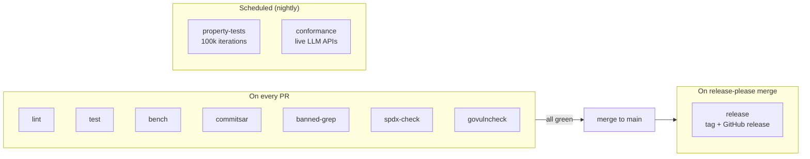

# Phase 6 — CI Pipeline

**Related decisions:** D85 (pipeline specification), D86 (coverage gate),
D87 (property tests), D88 (conformance suite), D94 (branch protection),
D97 (SPDX), D101 (claim constants), D105 (bench cache).

---

## 1. Pipeline Overview



---

## 2. PR Jobs (6 Required + 2 Informational)

### 2.1 `lint`

**Trigger:** every PR targeting `main`.
**Runner:** `ubuntu-latest`.
**Tool:** `golangci/golangci-lint-action@v6` (pinned).

Configuration (`.golangci.yml`):

```yaml
run:
  go: "1.23"
  timeout: 5m

linters:
  enable:
    - govet
    - errcheck
    - staticcheck
    - gosimple
    - unused
    - gosec
    - revive
    - misspell
    - unconvert
    - unparam
    - bodyclose
    - noctx
    - goconst
    - gocyclo

linters-settings:
  gocyclo:
    min-complexity: 15
  goconst:
    min-len: 3
    min-occurrences: 3
  gosec:
    excludes:
      - G104  # unhandled errors on deferred Close() — acceptable in tests
```

Notable inclusions:
- `goconst` — enforces D101 (JWT claim keys as constants).
- `gosec` — security linter, overlaps with CodeQL but catches Go-specific
  patterns (e.g., hardcoded credentials, weak crypto).
- `noctx` — catches HTTP requests without `context.Context`, relevant for
  LLM adapter code.

### 2.2 `test`

**Trigger:** every PR targeting `main`.
**Runner:** `ubuntu-latest`.
**Command:**

```bash
go test -race -coverprofile=coverage.out -count=1 ./...
```

Coverage gate:

```bash
COVERAGE=$(go tool cover -func=coverage.out | grep total | awk '{print $3}' | tr -d '%')
if (( $(echo "$COVERAGE < 85.0" | bc -l) )); then
  echo "Coverage $COVERAGE% is below 85% threshold"
  exit 1
fi
```

**Scope:** all packages including `internal/`. Excludes `examples/` (no test
files expected there).

Property-based tests run at 10,000 iterations (the `PRAXIS_PROP_ITERATIONS`
environment variable defaults to 10,000 in test code; overridden to 100,000
in the nightly job).

### 2.3 `bench`

**Trigger:** every PR targeting `main`.
**Runner:** `ubuntu-latest`.
**Status:** informational (non-blocking).

```bash
# Run benchmarks on the PR branch
go test -bench=. -benchmem -count=5 ./... > new.txt

# Fetch cached main-branch benchmarks
# (stored by the post-merge workflow via actions/cache)

# Compare with benchstat
go install golang.org/x/perf/cmd/benchstat@latest
benchstat main.txt new.txt
```

Benchmark results are posted as a PR comment via
`benchmark-action/github-action-benchmark` or a custom step. Regressions
are flagged but do not block the merge — GitHub Actions runners have known
variance that produces false positives.

**Seed §10 targets (enforced at milestone gates, not per-PR):**
- Orchestrator overhead: under 15 ms per invocation (LLM time excluded).
- State machine throughput: 1M transitions/sec/core.

### 2.4 `commitsar`

**Trigger:** every PR targeting `main`.
**Runner:** `ubuntu-latest`.
**Tool:** `aevea/commitsar` (Go-native binary).

Validates that all commits in the PR branch follow the conventional commit
format. Required check (D94).

### 2.5 `banned-grep`

**Trigger:** every PR targeting `main`.
**Runner:** `ubuntu-latest`.

Implements seed §6.1 banned-identifier enforcement plus Phase 5 D79 additions.

```makefile
banned-grep:
	@echo "Checking for banned identifiers..."
	@BANNED='custos|reef|governance.event|governance_event'; \
	RESULT=$$(grep -rniw -E "$$BANNED" --include='*.go' --include='*.md' \
	  --exclude-dir=docs/phase-* \
	  --exclude='PRAXIS-SEED-CONTEXT.md' \
	  --exclude='REVIEW.md' \
	  . || true); \
	if [ -n "$$RESULT" ]; then \
	  echo "BANNED IDENTIFIER FOUND:"; echo "$$RESULT"; exit 1; \
	fi
	@echo "Checking for hardcoded identity attributes..."
	@ATTRS='org\.id|agent\.id|user\.id|tenant\.id'; \
	RESULT=$$(grep -rn -E "$$ATTRS" --include='*.go' . || true); \
	if [ -n "$$RESULT" ]; then \
	  echo "HARDCODED IDENTITY ATTRIBUTE FOUND:"; echo "$$RESULT"; exit 1; \
	fi
	@echo "Banned-identifier check: PASS"
```

**Scope:** all `.go` and `.md` files in the repository. Excluded:
- `docs/phase-*/` directories (phase artifacts may contain negation-mentions
  in compliance declarations).
- `docs/PRAXIS-SEED-CONTEXT.md` §11 and §12 (permitted consumer disclosure).
- `REVIEW.md` files (contain compliance check results).

Test files (`.go` files in `*_test.go`) are included in the grep scope.
Test fixtures that need to reference banned terms for assertion purposes
must use string concatenation to avoid triggering the grep:

```go
// In test code, construct banned strings indirectly:
banned := "cust" + "os"  // avoids banned-grep match
```

### 2.6 `spdx-check`

**Trigger:** every PR targeting `main`.
**Runner:** `ubuntu-latest`.

```makefile
spdx-check:
	@missing=$$(find . -name '*.go' -not -path './vendor/*' -not -path './examples/*_test.go' \
	  | xargs grep -L 'SPDX-License-Identifier: Apache-2.0'); \
	if [ -n "$$missing" ]; then \
	  echo "Missing SPDX header in:"; echo "$$missing"; exit 1; \
	fi
	@echo "SPDX check: PASS"
```

### 2.7 `govulncheck`

**Trigger:** every PR targeting `main`.
**Runner:** `ubuntu-latest`.
**Tool:** `golang/govulncheck-action` (official, pinned version).

```yaml
- uses: golang/govulncheck-action@v1
  with:
    go-version-input: "1.23"
    govulncheck-version: "latest"
```

**Status during v0.x:** informational (non-blocking). Transitive dev
dependencies may contain vulnerabilities that are not exploitable in
library code.

**Status after v1.0:** required check (blocking). The dependency tree is
expected to be stable and clean by v1.0.

---

## 3. Scheduled Jobs (Nightly)

### 3.1 `property-tests`

**Schedule:** `cron: '0 3 * * *'` (03:00 UTC daily).
**Runner:** `ubuntu-latest`.

```bash
PRAXIS_PROP_ITERATIONS=100000 go test -race -run TestPropertyBased ./state/...
```

On failure, a GitHub issue is opened automatically:

```yaml
- if: failure()
  uses: peter-evans/create-issue-from-file@v5
  with:
    title: "Nightly property test failure"
    content-filepath: test-output.txt
    labels: bug, priority/high
```

### 3.2 `conformance`

**Schedule:** `cron: '0 4 * * *'` (04:00 UTC daily).
**Runner:** `ubuntu-latest`.
**Secrets:** `ANTHROPIC_API_KEY`, `OPENAI_API_KEY` (encrypted GitHub secrets).

```bash
PRAXIS_CONFORMANCE_MAX_TOKENS=100 \
PRAXIS_CONFORMANCE_MAX_COST_CENTS=50 \
go test -race -run TestConformance ./llm/conformance/...
```

Budget caps are enforced by the conformance test harness itself, not by
the provider SDKs. The `MAX_COST_CENTS=50` limit (i.e., $0.50) ensures
that a runaway test cannot accumulate unbounded API costs.

On failure, a GitHub issue is opened with the same mechanism as the
property test job.

---

## 4. CodeQL

**Trigger:** on every PR targeting `main` + weekly schedule.
**Runner:** `ubuntu-latest`.
**Configuration:** GitHub's default CodeQL analysis workflow for Go.

```yaml
# .github/workflows/codeql.yml
name: CodeQL
on:
  pull_request:
    branches: [main]
  schedule:
    - cron: '0 5 * * 1'  # weekly on Monday
jobs:
  analyze:
    runs-on: ubuntu-latest
    permissions:
      security-events: write
    steps:
      - uses: actions/checkout@v4
      - uses: github/codeql-action/init@v3
        with:
          languages: go
      - uses: github/codeql-action/autobuild@v3
      - uses: github/codeql-action/analyze@v3
```

CodeQL is not a required check for PR merge (to avoid blocking on false
positives) but findings are visible in the Security tab and must be triaged
within 7 days.

---

## 5. Post-Merge Benchmark Baseline (D105)

**Trigger:** on push to `main`.
**Runner:** `ubuntu-latest`.

This workflow caches benchmark results from `main` so that PR bench jobs
can compare against a known baseline.

```yaml
# .github/workflows/bench-baseline.yml
name: Benchmark Baseline
on:
  push:
    branches: [main]
jobs:
  bench:
    runs-on: ubuntu-latest
    steps:
      - uses: actions/checkout@v4
      - uses: actions/setup-go@v5
        with:
          go-version: "1.23"
      - run: go test -bench=. -benchmem -count=5 ./... > bench-main.txt
      - uses: actions/cache/save@v4
        with:
          path: bench-main.txt
          key: bench-main-${{ github.sha }}
```

The PR `bench` job (§2.3) fetches the cached baseline:

```yaml
- uses: actions/cache/restore@v4
  with:
    path: bench-main.txt
    key: bench-main-
    restore-keys: bench-main-
```

If no cached baseline exists, the PR bench job runs without comparison.

---

## 6. Release Workflow

**Trigger:** on push to `main` (release-please opens/updates a release PR).

```yaml
# .github/workflows/release.yml
name: Release
on:
  push:
    branches: [main]
jobs:
  release-please:
    runs-on: ubuntu-latest
    permissions:
      contents: write
      pull-requests: write
    steps:
      - uses: googleapis/release-please-action@v4
        with:
          config-file: release-please-config.json
          manifest-file: .release-please-manifest.json
```

When the release PR is merged, release-please creates the tag and GitHub
release. No additional steps are needed — the Go module proxy
(`proxy.golang.org`) fetches the tag automatically.

---

## 7. Makefile Targets

```makefile
.PHONY: test lint bench cover check banned-grep spdx-check

test:
	go test -race -count=1 ./...

lint:
	golangci-lint run ./...

bench:
	go test -bench=. -benchmem -count=5 ./...

cover:
	go test -race -coverprofile=coverage.out ./...
	go tool cover -func=coverage.out

check: lint test banned-grep spdx-check
	@echo "All checks passed."

banned-grep:
	# (see §2.5 above)

spdx-check:
	# (see §2.6 above)
```

The `make check` target runs all local checks in one command. Contributors
run `make check` before pushing to catch issues early. This is documented
in `CONTRIBUTING.md`.

---

## 8. Job Summary Table

| Job | Trigger | Blocking | Gate |
|---|---|---|---|
| `lint` | PR | yes | code quality |
| `test` | PR | yes | correctness + 85% coverage |
| `bench` | PR | no | performance regression tracking |
| `commitsar` | PR | yes | commit message hygiene |
| `banned-grep` | PR | yes | decoupling contract |
| `spdx-check` | PR | yes | license compliance |
| `govulncheck` | PR | v0.x: no; v1.x: yes | vulnerability scanning |
| `dco` (probot) | PR | yes | contributor agreement |
| `codeql` | PR + weekly | no | security analysis |
| `property-tests` | nightly | no (opens issue) | state machine correctness |
| `conformance` | nightly | no (opens issue) | adapter correctness |
| `bench-baseline` | push to main | n/a | benchmark cache for PR comparison |
| `release-please` | push to main | n/a | versioning + changelog |
