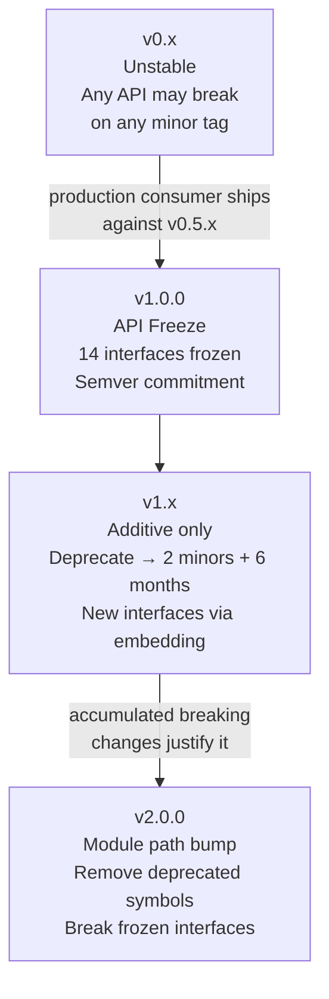

# Phase 6 — Versioning Policy

**Related decisions:** D81 (deprecation windows), D82 (branch strategy),
D100 (MetricsRecorder extension), D102 (v0.x breaking-change communication),
D103 (release milestones).

---

## 1. Semver Rules

praxis follows [Semantic Versioning 2.0.0](https://semver.org/).

Tags are `vMAJOR.MINOR.PATCH`. The Go module system uses the tag as the
canonical version source.

| Component | Incremented when |
|---|---|
| MAJOR | A breaking change is introduced (v1.0+ only) |
| MINOR | A new feature is added without breaking changes |
| PATCH | A bug fix, performance improvement, or documentation change |

---

## 2. v0.x Contract — Unstable by Design

During v0.x, the API is unstable. Consumers pinning to a v0.x tag accept
breakage risk as the price of early access (seed §9).

### What consumers CAN rely on during v0.x

- Tags are semver-compliant and monotonically increasing.
- `CHANGELOG.md` documents every change per tag.
- Breaking changes are signalled by a `BREAKING CHANGE:` footer in the
  commit that introduces them.
- The decoupling contract (seed §6) holds from v0.1.0 onward — the
  framework never contains consumer-specific identifiers, regardless of
  version.

### What consumers CANNOT rely on during v0.x

- Interface stability. Any public interface may change on any minor tag.
- Method signatures. A `frozen-v1.0` designation in the design documents
  is a *design intent*, not a semver guarantee, until v1.0.0 is tagged.
- Event vocabulary stability. The set of `EventType` constants may change.
- Error taxonomy stability. New `ErrorKind` values may be added; existing
  ones may be renamed or merged.

### Breaking-change communication during v0.x (D102)

1. **Always:** `CHANGELOG.md` entry generated by release-please from the
   `BREAKING CHANGE:` footer.
2. **For exported interface changes:** GitHub Discussion announcement in
   the "Announcements" category.
3. **For changes affecting 3+ exported symbols:** a migration guide at
   `docs/migration/v0.X-to-v0.Y.md` with before/after code snippets.

---

## 3. v1.0 Freeze — The Stability Commitment

When v1.0.0 is tagged, the interface surface listed in Phase 1
[`04-v1-freeze-surface.md`](../phase-1-api-scope/04-v1-freeze-surface.md)
is frozen. This is a semver-level commitment to downstream consumers.

### What "frozen" means

- **No method additions to frozen interfaces.** Adding a method is a
  breaking change. New methods require a new interface that embeds the
  original (e.g., `llm.ProviderV2 { llm.Provider; NewMethod(...) }`).
- **No method signature changes.** Parameter types, return types, and
  parameter order are frozen.
- **No method removals.** A frozen interface method cannot be removed
  without a v2 module path.
- **Additive changes are permitted.** New interfaces, new types, new
  functions, new constants, and new fields on structs (if the struct is
  not used as a function parameter) are non-breaking and can be added
  in any v1.x minor release.

### Frozen interfaces (all 14, per Phase 1 D04 + Phase 5 D76)

| Package | Interface |
|---|---|
| `orchestrator` | `AgentOrchestrator` |
| `llm` | `Provider` |
| `tools` | `Invoker` |
| `hooks` | `PolicyHook` |
| `hooks` | `PreLLMFilter` |
| `hooks` | `PostToolFilter` |
| `budget` | `Guard` |
| `budget` | `PriceProvider` |
| `errors` | `TypedError` |
| `errors` | `Classifier` |
| `telemetry` | `LifecycleEventEmitter` |
| `telemetry` | `AttributeEnricher` |
| `credentials` | `Resolver` |
| `identity` | `Signer` |

### Interface extension pattern (D100)

When a new capability is needed for an existing frozen interface:

```go
// MetricsRecorderV2 extends MetricsRecorder with additional metrics
// added in v1.x.
type MetricsRecorderV2 interface {
    MetricsRecorder
    RecordNewMetric(ctx context.Context, ...)
}
```

The orchestrator detects the extended interface via type assertion:

```go
if v2, ok := recorder.(telemetry.MetricsRecorderV2); ok {
    v2.RecordNewMetric(ctx, ...)
}
// else: silently skip — the caller's MetricsRecorder is still valid
```

This is the standard Go pattern (used by `net/http.Flusher`,
`net/http.Hijacker`, `io.ReaderAt`, etc.).

---

## 4. Deprecation Windows (D81)

A v1.x symbol may be deprecated in any minor release. The deprecated symbol
must remain functional for:

- **At least two subsequent minor releases**, AND
- **At least six calendar months** from the deprecating release.

Whichever is longer. Removal requires a v2 module path.

### Deprecation signals

1. `// Deprecated: Use NewThing instead.` godoc comment.
2. `Deprecated` section in `CHANGELOG.md` for the deprecating release.
3. `staticcheck` lint `SA1019` warns callers at build time.

### Example timeline

```
v1.2.0 (2027-03-01) — FeatureX deprecated
v1.3.0 (2027-06-01) — FeatureX still functional (minor 1 of 2)
v1.4.0 (2027-09-01) — FeatureX still functional (minor 2 of 2, 6 months met)
v1.5.0 (2027-12-01) — FeatureX MAY be removed... but removal is a breaking
                       change → requires v2.0.0 module path
```

In practice, deprecated symbols accumulate in v1.x and are removed in v2.0.0.

---

## 5. v2+ Module Path Rules

When a breaking change is needed after v1.0:

1. The module path changes to `github.com/praxis-go/praxis/v2`.
2. All import paths in the codebase update to include `/v2`.
3. v1.x consumers are never auto-upgraded — `go get` respects module
   version suffixes.
4. v1.x receives security patches only (no new features) on a
   `release/v1.x` branch created from the last v1.x tag.

The v2 module path change is a one-time migration cost. release-please
handles the tag (`v2.0.0`) but does **not** rewrite import paths or
`go.mod` — that is a manual step (see D84 notes).

### When v2 is justified

- Removing a deprecated frozen interface.
- Changing a frozen method signature.
- Removing a terminal state from the state machine.
- Any change that makes existing consumer code fail to compile.

### When v2 is NOT justified

- Adding a new interface alongside an existing one.
- Adding new struct fields.
- Adding new constants or event types.
- Changing `internal/` packages (consumers cannot import these).

---

## 6. Signal-Term Stability

Phase 4 D66 commits the following to `frozen-v1.0`:

- The PII signal-term list used by `RedactingHandler`.
- The injection signal-term list used by content-analysis event triggers.

These lists can be extended (new terms added) in v1.x minor releases but
cannot have terms removed. Removal would weaken a security contract and
is treated as a breaking change requiring v2.

---

## 7. Versioning Policy Summary


