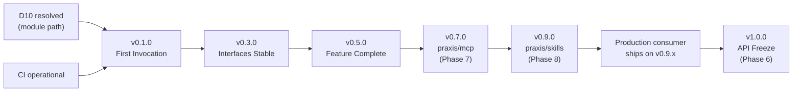

# Phase 6 — Release Milestones

**Related decisions:** D89 (D10 tripwire), D91 (production consumer gate),
D103 (exit criteria).

This document defines the concrete exit criteria for each release milestone.
A tag is created only when every item in the corresponding checklist is
satisfied. These checklists incorporate decisions from all six planning phases.

---

## 1. v0.1.0 — First Invocation

**Goal:** a consumable Go module that completes a single synchronous LLM
invocation with zero caller-supplied wiring beyond an `llm.Provider`.

### Exit Criteria

**Preconditions (blockers):**
- [ ] D10 resolved: module path confirmed, `go.mod` uses the final path
      (not `MODULE_PATH_TBD`). GitHub org acquired or fallback adopted.
- [ ] CI pipeline operational: all 7 PR checks green on `main`.

**Core:**
- [ ] `orchestrator.AgentOrchestrator` facade with `Invoke` (sync path only,
      no `InvokeStream`).
- [ ] `state.Machine` with all 14 states (9 non-terminal + 5 terminal, per
      Phase 2 D15) and the full transition allow-list (D16).
- [ ] `llm.Provider` interface + `anthropic.Provider` adapter passing basic
      smoke tests.
- [ ] `errors.TypedError` interface and all 8 concrete error types (D07
      adds `ApprovalRequiredError` to the original 7).
- [ ] `errors.Classifier` with the retry policy: transient LLM errors retry
      3x with exponential backoff and jitter; all others never retry.

**Defaults and null implementations:**
- [ ] `tools.NullInvoker` (returns `StatusNotImplemented`).
- [ ] `hooks.AllowAllPolicyHook`.
- [ ] `hooks.NoOpPreLLMFilter`, `hooks.NoOpPostToolFilter`.
- [ ] `budget.NullGuard` (no-op, never breaches).
- [ ] `budget.NullPriceProvider` (returns 0).
- [ ] `telemetry.NullEmitter`, `telemetry.NullEnricher`.
- [ ] `credentials.NullResolver` (returns error for any ref).
- [ ] `identity.NullSigner` (returns empty string).

**Construction:**
- [ ] `orchestrator.New(provider llm.Provider, ...Option)` constructible
      with only an `llm.Provider` (D12 zero-wiring promise).
- [ ] All `With*` options validate arguments at construction time, not at
      `Invoke` time.

**Quality:**
- [ ] 85% line coverage on all packages including `internal/` (D86).
- [ ] `make check` passes (lint, test, banned-grep, spdx-check).
- [ ] SPDX `Apache-2.0` header on every `.go` file (D97).
- [ ] `CHANGELOG.md` generated by release-please.

**Documentation:**
- [ ] `README.md` with: one-line description, prerequisites (Go 1.23+, API
      key), `go get` command, hello-world example (target: 25 lines), error
      handling note, "where to go next" links, anti-persona redirect.
- [ ] `examples/minimal/` — the hello-world example as a runnable program.
- [ ] `LICENSE` (Apache 2.0).
- [ ] `CODE_OF_CONDUCT.md` (Contributor Covenant 2.1).
- [ ] `CONTRIBUTING.md` (per §3 of `05-contribution-and-governance.md`).
- [ ] `SECURITY.md` (per §8 of `05-contribution-and-governance.md`).
- [ ] `DCO` file (Developer Certificate of Origin v1.1 text).

**Governance:**
- [ ] `probot/dco` installed and required.
- [ ] `commitsar` installed and required.
- [ ] Branch protection on `main` per D94.
- [ ] release-please configured per D84.

---

## 2. v0.3.0 — Interfaces Stable, Primitives Functional

**Goal:** all public interfaces at their v1.0-candidate shape with hooks,
filters, budget, streaming, and the OpenAI adapter functional.

### Exit Criteria

**All v0.1.0 criteria remain satisfied**, plus:

**Interfaces:**
- [ ] All 14 public interfaces implemented with their Phase 3 method
      surfaces (D31–D52).
- [ ] `budget.PriceProvider` promoted to `frozen-v1.0` candidate shape
      (per D08 per-invocation snapshot semantics).
- [ ] `identity.Signer` at `frozen-v1.0` candidate shape (per D70–D76).

**Hook and filter chains:**
- [ ] `hooks.PolicyHook` evaluation at all 4 phases: `PreInvocation`,
      `PreLLMInput`, `PostToolOutput`, `PostInvocation`.
- [ ] `hooks.PreLLMFilter` chain execution with `Pass`, `Redact`, `Log`,
      `Block` decisions.
- [ ] `hooks.PostToolFilter` chain execution with the same decisions.
- [ ] `ApprovalRequired` terminal state handling (D07, D17).

**Budget:**
- [ ] `budget.Guard` enforcing all 4 dimensions: wall-clock duration, total
      tokens, tool call count, cost estimate in micro-dollars.
- [ ] `budget.PriceProvider` per-invocation snapshot (D08, D26).
- [ ] `BudgetExceeded` terminal state with offending dimension identified.

**Streaming:**
- [ ] `InvokeStream` with 16-event channel buffer (D19).
- [ ] `sync.Once`-guarded channel close protocol (D19).
- [ ] Backpressure via `select + ctx.Done()` (D20).

**Telemetry:**
- [ ] `telemetry.OTelEmitter` default implementation with OTel span tree
      (D53: 1 root + 6 child spans).
- [ ] All 21 `InvocationEvent` types emitted (D18, D52b).
- [ ] `telemetry.AttributeEnricher` flow (D60): called once at Initializing,
      attributes to spans and events, never to metric labels.
- [ ] `MetricsRecorder` interface with `NullMetricsRecorder` default and
      `NewPrometheusRecorder` constructor (D57, D65).

**Adapters:**
- [ ] `openai.Provider` adapter passing the shared conformance suite.
- [ ] Azure OpenAI via base-URL configuration (D14, best-effort).

**State machine:**
- [ ] Property-based tests running in CI at 10k iterations (D87).
- [ ] All 21 property-based invariants from Phase 2 D28 enforced.

**Cancellation:**
- [ ] Soft cancel with 500ms grace window (D21).
- [ ] Hard cancel on deadline/budget breach (D21).
- [ ] Terminal lifecycle-event emission on 5s detached context (D22).

**Quality:**
- [ ] 85% line coverage maintained.
- [ ] Nightly property tests at 100k iterations operational (D87).

**Documentation:**
- [ ] `examples/tools/` — tool invocation example.
- [ ] `examples/policy/` — custom PolicyHook example.
- [ ] `examples/filters/` — PreLLM and PostTool filter example.
- [ ] `examples/streaming/` — InvokeStream with channel draining.

---

## 3. v0.5.0 — Feature Complete

**Goal:** production-ready quality with all features implemented, conformance
suite green, benchmarks green. Ready for the first production consumer.

### Exit Criteria

**All v0.3.0 criteria remain satisfied**, plus:

**Identity signing:**
- [ ] `identity.Ed25519Signer` reference implementation (D73).
- [ ] JWT with 5 mandatory registered claims (D70) and 2 mandatory custom
      claims (D71).
- [ ] Configurable token lifetime [5s, 300s] range (D72).
- [ ] `WithIssuer`, `WithTokenLifetime`, `WithKeyID`, `WithExtraClaims`
      options.
- [ ] `internal/jwt` package with stdlib-only construction (D99).
- [ ] Identity chaining via `praxis.parent_token` claim (D75, CP6).

**Credentials:**
- [ ] `credentials.Resolver.Fetch` with soft-cancel context
      (`context.WithoutCancel` + 500ms timeout, D69).
- [ ] `credentials.ZeroBytes` utility (D68).
- [ ] `Credential.Close()` with `runtime.KeepAlive`-fenced zeroing (D67).
- [ ] At least one non-null `Resolver` reference implementation in examples.

**Security:**
- [ ] `RedactingHandler` in `telemetry/slog/` with full deny-list (D58, D79).
- [ ] Panic recovery on all hook/filter call sites (D78).
- [ ] PostToolFilter at ERROR, PreLLMFilter at WARN for errors (D78).

**Observability:**
- [ ] 10 Prometheus metrics with bounded cardinality (D57).
- [ ] `RedactingHandler` deny-list includes `praxis.signed_identity` and
      `_jwt` suffix (D79).
- [ ] FilterDecision → content-analysis event mapping (D59).
- [ ] Error-to-event 1:1 mapping (D61).

**Error model:**
- [ ] `BudgetExceededError` godoc with token-overshoot caveat (D62).
- [ ] Classifier identity rule (`errors.As` first, D63).
- [ ] VerdictLog emission via AuditNote field (D64).

**Conformance and benchmarks:**
- [ ] LLM conformance suite green for Anthropic and OpenAI adapters.
- [ ] Conformance suite running nightly in CI (D88).
- [ ] Benchmark suite green:
  - Orchestrator overhead under 15 ms per invocation (LLM time excluded).
  - State machine at 1M transitions/sec/core.
- [ ] Benchmark comparison via benchstat in PR CI.

**Quality:**
- [ ] 85% line coverage maintained.
- [ ] All 26 security invariants from Phase 5 D80 verified by tests.
- [ ] All 14 public interfaces exercised by at least one integration test.
- [ ] All CI jobs operational (7 PR + 2 nightly + CodeQL weekly).

**Documentation:**
- [ ] `examples/identity/` — Ed25519Signer usage.
- [ ] `examples/credentials/` — custom Resolver example.
- [ ] Godoc on every exported symbol.

---

## 4. v0.7.0 — MCP Integration

**Goal:** ship the `github.com/praxis-os/praxis/mcp` sub-module as its own
independently-tagged release, implementing Phase 7 decisions D106–D121.
The core module's public surface is unchanged at its v0.5.x shape; the
sub-module is additive and lives behind its own go-module boundary.

> **Driving phase:** Phase 7 — MCP Integration. This section did not exist
> in the original Phase 6 exit-criteria document; it was added on 2026-04-10
> as part of the roadmap reorder that runs implementation order
> `5 → 7 → 8 → 6`. The exit criteria below are sourced verbatim from
> `docs/phase-7-mcp-integration/01-decisions-log.md` and do not amend any
> Phase 6 decision; they extend this derivative milestones document.

### Exit Criteria

**All v0.5.0 criteria remain satisfied**, plus:

**Release pipeline amendment (D121):**
- [ ] `.github/release-please-config.json` extended from the single-package
      form (`.`) to the two-package form (`.` + `mcp`) per D121. Second
      `packages` entry uses `release-type: go`,
      `bump-minor-pre-major: true`, `bump-patch-for-minor-pre-major: false`,
      and `extra-files: ["mcp/internal/version/version.go"]`.
- [ ] `.github/release-please-manifest.json` tracks two keys:
      `"."` and `"mcp"`.
- [ ] Conventional-commit scope `feat(mcp): ...` / `fix(mcp): ...`
      routing verified end-to-end by a dry-run release-please execution on
      a throwaway branch.
- [ ] Release-please configuration commit cites **D121** in its message.

**Sub-module public API (D106, D109, D110):**
- [ ] `praxis/mcp` importable at `github.com/praxis-os/praxis/mcp` with
      its own `go.mod`, sharing neither a version line nor a dependency
      closure with the core module.
- [ ] Minimal public API surface per **D110** frozen as
      `stable-v0.x-candidate`: constructor returning a value implementing
      `tools.Invoker` at the caller-chosen logical name, plus transport
      selector and credential resolver options. No plugins, no runtime
      registry (D109 / D09 re-confirmation).
- [ ] Build-time-only composition verified — no runtime discovery path
      exists (D109).

**Transports (D108):**
- [ ] stdio transport passing an interoperability smoke test against at
      least one published MCP server.
- [ ] Streamable HTTP transport passing the equivalent smoke test.
- [ ] Transport selection is caller-explicit at construction time; no
      implicit transport fallback.

**Tool namespacing (D111):**
- [ ] Tool identifiers exposed to the `tools.Invoker` surface use the
      `{logicalName}__{mcpToolName}` pattern verbatim.
- [ ] Collision test: two MCP servers exposing a same-named tool under
      distinct logical names produce two distinct orchestrator-visible
      identifiers with no silent dropping.

**Budget participation (D112):**
- [ ] MCP tool invocations count against `budget.Guard` `tool_calls` and
      `wall_clock` dimensions verbatim — no new budget dimension,
      no double-counting across the transport edge.
- [ ] Table-driven test confirms a runaway MCP tool-call loop surfaces
      `BudgetExceededError` with the offending dimension correctly
      populated.

**Error translation (D113):**
- [ ] All MCP transport and tool-invocation errors translate to
      `ErrorKindTool` with the sub-kinds enumerated in D113.
- [ ] `errors.Classifier` identity rule (D63) holds across the MCP edge:
      `errors.As` against the MCP-surfaced typed error matches the core
      classifier's expectation.

**Trust boundary (Phase 7 `04-security-and-credentials.md`):**
- [ ] The MCP transport edge is classified as an untrusted boundary;
      stdio hardening (process isolation, arg quoting, env scrubbing) is
      enforced.
- [ ] `PostToolFilter` chain runs on every MCP tool response before the
      orchestrator treats it as trusted (Phase 5 D77 / D78).
- [ ] Credential flow for long-lived MCP sessions is explicit and
      reviewable — no implicit credential passthrough from the core
      resolver to the MCP server without a caller-provided hook.

**Decoupling and scope discipline:**
- [ ] Zero amendments to the Phase 3 `frozen-v1.0` interface surface
      (verified by `git diff` on all Phase 3 signatures).
- [ ] `praxis/mcp` contains **no** reference to any consumer brand; the
      banned-identifier grep returns zero matches on the sub-module tree
      (same grep used by the core module CI job).

**Observability:**
- [ ] Any new metric added by `praxis/mcp` respects the Phase 4 D60
      cardinality boundary — tool names are never used as metric labels.
- [ ] OTel span tree under an MCP tool call attaches to the existing
      `tools.Invoker` span as a child, not as an orphan root.

**SDK reuse gate (D107 precondition 3):**
- [ ] Transitive-dependency audit of `modelcontextprotocol/go-sdk`
      recorded in the PR that introduces the dependency: list of added
      transitive modules, license summary, `govulncheck` pass.
- [ ] If the audit surfaces an unacceptable transitive dependency, the
      PR is blocked until either the dependency is removed upstream or
      D107 is amended in a new Phase 7 decision (e.g., D122 in Phase 8's
      successor range — not D122 itself, which is already allocated).

**Documentation and examples:**
- [ ] `praxis/mcp` has its own godoc landing page under
      `pkg.go.dev/github.com/praxis-os/praxis/mcp`.
- [ ] At least one runnable example under `examples/mcp/` loads a
      published MCP server over stdio and completes an end-to-end
      `Invoke` with an MCP-exposed tool call.
- [ ] Core module README links to the sub-module with a one-line
      summary; the link does not imply the sub-module is mandatory.

**Tag:**
- [ ] `mcp/v0.7.0` tag created by release-please against the `mcp`
      package entry. Core module stays at its current `v0.5.x` tag
      until v0.9.0.

---

## 5. v0.9.0 — Skills Integration

**Goal:** ship the `github.com/praxis-os/praxis/skills` sub-module as its
own independently-tagged release, implementing Phase 8 decisions
D122–D135. As with v0.7.0, the core module's public surface is unchanged;
the sub-module is additive.

> **Driving phase:** Phase 8 — Skills Integration. This section was added
> on 2026-04-10 alongside section 4 by the same roadmap reorder. The
> criteria are sourced from `docs/phase-8-skills-integration/01-decisions-log.md`
> (D122–D135, where D135 is the release-pipeline amendment obligation
> analogous to Phase 7 D121).

### Exit Criteria

**All v0.7.0 criteria remain satisfied**, plus:

**Release pipeline amendment (D135):**
- [ ] `.github/release-please-config.json` extended from the two-package
      form (`.` + `mcp`) to the three-package form (`.` + `mcp` +
      `skills`) per D135. Third `packages` entry uses `release-type: go`,
      `bump-minor-pre-major: true`,
      `bump-patch-for-minor-pre-major: false`, and
      `extra-files: ["skills/internal/version/version.go"]`.
- [ ] `.github/release-please-manifest.json` tracks three keys:
      `"."`, `"mcp"`, and `"skills"`.
- [ ] Conventional-commit scope `feat(skills): ...` / `fix(skills): ...`
      routing verified end-to-end by a dry-run release-please execution.
- [ ] Release-please configuration commit cites **D135** in its message.

**Sub-module public API (D122, D124, D125):**
- [ ] `praxis/skills` importable at `github.com/praxis-os/praxis/skills`
      with its own `go.mod`, independent from both the core module and
      `praxis/mcp`.
- [ ] Loader surface per **D124**: `skills.Open(fsys fs.FS, root string)
      (*Skill, []SkillWarning, error)` as primary entry point;
      `skills.Load(path string)` as thin wrapper.
- [ ] `skills.LoadError` implements the full `errors.TypedError`
      contract with the stable sub-kinds enumerated in D124 / D132.
- [ ] Composition surface per **D125**: `skills.WithSkill(s *Skill)
      praxis.Option` composes with the frozen `NewOrchestrator`
      single-return signature. No amendment to the constructor.

**Canonical `SKILL.md` shape (D123):**
- [ ] Required frontmatter fields: `name`, `description`.
- [ ] Optional recognised fields: `license`, `compatibility`,
      `metadata`, `allowed-tools`.
- [ ] Unknown frontmatter fields preserved verbatim in
      `Skill.Extensions() map[string]any` and surfaced via
      `SkillWarning{Kind: WarnExtensionField, ...}` — permissive-preserve,
      never permissive-ignore.
- [ ] Strict validation remains composable by the caller via
      `len(warnings) == 0`.

**Conflict resolution (D127):**
- [ ] Duplicate `Skill.Name()` across two `WithSkill` options causes
      `NewOrchestrator` to panic at construction time with a diagnostic
      that names both skills.
- [ ] Instruction-fragment ordering is deterministic by `WithSkill`
      call order (test asserts stable order across runs).

**Instruction injection (D128):**
- [ ] Skill instructions reach the LLM as an additive system-prompt
      fragment composed at construction time. Zero change to the frozen
      `LLMProvider` request surface.

**Budget participation (D129):**
- [ ] Skill-originated tool calls count against the Phase 7 D112
      dimensions verbatim (`tool_calls` + `wall_clock`). No new
      dimension, no per-skill sub-budget, no double-counting.

**Cross-module composition (D131):**
- [ ] `praxis/skills` does **not** import `praxis/mcp`. Verified by a
      dependency-graph check in CI that fails the build if the import
      appears.
- [ ] The `04-dx-and-errors.md §1.4` worked wiring example compiles and
      runs: a caller configures both `praxis/mcp` and `praxis/skills`
      independently and passes both to `praxis.NewOrchestrator`.
- [ ] No `MCPServerSpec` value type or `Skill.MCPServers()` accessor
      ships in `praxis/skills v1.0.0` (D131 forward-compatibility path
      preserved for a future minor version).

**Observability (D130):**
- [ ] Exactly one bounded counter `praxis_skills_loaded_total` with a
      `status` label only; skill names NEVER appear as metric labels
      (mirror Phase 7 D115, Phase 4 D60).
- [ ] No new event types or spans; optional `MetricsRecorder` surface
      uses the D115 type-assertion pattern.

**Non-goals discipline (D133):**
- [ ] All 11 non-goals from `docs/phase-8-skills-integration/05-non-goals.md`
      are re-verified by an explicit checklist in the PR that merges the
      sub-module: no registry, no download, no runtime discovery,
      no hot-reload, no authoring tooling, no sandboxing, no
      `mcp_servers` recognised field, no provenance verification, no
      automatic credential injection, no consumer brand awareness,
      explicit D09 re-confirmation.

**Impact on frozen surface (D134):**
- [ ] Zero amendments to Phase 3 `frozen-v1.0` signatures (verified by
      `git diff` identical to the check in v0.7.0).
- [ ] All new `praxis/skills` types at `stable-v0.x-candidate`; the
      optional `MetricsRecorder` at `experimental`. Freeze occurs at
      `praxis/skills v1.0.0`, not at `v0.9.0`.

**Phase 8 reviewer implementation-phase items:**
- [ ] YAML parser final choice locked and passing `govulncheck`
      (primary candidate: `gopkg.in/yaml.v3`).
- [ ] Case-insensitive filesystem behaviour of `skills.Open` verified
      on macOS/APFS and Windows NTFS (table-driven test per filesystem).
- [ ] `skills.ComposedInstructions` helper behaviour on non-skill
      options in the variadic list specified and tested.

**Decoupling and scope discipline:**
- [ ] Banned-identifier grep returns zero matches on the `skills/`
      tree.

**Documentation and examples:**
- [ ] `praxis/skills` has its own godoc landing page.
- [ ] At least one runnable example under `examples/skills/` loads a
      `SKILL.md` bundle via `Open` or `Load`, wires it with
      `WithSkill`, and completes an end-to-end `Invoke`.
- [ ] Cross-reference note in README: "`praxis/skills` reads the same
      `SKILL.md` bundle shape that Claude Code, Codex, and the
      agentskills.io ecosystem consume — see D132 for the
      cross-reference rather than a disambiguation."

**Tag:**
- [ ] `skills/v0.9.0` tag created by release-please against the `skills`
      package entry. Core module and `mcp` sub-module stay at their
      current tags until v1.0.0.

---

## 6. v1.0.0 — API Freeze

**Goal:** the stability commitment. Interface surface frozen, semver contract
in effect, first production consumer validated.

> **Production-consumer gate re-anchored.** The original version of this
> section anchored the D91 gate to a consumer shipping on a `v0.5.x` tag.
> On 2026-04-10 the gate was re-anchored to a `v0.9.x` tag as part of the
> roadmap reorder that inserted v0.7.0 (Phase 7) and v0.9.0 (Phase 8)
> between v0.5.0 and v1.0.0. The rationale: v1.0.0 freezes the core
> module together with both sub-modules, so the production consumer must
> have exercised at least one of `praxis/mcp` or `praxis/skills` in
> production before the freeze is asserted. This re-anchor does not edit
> Phase 6 D91; it is a derivative-document update driven by D106 (Phase
> 7), D122 (Phase 8), D121, and D135.

### Exit Criteria

**All v0.9.0 criteria remain satisfied**, plus:

**Production consumer gate (D91, re-anchored):**
- [ ] A production consumer has shipped against a `v0.9.x` tag in
      production (serving real traffic, not staging), exercising at least
      one of the `praxis/mcp` or `praxis/skills` sub-modules in its
      deployed configuration.
- [ ] Maintainer attestation recorded in release notes: consumer identity,
      version used, date of production deployment, which sub-module(s)
      were exercised.

**API freeze:**
- [ ] All 14 interfaces confirmed at `frozen-v1.0` (Phase 1 D04 + Phase 5
      D76).
- [ ] No `stable-v0.x-candidate` interfaces remaining — all promoted or
      explicitly deferred to `post-v1`.
- [ ] `internal/version/version.go` reads `1.0.0`.

**Governance:**
- [ ] `SECURITY.md` published with OI-1 and OI-2 known limitations (D96).
- [ ] RFC process active: "RFC" Discussion category created (D95).
- [ ] `CONTRIBUTING.md` updated with v1.0 review requirements (D93).

**CI hardening:**
- [ ] `govulncheck` promoted to required check (D85).
- [ ] Nightly conformance suite stable (no flaky failures for 30 days).

**Documentation:**
- [ ] `CHANGELOG.md` covering the full v0.x→v1.0 journey.
- [ ] README updated with the stability commitment and link to
      `04-versioning-policy.md`.

---

## 7. Milestone Dependency Graph

The critical path runs through D10 resolution → v0.1.0 → v0.3.0 → v0.5.0
→ **v0.7.0 (praxis/mcp) → v0.9.0 (praxis/skills)** → production consumer
→ v1.0.0. The implementation order runs `5 → 7 → 8 → 6`: Phase 6 lands
last because it *is* the freeze, and the freeze cannot be asserted until
the `praxis/mcp` and `praxis/skills` sub-modules are also stable. D10 is
the only external blocker before implementation begins.
