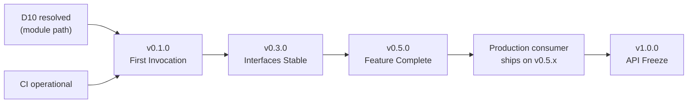

# Phase 6 — Release Milestones

**Related decisions:** D89 (D10 tripwire), D91 (production consumer gate),
D103 (exit criteria).

This document defines the concrete exit criteria for each release milestone.
A tag is created only when every item in the corresponding checklist is
satisfied. These checklists incorporate decisions from all six planning phases.

---

## 1. v0.1.0 — First Invocation

**Goal:** a consumable Go module that completes a single synchronous LLM
invocation with zero caller-supplied wiring beyond an `llm.Provider`.

### Exit Criteria

**Preconditions (blockers):**
- [ ] D10 resolved: module path confirmed, `go.mod` uses the final path
      (not `MODULE_PATH_TBD`). GitHub org acquired or fallback adopted.
- [ ] CI pipeline operational: all 7 PR checks green on `main`.

**Core:**
- [ ] `orchestrator.AgentOrchestrator` facade with `Invoke` (sync path only,
      no `InvokeStream`).
- [ ] `state.Machine` with all 14 states (9 non-terminal + 5 terminal, per
      Phase 2 D15) and the full transition allow-list (D16).
- [ ] `llm.Provider` interface + `anthropic.Provider` adapter passing basic
      smoke tests.
- [ ] `errors.TypedError` interface and all 8 concrete error types (D07
      adds `ApprovalRequiredError` to the original 7).
- [ ] `errors.Classifier` with the retry policy: transient LLM errors retry
      3x with exponential backoff and jitter; all others never retry.

**Defaults and null implementations:**
- [ ] `tools.NullInvoker` (returns `StatusNotImplemented`).
- [ ] `hooks.AllowAllPolicyHook`.
- [ ] `hooks.NoOpPreLLMFilter`, `hooks.NoOpPostToolFilter`.
- [ ] `budget.NullGuard` (no-op, never breaches).
- [ ] `budget.NullPriceProvider` (returns 0).
- [ ] `telemetry.NullEmitter`, `telemetry.NullEnricher`.
- [ ] `credentials.NullResolver` (returns error for any ref).
- [ ] `identity.NullSigner` (returns empty string).

**Construction:**
- [ ] `orchestrator.New(provider llm.Provider, ...Option)` constructible
      with only an `llm.Provider` (D12 zero-wiring promise).
- [ ] All `With*` options validate arguments at construction time, not at
      `Invoke` time.

**Quality:**
- [ ] 85% line coverage on all packages including `internal/` (D86).
- [ ] `make check` passes (lint, test, banned-grep, spdx-check).
- [ ] SPDX `Apache-2.0` header on every `.go` file (D97).
- [ ] `CHANGELOG.md` generated by release-please.

**Documentation:**
- [ ] `README.md` with: one-line description, prerequisites (Go 1.23+, API
      key), `go get` command, hello-world example (target: 25 lines), error
      handling note, "where to go next" links, anti-persona redirect.
- [ ] `examples/minimal/` — the hello-world example as a runnable program.
- [ ] `LICENSE` (Apache 2.0).
- [ ] `CODE_OF_CONDUCT.md` (Contributor Covenant 2.1).
- [ ] `CONTRIBUTING.md` (per §3 of `05-contribution-and-governance.md`).
- [ ] `SECURITY.md` (per §8 of `05-contribution-and-governance.md`).
- [ ] `DCO` file (Developer Certificate of Origin v1.1 text).

**Governance:**
- [ ] `probot/dco` installed and required.
- [ ] `commitsar` installed and required.
- [ ] Branch protection on `main` per D94.
- [ ] release-please configured per D84.

---

## 2. v0.3.0 — Interfaces Stable, Primitives Functional

**Goal:** all public interfaces at their v1.0-candidate shape with hooks,
filters, budget, streaming, and the OpenAI adapter functional.

### Exit Criteria

**All v0.1.0 criteria remain satisfied**, plus:

**Interfaces:**
- [ ] All 14 public interfaces implemented with their Phase 3 method
      surfaces (D31–D52).
- [ ] `budget.PriceProvider` promoted to `frozen-v1.0` candidate shape
      (per D08 per-invocation snapshot semantics).
- [ ] `identity.Signer` at `frozen-v1.0` candidate shape (per D70–D76).

**Hook and filter chains:**
- [ ] `hooks.PolicyHook` evaluation at all 4 phases: `PreInvocation`,
      `PreLLMInput`, `PostToolOutput`, `PostInvocation`.
- [ ] `hooks.PreLLMFilter` chain execution with `Pass`, `Redact`, `Log`,
      `Block` decisions.
- [ ] `hooks.PostToolFilter` chain execution with the same decisions.
- [ ] `ApprovalRequired` terminal state handling (D07, D17).

**Budget:**
- [ ] `budget.Guard` enforcing all 4 dimensions: wall-clock duration, total
      tokens, tool call count, cost estimate in micro-dollars.
- [ ] `budget.PriceProvider` per-invocation snapshot (D08, D26).
- [ ] `BudgetExceeded` terminal state with offending dimension identified.

**Streaming:**
- [ ] `InvokeStream` with 16-event channel buffer (D19).
- [ ] `sync.Once`-guarded channel close protocol (D19).
- [ ] Backpressure via `select + ctx.Done()` (D20).

**Telemetry:**
- [ ] `telemetry.OTelEmitter` default implementation with OTel span tree
      (D53: 1 root + 6 child spans).
- [ ] All 21 `InvocationEvent` types emitted (D18, D52b).
- [ ] `telemetry.AttributeEnricher` flow (D60): called once at Initializing,
      attributes to spans and events, never to metric labels.
- [ ] `MetricsRecorder` interface with `NullMetricsRecorder` default and
      `NewPrometheusRecorder` constructor (D57, D65).

**Adapters:**
- [ ] `openai.Provider` adapter passing the shared conformance suite.
- [ ] Azure OpenAI via base-URL configuration (D14, best-effort).

**State machine:**
- [ ] Property-based tests running in CI at 10k iterations (D87).
- [ ] All 21 property-based invariants from Phase 2 D28 enforced.

**Cancellation:**
- [ ] Soft cancel with 500ms grace window (D21).
- [ ] Hard cancel on deadline/budget breach (D21).
- [ ] Terminal lifecycle-event emission on 5s detached context (D22).

**Quality:**
- [ ] 85% line coverage maintained.
- [ ] Nightly property tests at 100k iterations operational (D87).

**Documentation:**
- [ ] `examples/tools/` — tool invocation example.
- [ ] `examples/policy/` — custom PolicyHook example.
- [ ] `examples/filters/` — PreLLM and PostTool filter example.
- [ ] `examples/streaming/` — InvokeStream with channel draining.

---

## 3. v0.5.0 — Feature Complete

**Goal:** production-ready quality with all features implemented, conformance
suite green, benchmarks green. Ready for the first production consumer.

### Exit Criteria

**All v0.3.0 criteria remain satisfied**, plus:

**Identity signing:**
- [ ] `identity.Ed25519Signer` reference implementation (D73).
- [ ] JWT with 5 mandatory registered claims (D70) and 2 mandatory custom
      claims (D71).
- [ ] Configurable token lifetime [5s, 300s] range (D72).
- [ ] `WithIssuer`, `WithTokenLifetime`, `WithKeyID`, `WithExtraClaims`
      options.
- [ ] `internal/jwt` package with stdlib-only construction (D99).
- [ ] Identity chaining via `praxis.parent_token` claim (D75, CP6).

**Credentials:**
- [ ] `credentials.Resolver.Fetch` with soft-cancel context
      (`context.WithoutCancel` + 500ms timeout, D69).
- [ ] `credentials.ZeroBytes` utility (D68).
- [ ] `Credential.Close()` with `runtime.KeepAlive`-fenced zeroing (D67).
- [ ] At least one non-null `Resolver` reference implementation in examples.

**Security:**
- [ ] `RedactingHandler` in `telemetry/slog/` with full deny-list (D58, D79).
- [ ] Panic recovery on all hook/filter call sites (D78).
- [ ] PostToolFilter at ERROR, PreLLMFilter at WARN for errors (D78).

**Observability:**
- [ ] 10 Prometheus metrics with bounded cardinality (D57).
- [ ] `RedactingHandler` deny-list includes `praxis.signed_identity` and
      `_jwt` suffix (D79).
- [ ] FilterDecision → content-analysis event mapping (D59).
- [ ] Error-to-event 1:1 mapping (D61).

**Error model:**
- [ ] `BudgetExceededError` godoc with token-overshoot caveat (D62).
- [ ] Classifier identity rule (`errors.As` first, D63).
- [ ] VerdictLog emission via AuditNote field (D64).

**Conformance and benchmarks:**
- [ ] LLM conformance suite green for Anthropic and OpenAI adapters.
- [ ] Conformance suite running nightly in CI (D88).
- [ ] Benchmark suite green:
  - Orchestrator overhead under 15 ms per invocation (LLM time excluded).
  - State machine at 1M transitions/sec/core.
- [ ] Benchmark comparison via benchstat in PR CI.

**Quality:**
- [ ] 85% line coverage maintained.
- [ ] All 26 security invariants from Phase 5 D80 verified by tests.
- [ ] All 14 public interfaces exercised by at least one integration test.
- [ ] All CI jobs operational (7 PR + 2 nightly + CodeQL weekly).

**Documentation:**
- [ ] `examples/identity/` — Ed25519Signer usage.
- [ ] `examples/credentials/` — custom Resolver example.
- [ ] Godoc on every exported symbol.

---

## 4. v1.0.0 — API Freeze

**Goal:** the stability commitment. Interface surface frozen, semver contract
in effect, first production consumer validated.

### Exit Criteria

**All v0.5.0 criteria remain satisfied**, plus:

**Production consumer gate (D91):**
- [ ] A production consumer has shipped against a v0.5.x tag in production
      (serving real traffic, not staging).
- [ ] Maintainer attestation recorded in release notes: consumer identity,
      version used, date of production deployment.

**API freeze:**
- [ ] All 14 interfaces confirmed at `frozen-v1.0` (Phase 1 D04 + Phase 5
      D76).
- [ ] No `stable-v0.x-candidate` interfaces remaining — all promoted or
      explicitly deferred to `post-v1`.
- [ ] `internal/version/version.go` reads `1.0.0`.

**Governance:**
- [ ] `SECURITY.md` published with OI-1 and OI-2 known limitations (D96).
- [ ] RFC process active: "RFC" Discussion category created (D95).
- [ ] `CONTRIBUTING.md` updated with v1.0 review requirements (D93).

**CI hardening:**
- [ ] `govulncheck` promoted to required check (D85).
- [ ] Nightly conformance suite stable (no flaky failures for 30 days).

**Documentation:**
- [ ] `CHANGELOG.md` covering the full v0.x→v1.0 journey.
- [ ] README updated with the stability commitment and link to
      `04-versioning-policy.md`.

---

## 5. Milestone Dependency Graph

The critical path runs through D10 resolution → v0.1.0 → v0.3.0 → v0.5.0 →
production consumer → v1.0.0. D10 is the only external blocker before
implementation begins.
